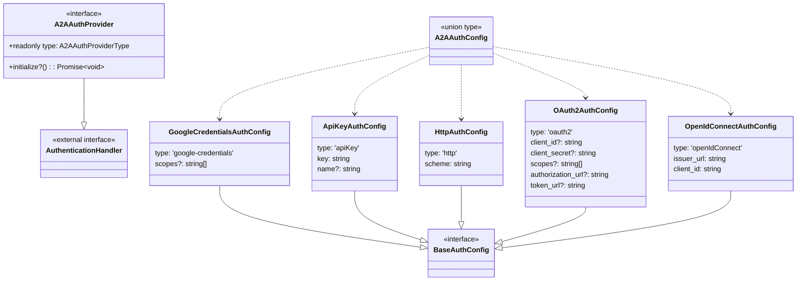

# types.ts

> A2A 远程代理认证的类型定义与接口规范

## 概述

`types.ts` 是 `auth-provider` 模块的类型基石文件，定义了 A2A（Agent-to-Agent）协议中客户端认证所需的全部 TypeScript 类型、接口和配置结构。该文件对应 A2A 规范中 `SecurityScheme` 的客户端实现，为工厂模式和各具体 Provider 提供统一的类型约束。

设计动机：将所有认证相关的类型集中管理，确保各 Provider 实现之间的类型一致性，同时为配置校验（`AuthValidationResult`）提供结构化的差异描述。

## 架构图



## 主要导出

### `A2AAuthProviderType`
```typescript
type A2AAuthProviderType = 'google-credentials' | 'apiKey' | 'http' | 'oauth2' | 'openIdConnect';
```
认证提供者的类型联合，涵盖 A2A 规范支持的全部认证方式以及 Gemini 特有的 `google-credentials`。

### `A2AAuthProvider`
```typescript
interface A2AAuthProvider extends AuthenticationHandler {
  readonly type: A2AAuthProviderType;
  initialize?(): Promise<void>;
}
```
所有认证提供者必须实现的核心接口。继承自 `@a2a-js/sdk/client` 的 `AuthenticationHandler`，增加了 `type` 标识和可选的异步初始化方法。

### `BaseAuthConfig`
```typescript
interface BaseAuthConfig {}
```
所有认证配置的基础接口，目前为空占位，便于未来扩展公共字段。

### `GoogleCredentialsAuthConfig`
Google ADC（应用默认凭据）认证配置。非 A2A 标准，为 Gemini 特有扩展。支持自定义 `scopes`。

### `ApiKeyAuthConfig`
API Key 认证配置。`key` 字段支持三种格式：`$ENV_VAR`（环境变量）、`!command`（Shell 命令）、字面量字符串。`name` 指定 Header 名称，默认 `X-API-Key`。

### `HttpAuthConfig`
HTTP 认证配置，使用 TypeScript 可辨识联合体（discriminated union）支持三种 scheme：
- **Bearer**：携带 `token` 字段
- **Basic**：携带 `username` 和 `password` 字段
- **通用 IANA 方案**：携带 `scheme` 和 `value` 字段，支持 Digest、HOBA 等

### `OAuth2AuthConfig`
OAuth 2.0 认证配置。`authorization_url` 和 `token_url` 可从 Agent Card 自动发现。

### `OpenIdConnectAuthConfig`
OpenID Connect 认证配置。需要 `issuer_url` 和 `client_id`。

### `A2AAuthConfig`
```typescript
type A2AAuthConfig = GoogleCredentialsAuthConfig | ApiKeyAuthConfig | HttpAuthConfig | OAuth2AuthConfig | OpenIdConnectAuthConfig;
```
所有认证配置的联合类型，用于工厂模式中的类型分发。

### `AuthConfigDiff` / `AuthValidationResult`
用于校验认证配置与 Agent Card 安全要求是否匹配的结构化差异描述。

## 核心逻辑

该文件为纯类型定义，不包含运行时逻辑。其核心设计决策包括：

1. **可辨识联合体**：每个配置接口通过 `type` 字段实现类型分发，配合 TypeScript 的 `switch` 穷举检查，确保工厂方法覆盖所有认证类型。
2. **值解析约定**：多个配置字段（`key`、`token`、`username`、`password`、`value`）统一支持 `$ENV_VAR`、`!command` 和字面量三种格式，由 `value-resolver.ts` 统一处理。
3. **HttpAuthConfig 的联合体嵌套**：使用交叉类型（`&`）加联合体（`|`）实现 scheme 和对应字段的强关联。

## 内部依赖

无（该文件是模块的类型根节点）。

## 外部依赖

| 包名 | 导入内容 | 用途 |
|------|---------|------|
| `@a2a-js/sdk/client` | `AuthenticationHandler` (type) | A2A SDK 定义的认证处理器接口，`A2AAuthProvider` 继承该接口 |
