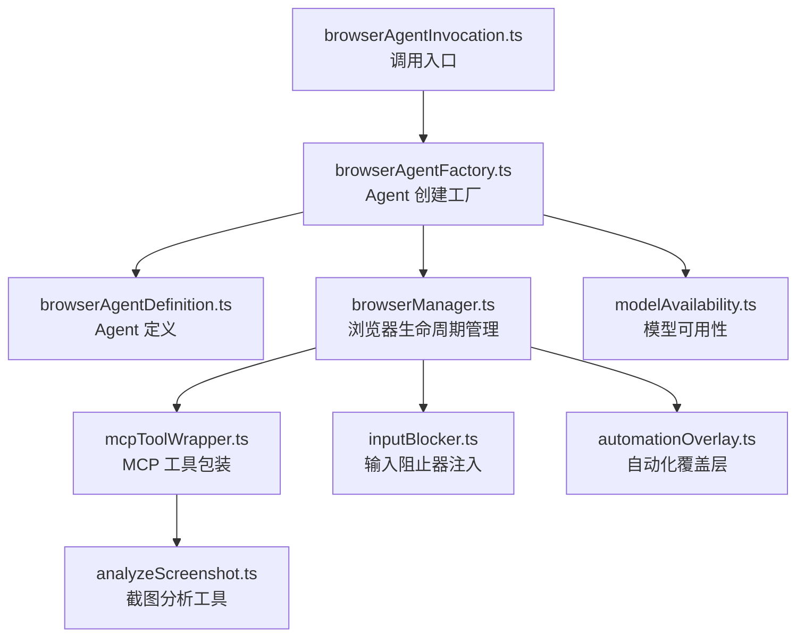

# browser 架构

> 浏览器自动化 Agent，通过 chrome-devtools-mcp 提供网页浏览和交互能力

## 概述

`browser/` 模块实现了一个基于 LocalAgentExecutor 的浏览器自动化 Agent。该 Agent 通过 `chrome-devtools-mcp` MCP 服务器与 Chrome DevTools Protocol (CDP) 交互，支持页面导航、元素点击、文本输入、截图分析等浏览器操作。Agent 仅通过 `delegate_to_agent` 工具调用可用，不直接暴露为顶层工具。使用隔离的 MCP 客户端（不注册到主工具注册表中），并在自动化会话期间注入输入阻止器和自动化覆盖层以防止用户干扰。

## 架构图



## 目录结构

```
browser/
├── browserAgentDefinition.ts    # LocalAgentDefinition 定义
├── browserAgentFactory.ts       # 创建浏览器 Agent 实例
├── browserAgentInvocation.ts    # Agent 调用与生命周期
├── browserManager.ts            # 浏览器 MCP 客户端管理
├── mcpToolWrapper.ts            # MCP 工具 -> DeclarativeTool 包装
├── analyzeScreenshot.ts         # 截图视觉分析工具
├── inputBlocker.ts              # Chrome 输入事件阻止器
├── automationOverlay.ts         # 页面自动化状态覆盖层
└── modelAvailability.ts         # 浏览器 Agent 模型选择
```

## 关键文件

| 文件 | 功能 |
|------|------|
| `browserAgentDefinition.ts` | 定义浏览器 Agent 的 `LocalAgentDefinition`，包括系统提示、输出 schema（`BrowserTaskResultSchema`）和工具配置 |
| `browserManager.ts` | `BrowserManager` 类：管理 chrome-devtools-mcp 进程的启动/关闭、MCP 工具发现、导航后自动重注入覆盖层 |
| `browserAgentFactory.ts` | 工厂函数：动态配置工具集，将 MCP 工具包装为 DeclarativeTool 供 LocalAgentExecutor 使用 |
| `mcpToolWrapper.ts` | 将 MCP 工具转换为 Gemini CLI 的 DeclarativeTool 格式 |
| `analyzeScreenshot.ts` | 实现 `analyze_screenshot` 工具：截取页面截图并使用 LLM 进行视觉分析 |
| `inputBlocker.ts` | 通过 CDP 注入 JavaScript 阻止键盘和鼠标事件，防止自动化期间的人工干扰 |

## 内部依赖

- `agents/types.ts` - LocalAgentDefinition 类型
- `config/` - Config 类、模型配置
- `config/storage.ts` - 存储目录路径
- `utils/debugLogger.ts` - 调试日志

## 外部依赖

| 依赖 | 用途 |
|------|------|
| `@modelcontextprotocol/sdk` | MCP 客户端，与 chrome-devtools-mcp 通信 |
| `chrome-devtools-mcp` | Chrome DevTools MCP 服务器（通过 npx 运行，版本锁定为 0.17.1） |
