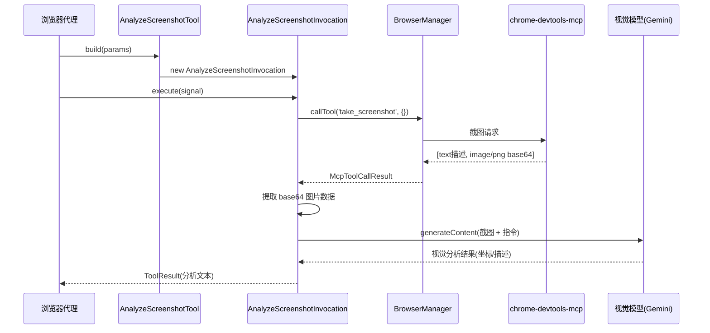

# analyzeScreenshot.ts

> 基于截图的视觉分析工具，通过 AI 模型识别页面元素的视觉属性和坐标

## 概述

`analyzeScreenshot.ts` 实现了浏览器代理的视觉分析能力。当语义浏览器代理（基于无障碍树工作）遇到需要通过视觉属性（颜色、布局、精确坐标）定位元素的场景时，可以调用此工具。它捕获当前页面截图，发送到具有 Computer Use 能力的视觉模型进行分析，并将分析结果（坐标、元素描述等）返回给浏览器代理。

设计动机：无障碍树（Accessibility Tree）只包含语义信息（角色、名称、状态），不包含视觉属性（颜色、位置、大小）。此工具作为补充能力填补这一空白，同时保持浏览器代理对后续操作的完全控制权——它只负责"看"，不负责"做"。

## 架构图

## 主要导出

### `createAnalyzeScreenshotTool(browserManager, config, messageBus): AnalyzeScreenshotTool`

工厂函数，创建 `analyze_screenshot` 工具实例供浏览器代理使用。

## 核心逻辑

### 内部类：AnalyzeScreenshotInvocation

继承 `BaseToolInvocation`，实现 `execute()` 方法：

1. **截图获取**：通过 `browserManager.callTool('take_screenshot', {})` 调用 MCP 工具。MCP 响应包含 `[text, image]` 两个 content item，需遍历所有 content 寻找 `type === 'image'` 的项获取 base64 数据。
2. **模型调用**：使用 `config.getContentGenerator().generateContent()` 发送单次请求，包含：
   - 系统提示词（`VISUAL_SYSTEM_PROMPT`）：定义坐标系、响应格式和角色约束
   - 用户消息：文本指令 + 内联 base64 图片
   - 模型参数：`temperature: 0`、`topP: 0.95`
3. **结果提取**：从响应的 `candidates[0].content.parts` 中过滤文本 part 并拼接

### 内部类：AnalyzeScreenshotTool

继承 `DeclarativeTool`，定义工具的元数据：
- 名称：`analyze_screenshot`
- 参数 schema：`{ instruction: string }`（必填）
- 输出为 Markdown 格式

### 视觉系统提示词

提示词严格定义了模型的角色边界：
- 坐标系：基于视口的像素坐标，(0,0) 为左上角
- 只提供分析，不执行操作
- 尽可能提供精确坐标，便于调用方使用 `click_at(x, y)`
- 元素不可见时必须明确说明

### 错误处理

- 截图失败：返回友好错误消息，建议使用无障碍树元素替代
- 模型返回空响应：提示使用替代方案
- 模型不可用（404/403）：识别模型错误并提供针对性回退建议
- 其他错误：包含错误详情并建议替代方案

## 内部依赖

| 模块 | 导入内容 | 用途 |
|------|---------|------|
| `../../tools/tools.js` | `DeclarativeTool`, `BaseToolInvocation`, `Kind`, `ToolResult` (type), `ToolInvocation` (type) | 工具框架基类和类型 |
| `../../confirmation-bus/message-bus.js` | `MessageBus` (type) | 消息总线 |
| `./browserManager.js` | `BrowserManager` (type) | 浏览器管理器，用于截图 |
| `../../config/config.js` | `Config` (type) | 运行时配置 |
| `./modelAvailability.js` | `getVisualAgentModel` | 获取视觉模型标识 |
| `../../utils/debugLogger.js` | `debugLogger` | 调试日志 |
| `../../telemetry/llmRole.js` | `LlmRole` | LLM 调用角色标识（UTILITY_TOOL） |

## 外部依赖

无直接的 npm 包依赖（通过 `config.getContentGenerator()` 间接使用 `@google/genai`）。
