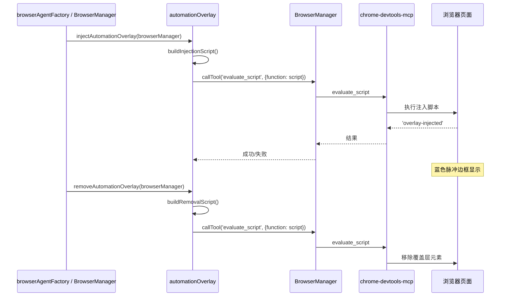

# automationOverlay.ts

> 浏览器自动化视觉指示器，注入脉冲蓝色边框标识 AI 控制状态

## 概述

`automationOverlay.ts` 提供了在浏览器页面上注入和移除自动化覆盖层（overlay）的工具函数。该覆盖层是一个固定定位的蓝色脉冲边框，覆盖在整个视口上方，用于向用户视觉指示当前浏览器正处于 AI 代理控制之下。

设计动机：用户安全感知——当 AI 代理操控浏览器时，脉冲蓝色边框提供持续的视觉反馈，让用户明确知道自动化正在进行中。同时使用 Web Animations API（而非注入 `<style>` 标签）确保在具有严格 CSP（内容安全策略）的网站（如 google.com）上也能正常工作。

## 架构图

## 主要导出

### `injectAutomationOverlay(browserManager: BrowserManager, signal?: AbortSignal): Promise<void>`

注入自动化覆盖层到当前页面。覆盖层特性：
- 固定定位，覆盖整个视口
- z-index 为最大值 `2147483647`
- `pointer-events: none` 确保不阻止用户/CDP 交互
- 6px 蓝色边框（Google 品牌蓝 `rgba(66, 133, 244, 1.0)`）
- 2 秒循环脉冲动画（透明度和阴影变化）
- 幂等：已存在则先移除再重新创建

### `removeAutomationOverlay(browserManager: BrowserManager, signal?: AbortSignal): Promise<void>`

从当前页面移除自动化覆盖层。通过 DOM `getElementById` + `remove()` 实现。

## 核心逻辑

### 脚本格式约束

chrome-devtools-mcp 的 `evaluate_script` 工具要求参数格式为 `{ function: "() => { ... }" }`——一个**普通箭头函数表达式**（不是 IIFE）。工具内部会调用该函数。因此：
- `buildInjectionScript()` 返回 `() => { ... }` 格式的字符串
- `buildRemovalScript()` 同理

### 注入脚本细节

1. 通过 `document.getElementById` 检查是否已存在覆盖层（幂等性）
2. 创建 `
` 元素，设置 `aria-hidden="true"` 和 `role="presentation"`（无障碍树不可见）
3. 使用 `Object.assign(overlay.style, {...})` 设置样式（避免 `cssText` 中的模板字面量嵌套问题）
4. 附加到 `document.documentElement`（而非 body，确保全页面覆盖）
5. 使用 `overlay.animate()` (Web Animations API) 创建脉冲效果
6. 动画错误静默忽略（某些 CSP 可能阻止 animate API）

### 错误容忍

两个导出函数都采用 try-catch 包装，失败只记录警告日志而不抛出异常。这是因为覆盖层是 UX 增强功能，不应影响自动化流程的正常运行。

## 内部依赖

| 模块 | 导入内容 | 用途 |
|------|---------|------|
| `./browserManager.js` | `BrowserManager` (type) | 通过其 `callTool` 方法执行页面脚本 |
| `../../utils/debugLogger.js` | `debugLogger` | 日志输出 |

## 外部依赖

无。
