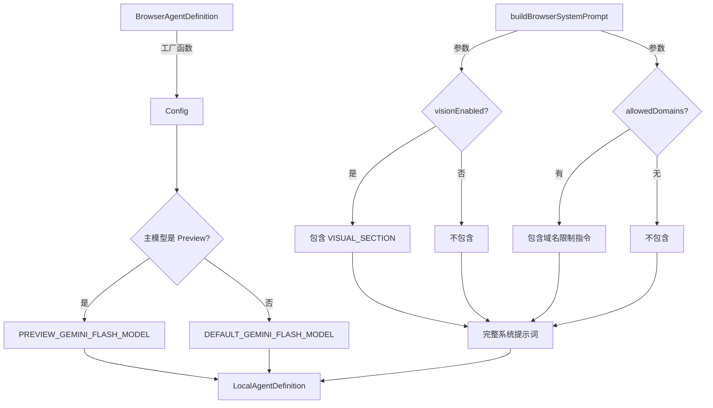

# browserAgentDefinition.ts

> 浏览器代理的定义工厂，生成 LocalAgentDefinition 配置（含系统提示词和输出 Schema）

## 概述

`browserAgentDefinition.ts` 按照 `LocalAgentDefinition` 模式定义了浏览器代理的完整配置，包括模型选择、系统提示词、输入/输出 Schema、运行限制等。它遵循与 `CodebaseInvestigatorAgent` 相同的模式——返回工厂函数而非静态对象，以支持基于运行时 `Config` 的动态模型选择。

设计要点：
- 浏览器代理仅通过 `delegate_to_agent` 可用，不作为直接工具暴露
- 工具配置（`toolConfig`）在此处为 `undefined`，由 `browserAgentFactory` 在调用时动态注入
- 系统提示词根据视觉能力是否启用和域名白名单动态构建

## 架构图



## 主要导出

### `BROWSER_AGENT_NAME` (常量)

```typescript
const BROWSER_AGENT_NAME = 'browser_agent';
```
代理的规范名称，用于路由和配置查找。

### `BrowserTaskResultSchema` (Zod Schema)

```typescript
z.object({
  success: z.boolean(),
  summary: z.string(),
  data: z.unknown().optional(),
})
```
浏览器代理输出的结构化 Schema，定义了任务是否成功、摘要描述和可选的提取数据。

### `buildBrowserSystemPrompt(visionEnabled: boolean, allowedDomains?: string[]): string`

构建浏览器代理的系统提示词。提示词内容涵盖：

| 段落 | 内容 |
|------|------|
| 角色定义 | 专家级浏览器自动化代理（Orchestrator） |
| 无障碍树交互 | 使用 uid 与 click/fill/fill_form 配合 |
| 并行调用限制 | 状态变更操作必须逐个执行 |
| 覆盖层处理 | 优先关闭弹窗、对话框、Cookie 横幅 |
| 视觉识别（条件） | analyze_screenshot 的使用方法和限制 |
| 复杂 Web 应用 | Sheets/Docs 等自定义渲染应用的操作技巧 |
| 终端错误处理 | 不可恢复错误的识别和即时退出策略 |
| 任务完成 | 必须调用 complete_task 工具退出循环 |
| 域名限制（条件） | 安全域名白名单（硬约束） |

### `BrowserAgentDefinition(config: Config, visionEnabled?: boolean): LocalAgentDefinition`

工厂函数，返回 `LocalAgentDefinition` 配置对象：

| 配置项 | 值 |
|--------|-----|
| `name` | `'browser_agent'` |
| `kind` | `'local'` |
| `experimental` | `true` |
| `model` | 根据主模型是否为 Preview 版动态选择 Flash 模型 |
| `temperature` | `0.1` |
| `topP` | `0.95` |
| `maxTimeMinutes` | `10` |
| `maxTurns` | `50` |
| `toolConfig` | `undefined`（由 browserAgentFactory 动态设置） |

## 核心逻辑

### 动态模型选择

```typescript
const model = isPreviewModel(config.getModel())
  ? PREVIEW_GEMINI_FLASH_MODEL
  : DEFAULT_GEMINI_FLASH_MODEL;
```
浏览器代理使用 Flash 模型（非主模型），但会根据用户选择的主模型是否为预览版来选择对应的 Flash 预览版或稳定版。

### 系统提示词的条件段落

1. **VISUAL_SECTION**：仅在 `visionEnabled === true` 时包含。描述 `analyze_screenshot` 工具的三步使用流程：调用 -> 获取分析 -> 自行执行操作。
2. **域名限制**：仅在 `allowedDomains` 非空时包含。使用 `CRITICAL` 标记强调这是硬安全约束。

### 查询模板

```
Your task is:
<task>
${task}
</task>

First, use new_page to open the relevant URL. Then call take_snapshot to see the page and proceed with your task.
```
标准化的任务注入模板，指导代理先打开页面再截取快照。

## 内部依赖

| 模块 | 导入内容 | 用途 |
|------|---------|------|
| `../types.js` | `LocalAgentDefinition` (type) | 代理定义类型 |
| `../../config/config.js` | `Config` (type) | 运行时配置 |
| `../../config/models.js` | `isPreviewModel`, `PREVIEW_GEMINI_FLASH_MODEL`, `DEFAULT_GEMINI_FLASH_MODEL` | 模型名称常量和预览版判断 |

## 外部依赖

| 包名 | 导入内容 | 用途 |
|------|---------|------|
| `zod` | `z` | 输出 Schema 定义 |
