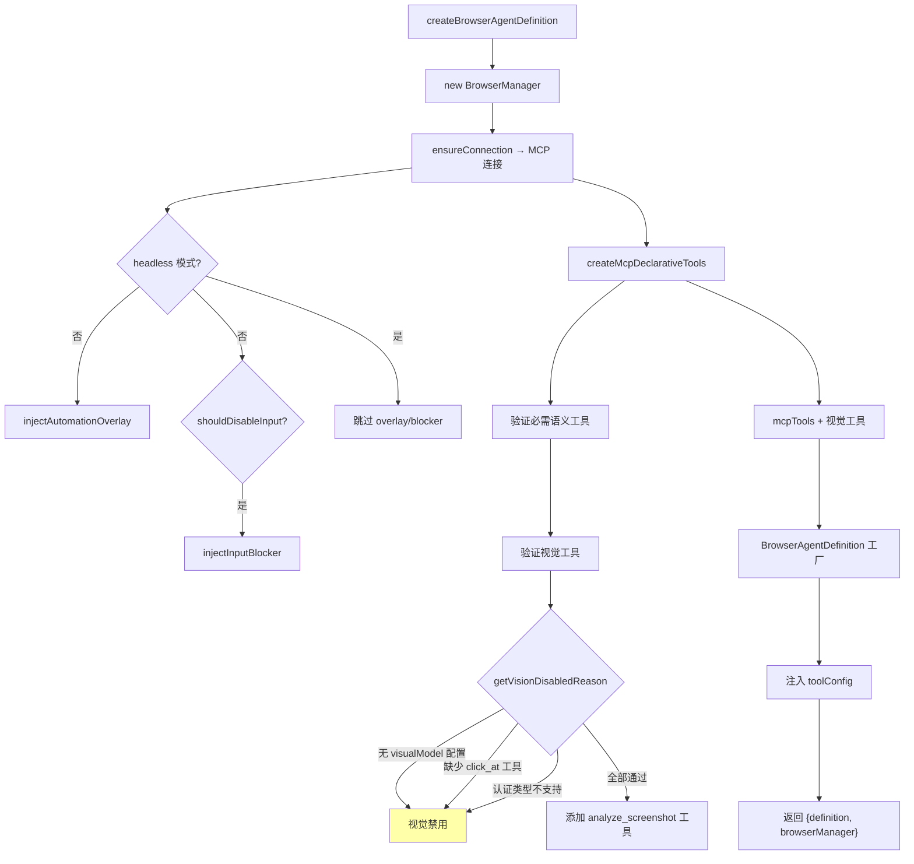

# browserAgentFactory.ts

> 浏览器代理创建工厂，负责 MCP 连接、工具组装和代理定义的完整初始化

## 概述

`browserAgentFactory.ts` 是浏览器代理调用链的入口工厂。当浏览器代理通过 `delegate_to_agent` 被调用时，此模块负责完整的初始化流程：创建 `BrowserManager`、建立隔离的 MCP 连接、注入自动化 overlay 和输入拦截器、从 MCP 服务器动态发现并包装工具、判断视觉能力是否可用，最终返回一个完全配置好的 `LocalAgentDefinition`。

设计动机：将浏览器代理的"一次性"初始化逻辑（MCP 连接、工具发现）与"可复用"的定义（系统提示词、模型配置）分离。工厂在每次调用时创建全新的 MCP 连接，确保隔离性。

## 架构图



## 主要导出

### `createBrowserAgentDefinition(config, messageBus, printOutput?)`

```typescript
async function createBrowserAgentDefinition(
  config: Config,
  messageBus: MessageBus,
  printOutput?: (msg: string) => void,
): Promise<{
  definition: LocalAgentDefinition<typeof BrowserTaskResultSchema>;
  browserManager: BrowserManager;
}>
```

主工厂函数。返回完全配置的代理定义和 BrowserManager 实例（用于后续清理）。

### `cleanupBrowserAgent(browserManager: BrowserManager): Promise<void>`

清理函数，关闭 BrowserManager 及其管理的浏览器进程。

## 核心逻辑

### 完整初始化流程

```
1. 创建 BrowserManager(config)
2. ensureConnection() — 建立 MCP 连接（启动 chrome-devtools-mcp）
3. 非 headless 模式：
   a. injectAutomationOverlay — 蓝色脉冲边框
   b. shouldDisableInput → injectInputBlocker — 输入拦截
4. createMcpDeclarativeTools — 从 MCP 动态发现工具并包装为 DeclarativeTool
5. 验证必需语义工具（click, fill, navigate_page, take_snapshot）
6. 检查视觉能力是否可启用（三道门槛）
7. 视觉可用 → 添加 analyze_screenshot 工具
8. 调用 BrowserAgentDefinition(config, visionEnabled)
9. 注入 toolConfig: { tools: allTools }
10. 返回 { definition, browserManager }
```

### 视觉能力启用条件（三道门槛）

`getVisionDisabledReason()` 按顺序检查：

| 检查项 | 禁用原因 |
|--------|---------|
| `browserConfig.customConfig.visualModel` 未配置 | "No visualModel configured." |
| `click_at` 工具不可用 | MCP 版本过旧 |
| 当前认证类型在黑名单中 | LOGIN_WITH_GOOGLE / LEGACY_CLOUD_SHELL / COMPUTE_ADC 不支持 |

全部通过后视觉能力启用，添加 `analyze_screenshot` 工具。

### 必需工具验证

语义工具（`click`, `fill`, `navigate_page`, `take_snapshot`）缺失时仅发出警告，不阻止代理运行。这是因为不同版本的 `chrome-devtools-mcp` 可能提供不同的工具集。

### printOutput 回调

可选的进度回调函数，在 MCP 连接建立和 overlay 注入等耗时步骤完成时通知调用方，用于更新 UI 进度显示。

## 内部依赖

| 模块 | 导入内容 | 用途 |
|------|---------|------|
| `../../config/config.js` | `Config` (type) | 运行时配置 |
| `../../core/contentGenerator.js` | `AuthType` | 认证类型枚举（视觉能力检查） |
| `../types.js` | `LocalAgentDefinition` (type) | 代理定义类型 |
| `../../confirmation-bus/message-bus.js` | `MessageBus` (type) | 消息总线 |
| `../../tools/tools.js` | `AnyDeclarativeTool` (type) | 工具类型 |
| `./browserManager.js` | `BrowserManager` | 浏览器管理器 |
| `./browserAgentDefinition.js` | `BrowserAgentDefinition`, `BrowserTaskResultSchema` | 代理定义工厂和输出 Schema |
| `./mcpToolWrapper.js` | `createMcpDeclarativeTools` | MCP 工具包装 |
| `./analyzeScreenshot.js` | `createAnalyzeScreenshotTool` | 视觉分析工具 |
| `./automationOverlay.js` | `injectAutomationOverlay` | 自动化覆盖层注入 |
| `./inputBlocker.js` | `injectInputBlocker` | 输入拦截器注入 |
| `../../utils/debugLogger.js` | `debugLogger` | 日志输出 |

## 外部依赖

无直接的 npm 包依赖。
