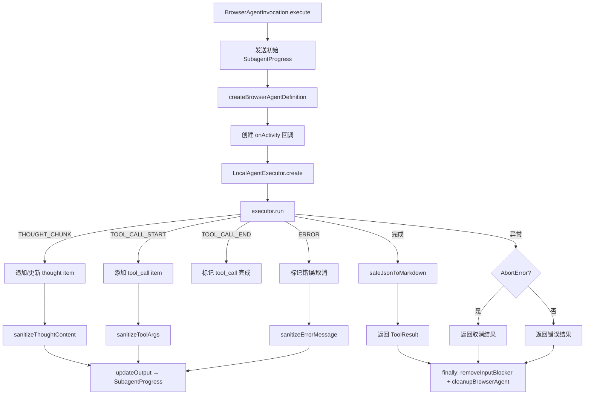

# browserAgentInvocation.ts

> 浏览器代理的调用入口，处理异步工具初始化、执行编排和实时进度流式输出

## 概述

`browserAgentInvocation.ts` 实现了浏览器代理的完整调用生命周期。作为 `BaseToolInvocation` 的子类，它是浏览器代理被 `delegate_to_agent` 调用时实际执行的代码入口。与普通的 `LocalSubagentInvocation` 不同，此调用有三个特殊需求：

1. **异步工具初始化**：调用时才创建 MCP 连接和工具（非提前注册）
2. **实时进度流式输出**：通过 `SubagentProgress` 向 UI 推送思考过程、工具调用状态
3. **安全脱敏**：所有输出内容经过递归敏感信息脱敏处理

该文件还包含了一套完整的安全脱敏工具函数，用于保护用户凭据不被泄露到日志和 UI 中。

## 架构图



## 主要导出

### `BrowserAgentInvocation` (class)

```typescript
class BrowserAgentInvocation extends BaseToolInvocation<AgentInputs, ToolResult> {
  constructor(context: AgentLoopContext, params: AgentInputs, messageBus: MessageBus, _toolName?: string, _toolDisplayName?: string);
  getDescription(): string;
  async execute(signal: AbortSignal, updateOutput?: (output: ToolLiveOutput) => void): Promise<ToolResult>;
}
```

## 核心逻辑

### execute() 执行流程

1. **初始化阶段**：
   - 发送空的 `SubagentProgress`（state: 'running'）
   - 调用 `createBrowserAgentDefinition` 建立 MCP 连接和工具
   - printOutput 回调产生的消息作为 thought 类型的活动记录

2. **运行阶段**：
   - 注册 `onActivity` 回调处理四种事件
   - 创建 `LocalAgentExecutor` 并调用 `run()`
   - 限制活动记录最大数量为 20 条（`MAX_RECENT_ACTIVITY`）

3. **完成阶段**：
   - 将输出转为 JSON/Markdown 格式
   - 发送 state: 'completed' 的最终进度

4. **清理阶段**（finally）：
   - `removeInputBlocker` 移除输入拦截器
   - `cleanupBrowserAgent` 关闭浏览器和 MCP 连接

### 活动事件处理

| 事件类型 | 处理逻辑 |
|---------|---------|
| `THOUGHT_CHUNK` | 如果最后一条活动也是 running 的 thought，追加文本；否则创建新 thought |
| `TOOL_CALL_START` | 创建新的 tool_call 活动（含脱敏后的 args） |
| `TOOL_CALL_END` | 通过 callId 查找并标记为 completed |
| `ERROR` | 查找关联的 running tool_call 标记为 error/cancelled；添加错误 thought |

### 敏感信息脱敏体系

文件包含三层脱敏函数：

#### `sanitizeToolArgs(args: unknown): unknown`
递归遍历对象/数组，将键名匹配敏感模式的值替换为 `[REDACTED]`。

敏感键名模式（17 种）：
```
password, pwd, apikey, api_key, api-key, token, secret, credential,
auth, authorization, access_token, access_key, refresh_token,
session_id, cookie, passphrase, privatekey, private_key, private-key,
secret_key, client_secret, client_id
```

特殊处理：
- 键名先进行 URL 解码（`decodeURIComponent`）再匹配
- 键名统一转小写并去除 `-_` 分隔符后匹配

#### `sanitizeErrorMessage(message: string): string`
四步正则替换：
1. **PEM 内容**：`-----BEGIN...-----END...-----` -> `[REDACTED_PEM]`
2. **键值对**：`key=value` / `key:value` / `--flag value` 模式中敏感键的值
3. **空格分隔**：`password mypass` / `bearer eyJ...` 模式
4. **文件路径**：`.key`、`.pem`、`.p12`、`.pfx` 文件路径

#### `sanitizeThoughtContent(text: string): string`
委托给 `sanitizeErrorMessage`，对 LLM 思考内容进行脱敏。

### 错误处理

- **AbortError**：标记所有 running 活动为 cancelled，返回取消消息
- **其他错误**：标记为 error，返回脱敏后的错误消息
- 错误消息统一经过 `sanitizeErrorMessage` 处理

## 内部依赖

| 模块 | 导入内容 | 用途 |
|------|---------|------|
| `../../config/config.js` | `Config` (type) | 运行时配置 |
| `../../config/agent-loop-context.js` | `AgentLoopContext` (type) | 代理循环上下文 |
| `../local-executor.js` | `LocalAgentExecutor` | 本地代理执行器 |
| `../../utils/markdownUtils.js` | `safeJsonToMarkdown` | JSON 转 Markdown |
| `../../tools/tools.js` | `BaseToolInvocation`, `ToolResult` (type), `ToolLiveOutput` (type) | 工具基类和类型 |
| `../../tools/tool-error.js` | `ToolErrorType` | 错误类型枚举 |
| `../types.js` | `AgentInputs`, `SubagentActivityEvent`, `SubagentProgress`, `SubagentActivityItem` (types) | 代理类型定义 |
| `../../confirmation-bus/message-bus.js` | `MessageBus` (type) | 消息总线 |
| `./browserAgentFactory.js` | `createBrowserAgentDefinition`, `cleanupBrowserAgent` | 工厂和清理函数 |
| `./inputBlocker.js` | `removeInputBlocker` | 输入拦截器移除 |

## 外部依赖

| 包名 | 导入内容 | 用途 |
|------|---------|------|
| `node:crypto` | `randomUUID` | 生成活动项的唯一 ID |
