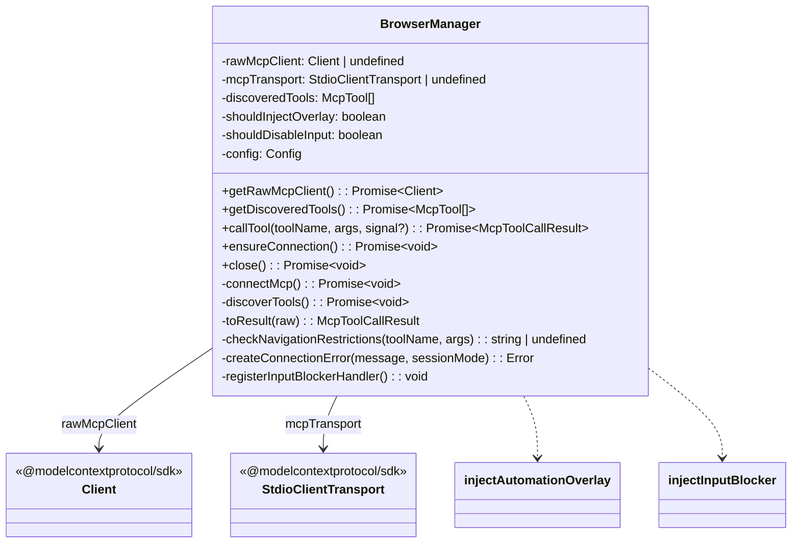

# browserManager.ts

> 浏览器生命周期管理器，维护与 chrome-devtools-mcp 的隔离 MCP 连接

## 概述

`browserManager.ts` 是浏览器代理模块的核心基础设施，管理浏览器进程的生命周期和与 `chrome-devtools-mcp` 之间的 MCP（Model Context Protocol）通信。它封装了一个**隔离的** MCP 客户端——与主代理的工具注册表完全独立，所有浏览器工具仅对浏览器代理可见。

设计动机：
1. **隔离性**：浏览器工具不应出现在主代理的工具列表中，避免误用
2. **生命周期管理**：通过 stdio 传输层控制 `npx chrome-devtools-mcp` 子进程
3. **安全性**：域名白名单限制导航目标，防止浏览器代理访问未授权站点
4. **自愈性**：导航操作后自动重新注入 overlay 和 input blocker

## 架构图



## 主要导出

### `McpContentItem` (interface)

```typescript
interface McpContentItem {
  type: 'text' | 'image';
  text?: string;
  data?: string;      // Base64 图片
  mimeType?: string;  // 如 'image/png'
}
```

### `McpToolCallResult` (interface)

```typescript
interface McpToolCallResult {
  content?: McpContentItem[];
  isError?: boolean;
}
```

### `BrowserManager` (class)

| 方法 | 说明 |
|------|------|
| `constructor(config)` | 读取浏览器配置，判断是否需要 overlay 和 input blocker |
| `getRawMcpClient()` | 获取原始 MCP SDK Client（延迟连接） |
| `getDiscoveredTools()` | 获取从 MCP 服务器动态发现的工具列表 |
| `callTool(name, args, signal?)` | 调用 MCP 工具，内含导航限制检查和 overlay/blocker 自动重注入 |
| `ensureConnection()` | 确保连接已建立（幂等） |
| `close()` | 关闭 MCP 客户端和传输层，终止浏览器进程 |

## 核心逻辑

### MCP 连接建立流程

```
connectMcp()
  |
  v
创建 MCP Client (name: 'gemini-cli-browser-agent')
  |
  v
构建 npx 命令参数
  |-- --experimental-vision （始终启用）
  |-- sessionMode:
  |     'isolated'   → --isolated（临时配置文件）
  |     'persistent'  → --userDataDir（持久配置文件，默认 ~/.gemini/cli-browser-profile/）
  |     'existing'    → --autoConnect（连接已运行的 Chrome）
  |-- headless? → --headless
  |-- profilePath? → --userDataDir <path>
  |-- allowedDomains? → --chromeArg="--host-rules=..."
  |
  v
创建 StdioClientTransport (command: npx, stderr: pipe)
  |
  v
连接到 MCP 服务器（超时：existing 15s / 其他 60s）
  |
  v
discoverTools() → 动态发现工具列表
  |
  v
registerInputBlockerHandler() → 注册通知处理器
```

### callTool 工具调用流程

```
callTool(toolName, args, signal)
  |
  v
1. 检查 signal 是否已 abort
  |
  v
2. checkNavigationRestrictions(toolName, args)
   └─ navigate_page/new_page + allowedDomains → 域名白名单校验
  |
  v
3. 调用 MCP client.callTool (超时 60s)
   └─ 若有 signal，与 AbortSignal 竞赛
  |
  v
4. toResult() 映射响应类型
  |
  v
5. 导航工具成功后自动重注入:
   - shouldInjectOverlay → injectAutomationOverlay
   - shouldDisableInput + 可靠导航工具 → injectInputBlocker
```

### 导航域名白名单

`checkNavigationRestrictions` 仅对 `navigate_page` 和 `new_page` 工具生效：
- 解析目标 URL 的 hostname
- 支持通配符域名（`*.example.com` 匹配 `sub.example.com` 和 `example.com`）
- 不匹配任何白名单域名时返回拒绝消息

### 导航后自动重注入

`POTENTIALLY_NAVIGATING_TOOLS` 集合包含可能导致页面导航的 7 个工具。成功调用后：
- **overlay**：所有导航工具后重注入
- **input blocker**：仅 `navigate_page`、`new_page`、`select_page` 后重注入（这些可靠地替换整个页面 DOM）
- `click`/`click_at` 的 blocker 由 `mcpToolWrapper` 的 suspend/resume 机制处理

### MCP 通知处理器

`registerInputBlockerHandler` 注册了 `fallbackNotificationHandler`，监听 `notifications/resources/updated` 事件（表示页面内容变化），自动重注入 input blocker。这覆盖了所有导航类型（链接点击、表单提交、历史导航），不仅限于显式 navigate_page 调用。

### 连接错误的上下文感知诊断

`createConnectionError` 根据错误消息内容和 `sessionMode` 生成针对性的修复建议：
- "already running" + persistent → 建议关闭其他 Chrome 实例或切换 sessionMode
- 超时 + existing → 提示启用 Chrome 远程调试
- 超时 + persistent → 检查 Chrome 安装和网络
- existing 模式通用错误 → 远程调试启用指南

## 内部依赖

| 模块 | 导入内容 | 用途 |
|------|---------|------|
| `../../utils/debugLogger.js` | `debugLogger` | 日志输出 |
| `../../config/config.js` | `Config` (type) | 运行时配置 |
| `../../config/storage.js` | `Storage` | 获取 Gemini 全局目录路径 |
| `./inputBlocker.js` | `injectInputBlocker` | 导航后重注入输入拦截器 |
| `./automationOverlay.js` | `injectAutomationOverlay` | 导航后重注入自动化覆盖层 |

## 外部依赖

| 包名 | 导入内容 | 用途 |
|------|---------|------|
| `@modelcontextprotocol/sdk/client/index.js` | `Client` | MCP SDK 客户端 |
| `@modelcontextprotocol/sdk/client/stdio.js` | `StdioClientTransport` | 基于 stdio 的 MCP 传输层 |
| `@modelcontextprotocol/sdk/types.js` | `Tool` (type, as McpTool) | MCP 工具定义类型 |
| `node:path` | `path` | 路径拼接 |
