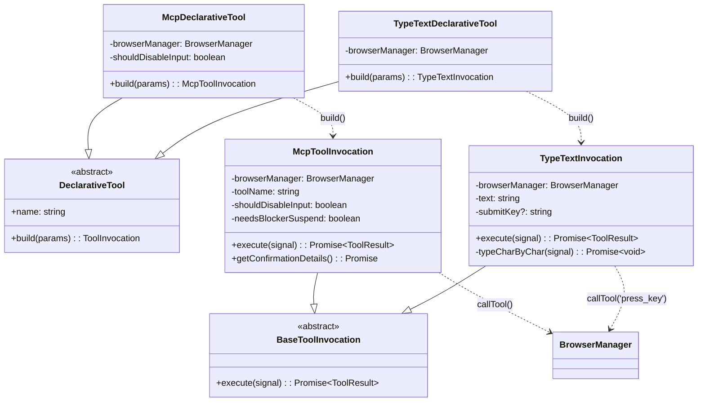

# mcpToolWrapper.ts

> MCP 工具到 DeclarativeTool 的适配层，含自定义 type_text 组合工具和工具描述增强

## 概述

`mcpToolWrapper.ts` 是浏览器代理工具系统的核心适配层。它负责将 `chrome-devtools-mcp` 动态发现的 MCP 工具转换为 Gemini 代理框架可使用的 `DeclarativeTool` 实例，并注册在浏览器代理的隔离工具注册表中（不影响主代理）。

此外，它还实现了：
1. **自定义组合工具 `type_text`**：将多个 `press_key` 调用封装为单次工具调用，避免 N 次模型往返
2. **工具描述增强**：为 MCP 工具追加使用指南（如 uid 使用方式、press_key 限制等）
3. **结果后处理**：检测常见错误模式（overlay 遮挡、stale 引用）并追加修复提示
4. **输入拦截器协调**：交互式工具执行前后自动 suspend/resume input blocker

## 架构图



## 主要导出

### `createMcpDeclarativeTools(browserManager, messageBus, shouldDisableInput?)`

```typescript
async function createMcpDeclarativeTools(
  browserManager: BrowserManager,
  messageBus: MessageBus,
  shouldDisableInput?: boolean,
): Promise<Array<McpDeclarativeTool | TypeTextDeclarativeTool>>
```

主工厂函数。流程：
1. 从 `browserManager.getDiscoveredTools()` 获取 MCP 工具列表
2. 为每个工具创建 `McpDeclarativeTool`（含描述增强）
3. 追加自定义 `TypeTextDeclarativeTool`
4. 返回完整工具数组

### `postProcessToolResult(toolName: string, result: string): string`

工具结果后处理函数。

## 核心逻辑

### McpToolInvocation 执行流程

```
execute(signal)
  |
  v
1. needsBlockerSuspend? → suspendInputBlocker()
   (交互式工具需要暂停输入拦截)
  |
  v
2. browserManager.callTool(name, params, signal)
  |
  v
3. 提取文本内容 + postProcessToolResult()
  |
  v
4. needsBlockerSuspend? → resumeInputBlocker()
  |
  v
5. 返回 ToolResult
  |
  v
(异常) Chrome 连接错误 → 重新抛出（终止代理）
(异常) 其他 → resumeInputBlocker() + 返回错误结果
```

### 输入拦截器 suspend/resume

`INTERACTIVE_TOOLS` 集合定义了需要暂停输入拦截的工具：
```
click, click_at, fill, fill_form, hover, drag, upload_file
```

这些工具需要与页面元素交互，但 input blocker 的 `pointer-events: auto` 会阻挡 hit-testing。解决方案：执行前设为 `pointer-events: none`，执行后恢复。

### TypeTextInvocation 组合工具

`type_text` 将字符串输入封装为逐字符的 `press_key` 调用：

1. 使用 `[...this.text]` 正确处理 Unicode 字符
2. 空格映射为 `'Space'`，其他字符直接传递
3. 可选的 `submitKey` 参数在输入完成后按下指定键（Enter、Tab 等）
4. 支持 AbortSignal 取消

### 工具描述增强（augmentToolDescription）

为 MCP 原始描述追加语境化使用指南：

| 工具名 | 追加的提示 |
|--------|-----------|
| `fill_form` | 一次填充多个标准表单字段，不适用于 canvas/自定义控件 |
| `fill` | 标准 HTML 表单字段，不适用于 Sheets/Notion；失败时改用 click + press_key |
| `click_at` | 使用精确像素坐标 |
| `click` | 使用无障碍树 uid，操作后 uid 失效 |
| `take_snapshot` | 首次和每次状态变更后必须调用 |
| `press_key` | 仅接受单个按键名，文本输入请用 type_text |
| `navigate_page` / `new_page` | 导航后需调用 take_snapshot |
| `hover` | 使用无障碍树 uid |

匹配使用 `toolName.toLowerCase().includes(key)`，更具体的键（如 `fill_form`）排在 `fill` 前面防止短路匹配。

### 结果后处理（postProcessToolResult）

三类后处理：

1. **内嵌快照剥离**：非 `take_snapshot` 工具的响应中如果包含 `## Latest page snapshot`，截断该部分以防止 token 膨胀
2. **覆盖层遮挡检测**：关键词匹配（`not interactable`、`obscured` 等）→ 提示关闭弹窗
3. **stale 引用检测**：关键词匹配（`stale`、`detached`）→ 提示调用 take_snapshot 刷新 uid

### MCP 到 Gemini 的 Schema 转换

`convertMcpToolToFunctionDeclaration` 将 MCP 工具的 `inputSchema`（JSON Schema）直接映射为 Gemini 的 `parametersJsonSchema`，实现零转换损耗。

### 确认机制

`McpToolInvocation` 和 `TypeTextInvocation` 均实现了 `getConfirmationDetails()`，返回 `type: 'mcp'` 的确认详情，使用 `'browser-agent'` 作为 serverName。这允许用户通过策略设置批量信任浏览器代理的工具调用。

## 内部依赖

| 模块 | 导入内容 | 用途 |
|------|---------|------|
| `../../tools/tools.js` | `DeclarativeTool`, `BaseToolInvocation`, `Kind`, `ToolResult` (type), `ToolInvocation` (type), `ToolCallConfirmationDetails` (type), `ToolConfirmationOutcome` (type), `PolicyUpdateOptions` (type) | 工具框架 |
| `../../confirmation-bus/message-bus.js` | `MessageBus` (type) | 消息总线 |
| `./browserManager.js` | `BrowserManager` (type), `McpToolCallResult` (type) | 浏览器管理器 |
| `../../utils/debugLogger.js` | `debugLogger` | 日志输出 |
| `./inputBlocker.js` | `suspendInputBlocker`, `resumeInputBlocker` | 输入拦截器控制 |

## 外部依赖

| 包名 | 导入内容 | 用途 |
|------|---------|------|
| `@google/genai` | `FunctionDeclaration` (type) | Gemini 函数声明类型 |
| `@modelcontextprotocol/sdk/types.js` | `Tool` (type, as McpTool) | MCP 工具定义类型 |
