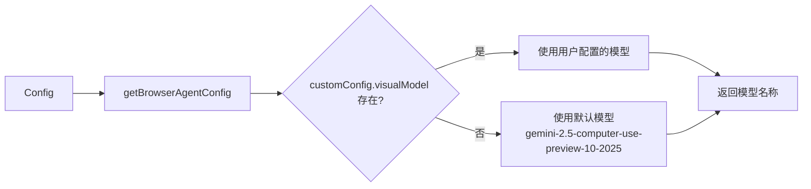

# modelAvailability.ts

> 浏览器代理的视觉模型配置与解析工具

## 概述

`modelAvailability.ts` 负责确定浏览器代理视觉分析功能所使用的 AI 模型。它提供了默认的 Computer Use 模型标识符以及一个从运行时配置中解析实际使用模型的函数。

在模块中的角色：作为浏览器代理视觉能力的模型层配置入口，被 `analyzeScreenshot.ts` 和 `browserAgentFactory.ts` 调用以确定是否启用视觉功能以及使用哪个模型。

## 架构图



## 主要导出

### `VISUAL_AGENT_MODEL` (常量)

```typescript
const VISUAL_AGENT_MODEL = 'gemini-2.5-computer-use-preview-10-2025';
```
默认的视觉代理模型标识符，具备 Computer Use（计算机操控）能力的 Gemini 模型。

### `getVisualAgentModel(config: Config): string`

从运行时配置中获取视觉代理模型名称。优先使用 `browserAgentConfig.customConfig.visualModel`，若未配置则回退到 `VISUAL_AGENT_MODEL` 默认值。

## 核心逻辑

函数逻辑非常简洁：通过 `config.getBrowserAgentConfig()` 获取浏览器代理配置，使用空值合并运算符（`??`）实现配置优先、默认兜底的策略。每次调用都会输出调试日志记录实际使用的模型名。

## 内部依赖

| 模块 | 导入内容 | 用途 |
|------|---------|------|
| `../../config/config.js` | `Config` (type) | 运行时配置对象 |
| `../../utils/debugLogger.js` | `debugLogger` | 调试日志输出 |

## 外部依赖

无。
