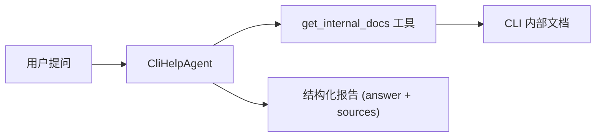

# cli-help-agent.ts

> 定义 CLI Help Agent，一个专门回答 Gemini CLI 相关问题的内置代理，利用内部文档和运行时状态提供准确的帮助信息。

## 概述

该文件导出 `CliHelpAgent` 工厂函数，创建一个专注于回答 Gemini CLI 使用问题的本地代理定义。该代理具有以下特点：

- 使用 Flash 模型（低延迟、低成本）。
- 配备 `get_internal_docs` 工具，可以检索 CLI 内部文档。
- 输出结构化的 JSON 报告，包含答案和引用的文档来源。
- 系统提示词中注入运行时上下文（CLI 版本、当前模型、日期）。

在 agents 模块中，该代理是内置的"帮助"代理，当用户询问 CLI 本身的功能时被调度执行。

## 架构图



## 主要导出

### 函数 `CliHelpAgent`

```typescript
export const CliHelpAgent = (
  context: AgentLoopContext,
): AgentDefinition<typeof CliHelpReportSchema> => ({ ... })
```

工厂函数，接收 `AgentLoopContext` 上下文，返回完整的 `AgentDefinition` 配置。

#### 代理配置详情

| 配置项 | 值 | 说明 |
|--------|-----|------|
| `name` | `'cli_help'` | 代理内部标识 |
| `kind` | `'local'` | 本地代理 |
| `displayName` | `'CLI Help Agent'` | 显示名称 |
| `model` | `GEMINI_MODEL_ALIAS_FLASH` | 使用 Flash 模型 |
| `temperature` | `0.1` | 低温度，确保回答精确 |
| `maxTimeMinutes` | `3` | 最大运行 3 分钟 |
| `maxTurns` | `10` | 最多 10 轮对话 |
| `thinkingBudget` | `-1` | 无限制思考预算 |

#### 输入 Schema

```json
{
  "type": "object",
  "properties": {
    "question": {
      "type": "string",
      "description": "The specific question about Gemini CLI."
    }
  },
  "required": ["question"]
}
```

#### 输出 Schema (`CliHelpReportSchema`)

```typescript
z.object({
  answer: z.string(),   // 详细回答
  sources: z.array(z.string()),  // 引用的文档文件列表
})
```

#### `processOutput`

将结构化输出 JSON 格式化为缩进的字符串表示。

## 核心逻辑

### 系统提示词设计

系统提示词包含以下关键指令：
1. **文档探索**：指导代理使用 `get_internal_docs` 工具，无参数调用时列出所有可用文档。
2. **精确回答**：结合运行时上下文和文档给出准确答案。
3. **引用来源**：报告中必须包含使用的文档文件。
4. **非交互模式**：代理在循环中运行，不能向用户追问，模糊问题尽力回答。

### 运行时上下文注入

系统提示词中使用模板变量（`${cliVersion}`、`${activeModel}`、`${today}`），在运行时被实际值替换。

## 内部依赖

| 模块 | 用途 |
|------|------|
| `./types.js` | `AgentDefinition` 类型 |
| `../config/models.js` | `GEMINI_MODEL_ALIAS_FLASH` — Flash 模型别名 |
| `../tools/get-internal-docs.js` | `GetInternalDocsTool` — 内部文档检索工具 |
| `../config/agent-loop-context.js` | `AgentLoopContext` 类型 |

## 外部依赖

| 包名 | 用途 |
|------|------|
| `zod` | 输出 Schema 定义（`CliHelpReportSchema`） |
