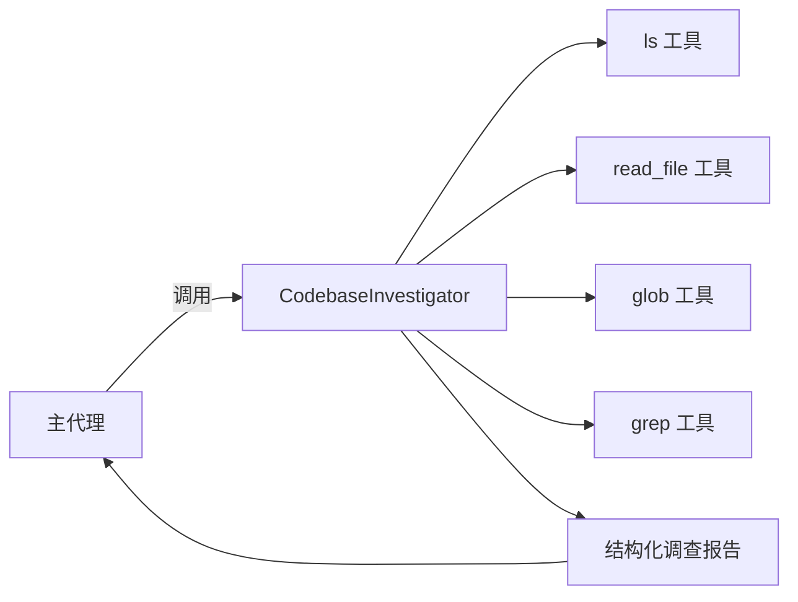

# codebase-investigator.ts

> 定义 Codebase Investigator Agent，一个专门用于代码库分析、架构映射和系统依赖理解的子代理。

## 概述

该文件导出 `CodebaseInvestigatorAgent` 工厂函数，创建一个专注于深度代码库调查的本地代理定义。当用户提出模糊请求、需要定位 Bug 根因、进行系统重构或理解代码架构时，该代理被调度执行。

该代理的核心设计理念是"深度分析而非简单文件查找"——它不仅要找到相关文件，还要理解代码的设计意图、依赖关系和潜在的变更影响。最终输出一份结构化的 JSON 调查报告，包含发现摘要、探索轨迹和关键代码位置。

## 架构图



## 主要导出

### 函数 `CodebaseInvestigatorAgent`

```typescript
export const CodebaseInvestigatorAgent = (
  config: Config,
): LocalAgentDefinition<typeof CodebaseInvestigationReportSchema> => ({ ... })
```

工厂函数，接收全局配置，返回完整的代理定义。

#### 代理配置详情

| 配置项 | 值 | 说明 |
|--------|-----|------|
| `name` | `'codebase_investigator'` | 代理内部标识 |
| `kind` | `'local'` | 本地代理 |
| `displayName` | `'Codebase Investigator Agent'` | 显示名称 |
| `model` | 动态选择 | 主模型支持现代特性时用 Preview Flash，否则用默认 Pro |
| `temperature` | `0.1` | 低温度，确保分析精确 |
| `maxTimeMinutes` | `3` | 最大运行 3 分钟 |
| `maxTurns` | `10` | 最多 10 轮工具调用 |
| `tools` | `ls`, `read_file`, `glob`, `grep` | 仅只读工具 |

#### 输出 Schema (`CodebaseInvestigationReportSchema`)

```typescript
z.object({
  SummaryOfFindings: z.string(),        // 调查结论和洞察摘要
  ExplorationTrace: z.array(z.string()), // 逐步的操作和工具使用记录
  RelevantLocations: z.array(z.object({
    FilePath: z.string(),               // 相关文件路径
    Reasoning: z.string(),              // 选择原因
    KeySymbols: z.array(z.string()),    // 关键符号名
  })),
})
```

## 核心逻辑

### 模型选择策略

根据主模型是否支持现代特性（`supportsModernFeatures`）动态选择子代理的模型：
- 支持时：使用 `PREVIEW_GEMINI_FLASH_MODEL`（更快、更低成本）。
- 不支持时：回退到 `DEFAULT_GEMINI_MODEL`（Pro 模型）。

对应地，思考配置也有差异：
- 现代模型：使用 `ThinkingLevel.HIGH`。
- 传统模型：使用 `DEFAULT_THINKING_MODE` 预算。

### 系统提示词设计

系统提示词精心设计了以下几个方面：

1. **角色定位**：逆向工程专家，专注于构建代码的完整心智模型。
2. **核心指令**：
   - 深度分析而非简单查找文件。
   - 系统化且好奇的探索方式。
   - 全面且精确——找到需要理解或修改的完整最小集合。
3. **Scratchpad 管理**：要求代理维护一个"草稿本"，包含检查清单、待解决问题、关键发现和可忽略路径。
4. **终止条件**：所有待解决问题清空后才能完成任务。

### 跨平台兼容

目录列表命令根据 `process.platform` 动态选择：
- Windows：`dir /s` 或 `Get-ChildItem -Recurse`
- 其他平台：`ls -R`

## 内部依赖

| 模块 | 用途 |
|------|------|
| `./types.js` | `LocalAgentDefinition` 类型 |
| `../tools/tool-names.js` | 工具名称常量（`GLOB_TOOL_NAME`, `GREP_TOOL_NAME`, `LS_TOOL_NAME`, `READ_FILE_TOOL_NAME`） |
| `../config/models.js` | 模型相关常量和函数（`DEFAULT_THINKING_MODE`, `DEFAULT_GEMINI_MODEL`, `PREVIEW_GEMINI_FLASH_MODEL`, `supportsModernFeatures`） |
| `../config/config.js` | `Config` 类型 |

## 外部依赖

| 包名 | 用途 |
|------|------|
| `zod` | 输出 Schema 定义 |
| `@google/genai` | `ThinkingLevel` 枚举 |
