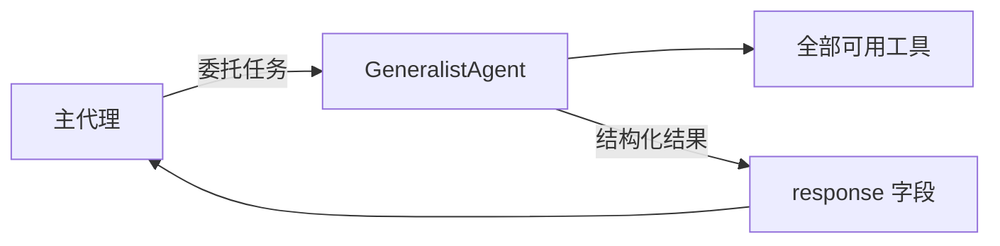

# generalist-agent.ts

> 定义 Generalist Agent，一个拥有全部工具访问权限的通用子代理，用于处理高轮次或大数据量的任务。

## 概述

该文件导出 `GeneralistAgent` 工厂函数，创建一个通用型本地子代理。与主代理不同的是，该代理在非交互模式下运行，适用于需要大量工具调用轮次或处理大量数据的场景——如批量重构、多文件错误修复、高输出量命令执行和探索性调查。

其设计目标是将高消耗的任务从主会话中分离出来，保持主会话历史精简高效。它继承主代理的模型和核心系统提示词，但拥有更高的超时和轮次限制。

## 架构图



## 主要导出

### 函数 `GeneralistAgent`

```typescript
export const GeneralistAgent = (
  context: AgentLoopContext,
): LocalAgentDefinition<typeof GeneralistAgentSchema> => ({ ... })
```

工厂函数，接收 `AgentLoopContext` 上下文，返回完整的代理定义。

#### 代理配置详情

| 配置项 | 值 | 说明 |
|--------|-----|------|
| `name` | `'generalist'` | 代理内部标识 |
| `kind` | `'local'` | 本地代理 |
| `displayName` | `'Generalist Agent'` | 显示名称 |
| `model` | `'inherit'` | 继承主代理的模型 |
| `maxTimeMinutes` | `10` | 最大运行 10 分钟 |
| `maxTurns` | `20` | 最多 20 轮对话 |
| `tools` | 全部工具 | 通过 `toolRegistry.getAllToolNames()` 动态获取 |

#### 输入 Schema

```json
{
  "type": "object",
  "properties": {
    "request": {
      "type": "string",
      "description": "The task or question for the generalist agent."
    }
  },
  "required": ["request"]
}
```

#### 输出 Schema (`GeneralistAgentSchema`)

```typescript
z.object({
  response: z.string(),  // 代理的最终响应
})
```

## 核心逻辑

### 动态配置获取

`toolConfig` 和 `promptConfig` 使用 getter 属性（`get` 访问器），确保在代理实例化时动态获取最新的工具列表和系统提示词：

- **`toolConfig`**：通过 `context.toolRegistry.getAllToolNames()` 获取当前注册的所有工具名称，确保代理拥有完整的工具访问权限。
- **`promptConfig`**：调用 `getCoreSystemPrompt` 生成核心系统提示词，参数 `interactiveOverride = false` 表示非交互模式（代理不能向用户追问），`useMemory = undefined` 表示使用默认的记忆设置。

### 模型继承

`model: 'inherit'` 表示该代理使用与主代理相同的模型，避免不必要的模型切换开销。

## 内部依赖

| 模块 | 用途 |
|------|------|
| `../config/agent-loop-context.js` | `AgentLoopContext` 类型 |
| `../core/prompts.js` | `getCoreSystemPrompt` — 生成核心系统提示词 |
| `./types.js` | `LocalAgentDefinition` 类型 |

## 外部依赖

| 包名 | 用途 |
|------|------|
| `zod` | 输出 Schema 定义 |
