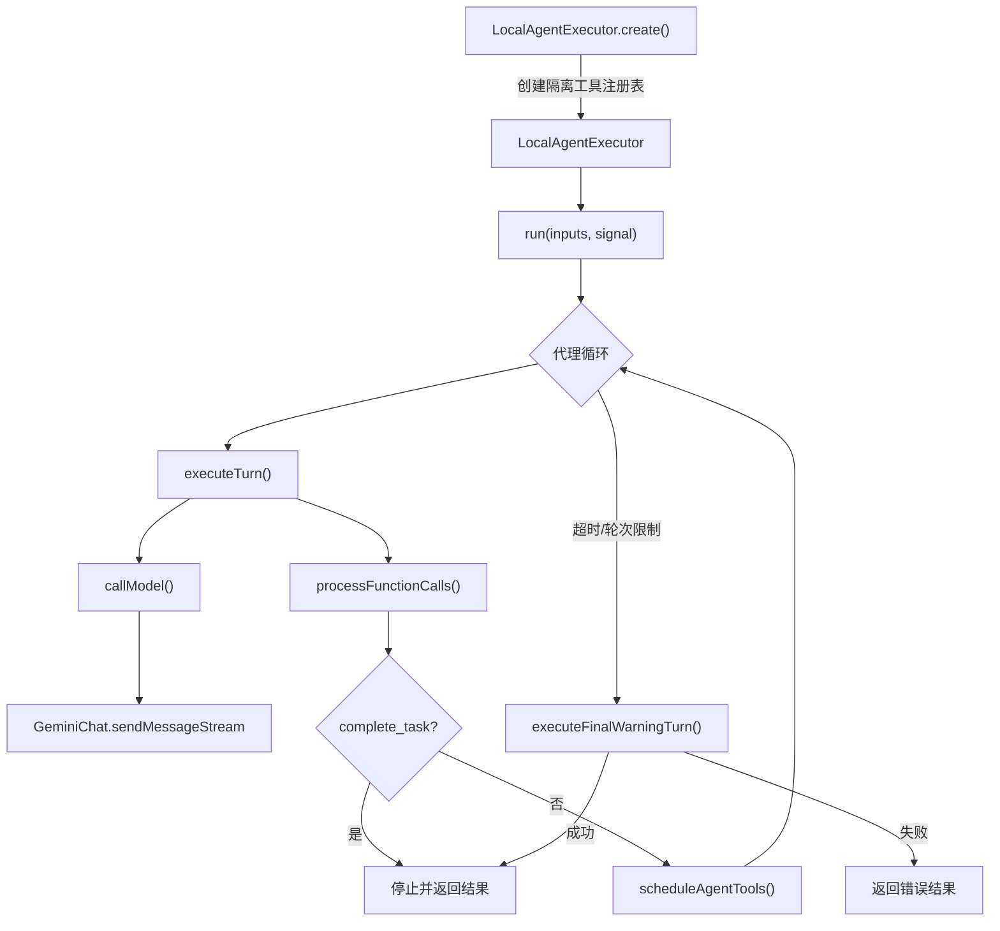

# local-executor.ts

> 实现本地代理的执行引擎，在循环中调用模型和工具直到代理通过 `complete_task` 完成任务。

## 概述

该文件是本地代理执行的核心引擎，实现了 `LocalAgentExecutor` 类。它负责：

1. **创建隔离的工具注册表**：根据代理定义中声明的工具列表，从父注册表中筛选并注册允许使用的工具，防止代理递归调用其他子代理。
2. **执行代理循环**：反复调用 LLM 模型，处理模型返回的工具调用请求，将结果反馈给模型，直到代理调用 `complete_task` 完成任务。
3. **管理终止条件**：包括最大轮次、超时、外部中断、协议违规（未调用 `complete_task`）。
4. **优雅恢复**：当代理因超时或达到最大轮次而终止时，给予 1 分钟的宽限期尝试恢复。
5. **对话压缩**：在轮次之间尝试压缩对话历史以控制 token 使用。

在 agents 模块中，该文件是 `local-invocation.ts` 的下游执行者，是本地代理实际运行的核心。

## 架构图



## 主要导出

### 类型 `ActivityCallback`

```typescript
export type ActivityCallback = (activity: SubagentActivityEvent) => void;
```

代理活动事件的回调函数类型。

### 函数 `createUnauthorizedToolError`

```typescript
export function createUnauthorizedToolError(toolName: string): string
```

生成未授权工具调用的错误消息。

### 类 `LocalAgentExecutor<TOutput extends z.ZodTypeAny>`

泛型类，`TOutput` 是代理输出 Schema 的 Zod 类型。

#### `static async create(definition, context, onActivity?): Promise<LocalAgentExecutor<TOutput>>`

工厂方法，创建并验证执行器实例：
1. 创建子代理专用的消息总线代理（注入子代理名称到确认请求）。
2. 创建隔离的工具注册表，支持以下方式注册工具：
   - 全局通配符 `*`：注册所有工具。
   - MCP 通配符 `mcp:*` 或 `mcp:<server>:*`：注册 MCP 工具。
   - 具名工具：从父注册表中查找并注册。
   - 工具实例：直接注册。
3. 排除其他子代理工具以防止递归。

#### `async run(inputs, signal): Promise<OutputObject>`

代理的主执行方法：
1. 初始化 `DeadlineTimer` 管理超时。
2. 注入运行时上下文（CLI 版本、当前模型、日期）。
3. 准备工具列表和 `GeminiChat` 实例。
4. 进入主循环，每轮执行 `executeTurn`。
5. 监听用户引导提示（hints）并注入到下一轮。
6. 终止后尝试优雅恢复。

## 核心逻辑

### 工具调用处理 (`processFunctionCalls`)

将模型返回的工具调用分为三类处理：
1. **`complete_task`**：验证输出 Schema（如有定义），处理结构化输出或默认 `result` 参数。
2. **未授权工具**：返回错误响应。
3. **普通工具**：通过 `scheduleAgentTools` 批量调度执行。

所有结果按原始调用顺序重组为 `Content` 返回给模型。

### 优雅恢复机制 (`executeFinalWarningTurn`)

当代理因超时、最大轮次或协议违规而终止时：
1. 发送包含终止原因和要求立即调用 `complete_task` 的消息。
2. 给予 1 分钟宽限期。
3. 如果代理在宽限期内成功调用 `complete_task`，视为恢复成功。
4. 记录恢复尝试的遥测事件。

### 对话压缩 (`tryCompressChat`)

在每轮开始前尝试压缩对话历史：
- `COMPRESSED`：成功压缩，更新历史。
- `COMPRESSION_FAILED_INFLATED_TOKEN_COUNT`：压缩失败（膨胀），标记避免再次尝试。
- `CONTENT_TRUNCATED`：内容截断（之前压缩失败后的降级策略）。

### 模型路由

当模型配置为 `auto` 时，使用 `ModelRouterService` 进行动态路由。路由失败时回退到默认 Pro 模型。

### `complete_task` 工具注入

`prepareToolsList` 方法始终注入 `complete_task` 工具声明。如果定义了 `outputConfig`，使用 `zodToJsonSchema` 将 Zod Schema 转换为 JSON Schema 作为参数定义；否则使用默认的 `result` 字符串参数。

## 内部依赖

| 模块 | 用途 |
|------|------|
| `../config/config.js` | `Config` 类型 |
| `../config/agent-loop-context.js` | `AgentLoopContext` 类型 |
| `../utils/errorReporting.js` | `reportError` — 错误上报 |
| `../core/geminiChat.js` | `GeminiChat`, `StreamEventType` — Gemini 对话管理 |
| `../tools/tool-registry.js` | `ToolRegistry` — 工具注册表 |
| `../tools/tools.js` | `AnyDeclarativeTool` 类型 |
| `../tools/mcp-tool.js` | MCP 工具相关函数和常量 |
| `../core/turn.js` | `CompressionStatus` — 压缩状态枚举 |
| `../scheduler/types.js` | `ToolCallRequestInfo` 类型 |
| `../confirmation-bus/types.js` | `Message` 类型 |
| `../services/chatCompressionService.js` | `ChatCompressionService` — 对话压缩服务 |
| `../utils/environmentContext.js` | `getDirectoryContextString` — 环境上下文 |
| `../utils/promptIdContext.js` | `promptIdContext` — 提示 ID 上下文 |
| `../telemetry/loggers.js` | 遥测日志函数 |
| `../telemetry/types.js` | 遥测事件类型 |
| `./types.js` | 代理定义类型和常量 |
| `../utils/errors.js` | `getErrorMessage` |
| `./utils.js` | `templateString` — 模板字符串替换 |
| `../config/models.js` | 模型相关常量和函数 |
| `../routing/routingStrategy.js` | `RoutingContext` 类型 |
| `../utils/thoughtUtils.js` | `parseThought` — 思考内容解析 |
| `../utils/debugLogger.js` | `debugLogger` |
| `./registry.js` | `getModelConfigAlias` — 获取模型配置别名 |
| `../utils/version.js` | `getVersion` — 获取 CLI 版本 |
| `../utils/toolCallContext.js` | `getToolCallContext` — 获取工具调用上下文 |
| `./agent-scheduler.js` | `scheduleAgentTools` — 批量调度工具 |
| `../utils/deadlineTimer.js` | `DeadlineTimer` — 可暂停的截止时间计时器 |
| `../utils/fastAckHelper.js` | `formatUserHintsForModel` — 格式化用户提示 |

## 外部依赖

| 包名 | 用途 |
|------|------|
| `@google/genai` | Gemini API 类型（Type, Content, Part, FunctionCall, FunctionDeclaration, Schema） |
| `zod` | 泛型类型约束和 Schema 验证 |
| `zod-to-json-schema` | 将 Zod Schema 转换为 JSON Schema |
