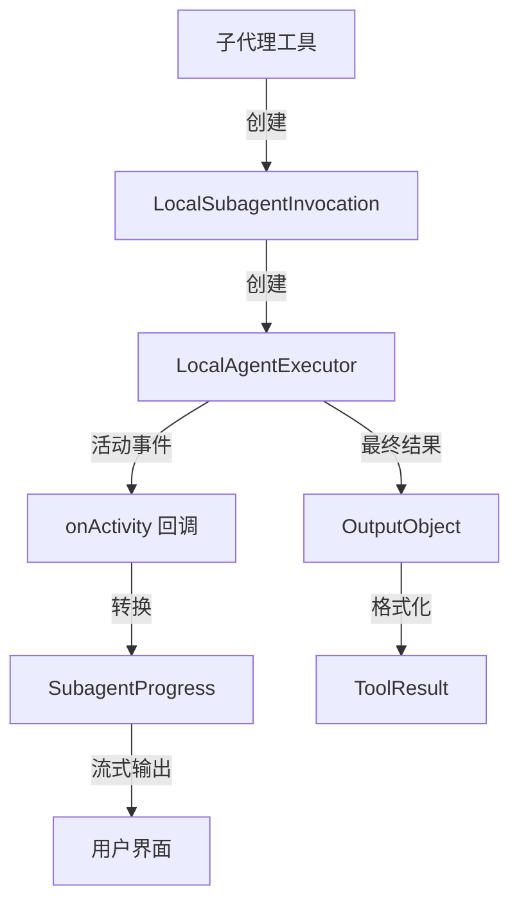

# local-invocation.ts

> 将本地子代理封装为可执行的工具调用实例，桥接代理执行器与工具系统的流式输出。

## 概述

该文件实现了 `LocalSubagentInvocation` 类，它是本地子代理在工具系统中的具体调用实例。当主代理决定调用一个子代理时，系统会创建该类的实例来执行子代理。

该类的核心职责是：
1. 初始化 `LocalAgentExecutor` 并运行代理循环。
2. 将代理的流式活动事件（思考、工具调用开始/结束、错误）桥接为工具的实时输出（`ToolLiveOutput`），使 UI 能够展示子代理的执行进度。
3. 将代理的最终结果格式化为 `ToolResult`，包含 LLM 可用的内容和用户可见的显示内容。

## 架构图



## 主要导出

### 类 `LocalSubagentInvocation`

继承 `BaseToolInvocation<AgentInputs, ToolResult>`，代表一次本地子代理的具体调用。

#### 构造函数

```typescript
constructor(
  definition: LocalAgentDefinition,
  context: AgentLoopContext,
  params: AgentInputs,
  messageBus: MessageBus,
  _toolName?: string,
  _toolDisplayName?: string,
)
```

#### `getDescription(): string`

返回简洁的人类可读调用描述，用于日志和展示。输入参数预览截断为 50 字符，总描述截断为 200 字符。

#### `async execute(signal, updateOutput?): Promise<ToolResult>`

执行子代理：
1. 发送初始进度状态。
2. 创建活动回调函数，将代理事件转换为 `SubagentProgress`。
3. 创建并运行 `LocalAgentExecutor`。
4. 处理终止结果，格式化为 `ToolResult`。
5. 错误处理：区分用户取消（AbortError）和执行错误。

## 核心逻辑

### 活动事件桥接

`onActivity` 回调函数将代理的四种活动事件转换为 `SubagentActivityItem`：

| 事件类型 | 处理逻辑 |
|----------|----------|
| `THOUGHT_CHUNK` | 追加到最后一个运行中的 thought 条目，或创建新条目 |
| `TOOL_CALL_START` | 创建新的 tool_call 条目（包含名称、显示名、描述、参数） |
| `TOOL_CALL_END` | 将最后一个同名运行中的 tool_call 标记为 completed |
| `ERROR` | 区分取消和错误，更新相关条目状态，添加错误信息条目 |

活动列表限制最多保留 3 条最近记录（`MAX_RECENT_ACTIVITY`）。

### 结果格式化

根据终止原因的不同，生成不同格式的显示内容：
- **`GOAL`**（正常完成）：直接展示结果的 Markdown 格式。
- **其他原因**（提前终止）：展示带有终止原因和结果摘要的结构化 Markdown。

`llmContent` 始终包含完整的结构化文本，供主代理继续推理。

### 错误处理策略

- **AbortError**（用户取消）：将所有运行中的活动标记为 `cancelled`，设置进度状态为 `cancelled`，重新抛出错误。
- **其他错误**：将活动标记为 `error`，返回包含错误信息的 `ToolResult`（不设置 `error` 属性，让 UI 渲染富进度显示而非原始错误消息）。

## 内部依赖

| 模块 | 用途 |
|------|------|
| `../config/agent-loop-context.js` | `AgentLoopContext` 类型 |
| `./local-executor.js` | `LocalAgentExecutor` — 本地代理执行器 |
| `../utils/markdownUtils.js` | `safeJsonToMarkdown` — JSON 转 Markdown |
| `../tools/tools.js` | `BaseToolInvocation`, `ToolResult`, `ToolLiveOutput` |
| `./types.js` | 代理定义类型和事件类型 |
| `../confirmation-bus/message-bus.js` | `MessageBus` 类型 |

## 外部依赖

| 包名 | 用途 |
|------|------|
| `node:crypto` | `randomUUID` — 生成活动条目 ID |
