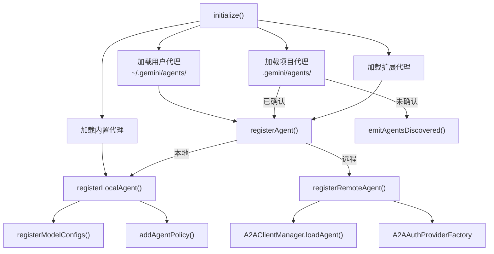

# registry.ts

> 管理代理的发现、加载、校验和注册，是代理系统的核心注册中心。

## 概述

该文件实现了 `AgentRegistry` 类，是整个代理子系统的中央注册表。它负责：

1. **内置代理加载**：注册 CodebaseInvestigator、CliHelp、Generalist 和 Browser（可选）等内置代理。
2. **用户级代理加载**：从 `~/.gemini/agents/` 目录加载用户定义的代理。
3. **项目级代理加载**：从 `.gemini/agents/` 目录加载项目定义的代理，支持文件夹信任和代理确认机制。
4. **扩展代理加载**：从已激活的扩展中加载代理。
5. **远程代理注册**：通过 A2A 协议加载远程代理的 AgentCard 并注册。
6. **配置覆盖**：支持通过设置文件覆盖代理的运行配置和模型配置。
7. **策略管理**：为每个注册的代理动态添加执行策略（本地代理自动允许，远程代理需用户确认）。
8. **模型配置注册**：为每个代理注册独立的模型配置。

## 架构图



## 主要导出

### 函数 `getModelConfigAlias`

```typescript
export function getModelConfigAlias<TOutput extends z.ZodTypeAny>(
  definition: AgentDefinition<TOutput>,
): string
```

返回代理的模型配置别名，格式为 `<agent-name>-config`。

### 类 `AgentRegistry`

代理注册中心。

#### `async initialize(): Promise<void>`

初始化注册表，监听模型变更事件，加载所有代理。

#### `async reload(): Promise<void>`

清除缓存并重新加载所有代理。同时清除 A2A 客户端管理器缓存。

#### `async acknowledgeAgent(agent): Promise<void>`

确认并注册一个之前未确认的代理，持久化确认状态。

#### `dispose(): void`

释放资源，移除事件监听器。

#### `getDefinition(name): AgentDefinition | undefined`

按名称获取已注册的代理定义。

#### `getAllDefinitions(): AgentDefinition[]`

获取所有已激活的代理定义。

#### `getAllAgentNames(): string[]`

获取所有已注册的代理名称。

#### `getAllDiscoveredAgentNames(): string[]`

获取所有已发现的代理名称（包括未启用的）。

#### `getDiscoveredDefinition(name): AgentDefinition | undefined`

获取已发现但可能未启用的代理定义。

## 核心逻辑

### 代理加载优先级

加载顺序决定了同名代理的覆盖优先级：
1. 内置代理（最低）
2. 用户级代理（`~/.gemini/agents/`）
3. 项目级代理（`.gemini/agents/`）
4. 扩展代理（最高）

### 项目级代理的安全机制

项目级代理有两层安全保护：
1. **文件夹信任**：如果启用了文件夹信任且当前文件夹不受信任，跳过项目代理。
2. **代理确认**：未确认的代理不会被注册，而是通过 `emitAgentsDiscovered` 事件通知 UI。远程代理使用 `agentCardUrl` 作为哈希值。

### 远程代理注册流程

1. 如果定义了认证配置，通过 `A2AAuthProviderFactory` 创建认证处理器。
2. 通过 `A2AClientManager.loadAgent` 加载 AgentCard。
3. 校验 AgentCard 的安全方案与认证配置是否匹配。
4. 合并用户描述、AgentCard 描述和技能列表作为最终描述。
5. 对已知错误（`A2AAgentError`）提供用户友好的错误消息。

### 配置覆盖机制

`applyOverrides` 方法使用 `Object.create` 保持原始定义的 lazy getter 不被破坏，仅覆盖 `runConfig` 和 `modelConfig`。

### 动态策略注册

`addAgentPolicy` 为每个代理注册执行策略：
- 本地代理：`PolicyDecision.ALLOW`（自动允许）
- 远程代理：`PolicyDecision.ASK_USER`（需用户确认）

如果用户已为该工具定义了自定义策略，尊重用户策略。

### 模型配置注册

`registerModelConfigs` 为每个本地代理注册独立的模型配置：
- `model: 'inherit'` 会被解析为当前主模型。
- `auto` 模型会额外注册运行时模型覆盖。

## 内部依赖

| 模块 | 用途 |
|------|------|
| `../config/storage.js` | `Storage` — 获取用户代理目录 |
| `../utils/events.js` | `CoreEvent`, `coreEvents` — 事件系统 |
| `../config/config.js` | `Config`, `AgentOverride` 类型 |
| `./types.js` | `AgentDefinition`, `LocalAgentDefinition` 类型 |
| `./agentLoader.js` | `loadAgentsFromDirectory` — 从目录加载代理 |
| `./codebase-investigator.js` | `CodebaseInvestigatorAgent` — 内置代理 |
| `./cli-help-agent.js` | `CliHelpAgent` — 内置代理 |
| `./generalist-agent.js` | `GeneralistAgent` — 内置代理 |
| `./browser/browserAgentDefinition.js` | `BrowserAgentDefinition` — 浏览器代理 |
| `./a2a-client-manager.js` | `A2AClientManager` — A2A 客户端管理器 |
| `./auth-provider/factory.js` | `A2AAuthProviderFactory` — 认证提供者工厂 |
| `../utils/debugLogger.js` | `debugLogger` — 调试日志 |
| `../config/models.js` | `isAutoModel` — 判断自动模型 |
| `../services/modelConfigService.js` | `ModelConfig`, `ModelConfigService` |
| `../policy/types.js` | `PolicyDecision`, `PRIORITY_SUBAGENT_TOOL` |
| `./a2a-errors.js` | `A2AAgentError`, `AgentAuthConfigMissingError` |

## 外部依赖

| 包名 | 用途 |
|------|------|
| `@a2a-js/sdk/client` | `AuthenticationHandler` 类型 |
| `zod` | 泛型类型约束 |
