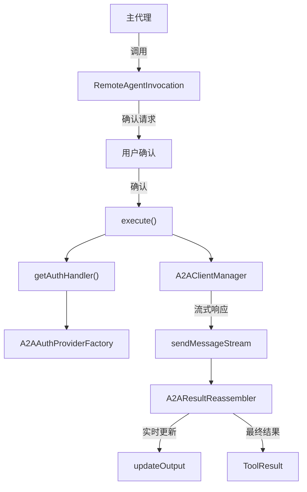

# remote-invocation.ts

> 将远程 A2A 代理封装为可执行的工具调用实例，直接代理到远程代理而跳过本地执行循环。

## 概述

该文件实现了 `RemoteAgentInvocation` 类，是远程 A2A 代理在工具系统中的具体调用实例。与本地代理不同，远程代理不经过 `LocalAgentExecutor` 循环，而是直接通过 `A2AClientManager` 与远程代理通信。

该类的核心职责：
1. 管理与远程代理的会话状态（contextId、taskId）。
2. 处理认证（按需创建认证处理器）。
3. 流式接收远程代理的响应，通过 `A2AResultReassembler` 重组为完整结果。
4. 将流式进度实时推送到 UI。
5. 提供用户友好的错误消息。

## 架构图



## 主要导出

### 类 `RemoteAgentInvocation`

继承 `BaseToolInvocation<RemoteAgentInputs, ToolResult>`，代表一次远程 A2A 代理调用。

#### 静态属性 `sessionState`

```typescript
private static readonly sessionState = new Map<
  string,
  { contextId?: string; taskId?: string }
>();
```

跨调用实例保持会话状态（contextId 和 taskId），使得同一远程代理的多次调用可以维持对话连续性。

#### 构造函数

```typescript
constructor(
  definition: RemoteAgentDefinition,
  params: AgentInputs,
  messageBus: MessageBus,
  _toolName?: string,
  _toolDisplayName?: string,
)
```

从参数中提取 `query`，默认为 `DEFAULT_QUERY_STRING`。

#### `getDescription(): string`

返回调用描述字符串。

#### `async execute(signal, updateOutput?): Promise<ToolResult>`

执行远程代理调用：
1. 恢复之前的会话状态。
2. 创建认证处理器（如需要）。
3. 确保代理已加载（利用缓存）。
4. 流式发送消息，逐块更新 UI 和重组器。
5. 从响应中提取 contextId/taskId 维持会话。
6. 返回格式化的 `ToolResult`。

## 核心逻辑

### 会话状态持久化

`sessionState` 是一个静态 Map，按代理名称存储 `contextId` 和 `taskId`。这允许跨多次工具调用保持与远程代理的对话连续性。即使在执行出错时，`finally` 块也会持久化当前状态。

### 认证处理

`getAuthHandler` 方法使用懒初始化模式创建认证处理器：
- 如果已创建，直接返回缓存。
- 否则通过 `A2AAuthProviderFactory.create` 创建并缓存。

### 确认机制

`getConfirmationDetails` 始终返回确认详情，要求用户在调用远程代理前进行确认。返回 `info` 类型的确认请求，展示代理名称和查询内容。

### 流式响应处理

使用 `for await...of` 遍历远程代理的流式响应：
1. 每个 chunk 都通过 `reassembler.update` 更新。
2. 通过 `updateOutput` 回调实时推送当前重组状态。
3. 通过 `extractIdsFromResponse` 提取并更新会话 ID。
4. 当任务进入终态时清除 `taskId`。

### 错误处理

`formatExecutionError` 方法：
- 对 `A2AAgentError` 使用其 `userMessage` 字段。
- 对其他错误使用通用格式。

即使出错，已接收的部分输出也会通过 `reassembler.toString()` 包含在结果中。

## 内部依赖

| 模块 | 用途 |
|------|------|
| `../tools/tools.js` | `BaseToolInvocation`, `ToolResult`, 确认相关类型 |
| `./types.js` | `DEFAULT_QUERY_STRING`, `RemoteAgentInputs`, `RemoteAgentDefinition`, `AgentInputs` |
| `../confirmation-bus/message-bus.js` | `MessageBus` 类型 |
| `./a2a-client-manager.js` | `A2AClientManager`, `SendMessageResult` |
| `./a2aUtils.js` | `extractIdsFromResponse`, `A2AResultReassembler` |
| `../utils/debugLogger.js` | `debugLogger` |
| `../utils/markdownUtils.js` | `safeJsonToMarkdown` |
| `../utils/terminalSerializer.js` | `AnsiOutput` 类型 |
| `./auth-provider/factory.js` | `A2AAuthProviderFactory` |
| `./a2a-errors.js` | `A2AAgentError` |

## 外部依赖

| 包名 | 用途 |
|------|------|
| `@a2a-js/sdk/client` | `AuthenticationHandler` 类型 |
