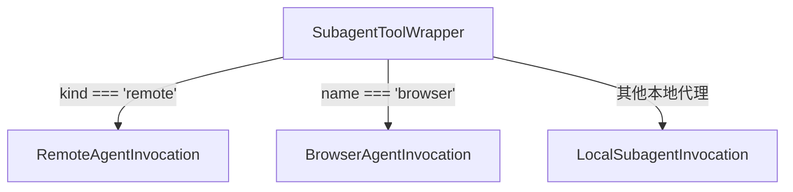

# subagent-tool-wrapper.ts

> 将子代理动态封装为标准的声明式工具，根据代理类型（本地/远程/浏览器）创建对应的调用实例。

## 概述

该文件实现了 `SubagentToolWrapper` 类，是子代理在工具系统中的统一封装层。它将 `AgentDefinition` 包装为 `BaseDeclarativeTool`，并在 `createInvocation` 方法中根据代理类型（remote、browser、local）分发到不同的调用实现类。

在 agents 模块中，该文件是子代理工具调用的分发器（dispatcher），由 `SubagentTool` 中的 `SubAgentInvocation` 使用来构建具体的调用实例。

## 架构图



## 主要导出

### 类 `SubagentToolWrapper`

继承 `BaseDeclarativeTool<AgentInputs, ToolResult>`。

#### 构造函数

```typescript
constructor(
  definition: AgentDefinition,
  context: AgentLoopContext,
  messageBus: MessageBus,
)
```

根据代理定义的 `inputConfig.inputSchema` 动态生成工具参数 Schema。设置工具类型为 `Kind.Agent`，启用 Markdown 输出和输出更新能力。

#### `createInvocation(params, messageBus, _toolName?, _toolDisplayName?): ToolInvocation`

核心分发方法，根据代理类型创建不同的调用实例：

| 条件 | 创建的实例 | 说明 |
|------|------------|------|
| `definition.kind === 'remote'` | `RemoteAgentInvocation` | 远程 A2A 代理 |
| `definition.name === BROWSER_AGENT_NAME` | `BrowserAgentInvocation` | 浏览器代理（需要异步 MCP 设置） |
| 其他 | `LocalSubagentInvocation` | 普通本地代理 |

## 核心逻辑

### 类型分发策略

分发逻辑采用简单的条件判断：
1. 先检查是否为远程代理（`kind === 'remote'`）。
2. 再检查是否为浏览器代理（通过名称匹配 `BROWSER_AGENT_NAME`）。浏览器代理虽然是本地代理，但需要特殊的异步 MCP 设置，因此有独立的调用实现。
3. 其余情况为普通本地代理。

这种设计使得添加新的代理类型只需在此处增加一个条件分支。

## 内部依赖

| 模块 | 用途 |
|------|------|
| `../tools/tools.js` | `BaseDeclarativeTool`, `Kind`, `ToolInvocation`, `ToolResult` |
| `../config/agent-loop-context.js` | `AgentLoopContext` 类型 |
| `./types.js` | `AgentDefinition`, `AgentInputs` 类型 |
| `./local-invocation.js` | `LocalSubagentInvocation` — 本地代理调用实现 |
| `./remote-invocation.js` | `RemoteAgentInvocation` — 远程代理调用实现 |
| `./browser/browserAgentInvocation.js` | `BrowserAgentInvocation` — 浏览器代理调用实现 |
| `./browser/browserAgentDefinition.js` | `BROWSER_AGENT_NAME` — 浏览器代理名称常量 |
| `../confirmation-bus/message-bus.js` | `MessageBus` 类型 |

## 外部依赖

无。
