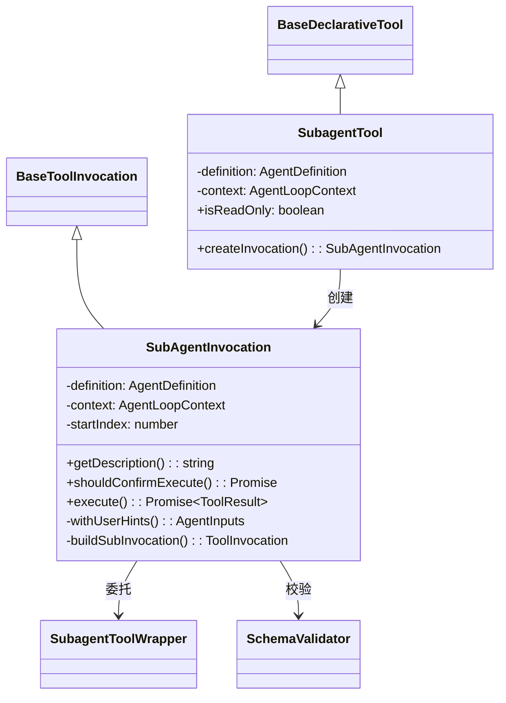

# subagent-tool.ts

> 将代理定义封装为工具系统中的声明式工具，使主代理可以通过标准工具调用接口调用子代理。

## 概述

该文件实现了 `SubagentTool` 类，将 `AgentDefinition`（无论本地还是远程）包装为 `BaseDeclarativeTool`。这使得代理可以像普通工具一样被注册到 `ToolRegistry` 中，让主代理（或其他代理）通过标准的函数调用机制调用它们。

内部还实现了 `SubAgentInvocation` 类，处理参数校验、用户提示注入、确认流程委托和遥测追踪等具体调用逻辑。

## 架构图



## 主要导出

### 类 `SubagentTool`

继承 `BaseDeclarativeTool<AgentInputs, ToolResult>`，将代理定义注册为声明式工具。

#### 构造函数

```typescript
constructor(
  definition: AgentDefinition,
  context: AgentLoopContext,
  messageBus: MessageBus,
)
```

在构造时验证代理的输入 Schema，设置工具类型为 `Kind.Agent`，启用 Markdown 输出和输出更新能力。

#### `get isReadOnly(): boolean`

判断该代理工具是否只读。逻辑：
- 远程代理始终非只读。
- 本地代理：检查其所有工具是否都是只读的。
- `FunctionDeclaration`（原始声明）假设为非只读。
- 结果会被缓存。

#### `createInvocation(params, messageBus): SubAgentInvocation`

创建 `SubAgentInvocation` 实例。

## 核心逻辑

### SubAgentInvocation（内部类）

#### 参数校验

在 `execute` 中使用 `SchemaValidator.validate` 对输入参数进行校验，校验失败时抛出包含 Schema 信息的错误。

#### 用户提示注入

`withUserHints` 方法仅对远程代理生效：
1. 获取自代理调用开始后的用户提示（hints）。
2. 将格式化后的提示前置到 `query` 参数中。
3. 本地代理通过 `LocalAgentExecutor` 中的监听机制处理提示，无需在此注入。

#### 确认流程委托

`shouldConfirmExecute` 将确认请求委托给 `SubagentToolWrapper` 构建的底层调用实例（`LocalSubagentInvocation` 或 `RemoteAgentInvocation`），确保确认逻辑由具体实现决定。

#### 遥测追踪

`execute` 方法使用 `runInDevTraceSpan` 包装实际执行，记录代理名称和描述等遥测属性。

#### 调用构建

`buildSubInvocation` 通过 `SubagentToolWrapper` 创建具体的调用实例（本地或远程），实现了代理类型的透明委托。

## 内部依赖

| 模块 | 用途 |
|------|------|
| `../tools/tools.js` | `BaseDeclarativeTool`, `Kind`, `BaseToolInvocation`, 各种工具类型 |
| `../config/config.js` | `Config` 类型 |
| `../config/agent-loop-context.js` | `AgentLoopContext` 类型 |
| `../confirmation-bus/message-bus.js` | `MessageBus` 类型 |
| `./types.js` | `AgentDefinition`, `AgentInputs` |
| `./subagent-tool-wrapper.js` | `SubagentToolWrapper` — 子代理工具包装器 |
| `../utils/schemaValidator.js` | `SchemaValidator` — Schema 校验 |
| `../utils/fastAckHelper.js` | `formatUserHintsForModel` — 用户提示格式化 |
| `../telemetry/trace.js` | `runInDevTraceSpan` — 遥测追踪 |
| `../telemetry/constants.js` | 遥测常量 |

## 外部依赖

无。
