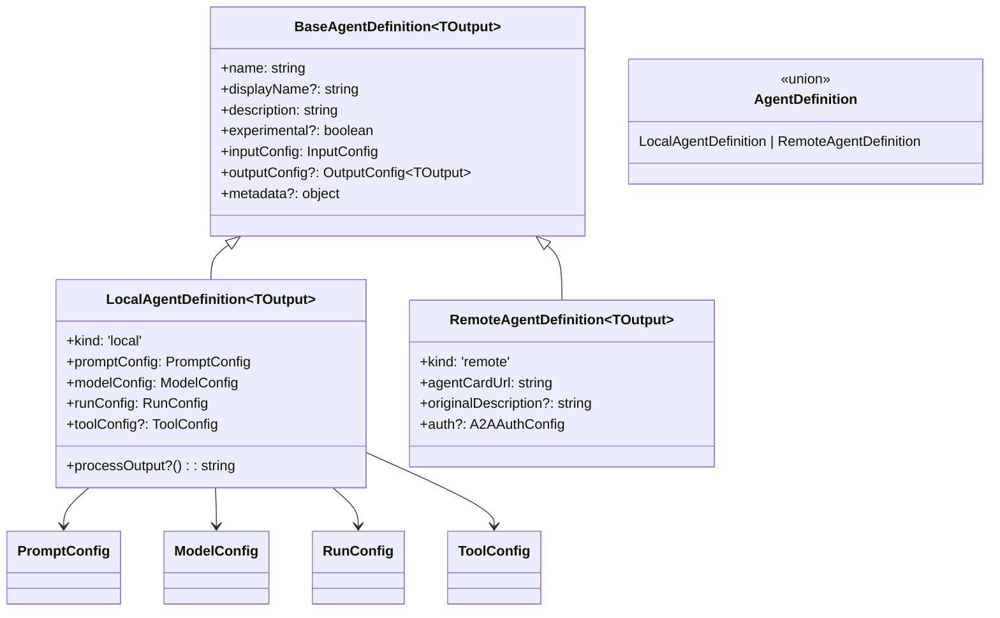

# types.ts

> 定义代理架构的核心配置接口和类型，是整个 agents 模块的类型基础。

## 概述

该文件是代理系统的类型定义中心，定义了所有代理相关的核心接口、类型、枚举和常量。其他 agents 模块中的文件几乎都依赖于此文件。

主要包含：
- 代理定义的类型层次结构（`BaseAgentDefinition` -> `LocalAgentDefinition` / `RemoteAgentDefinition`）。
- 代理终止模式枚举。
- 代理配置接口（提示词、工具、输入、输出、运行配置）。
- 子代理活动事件和进度类型（用于 UI 展示）。
- 默认常量。

## 架构图



## 主要导出

### 枚举 `AgentTerminateMode`

```typescript
export enum AgentTerminateMode {
  ERROR = 'ERROR',
  TIMEOUT = 'TIMEOUT',
  GOAL = 'GOAL',
  MAX_TURNS = 'MAX_TURNS',
  ABORTED = 'ABORTED',
  ERROR_NO_COMPLETE_TASK_CALL = 'ERROR_NO_COMPLETE_TASK_CALL',
}
```

描述代理执行终止的可能模式：

| 值 | 说明 |
|----|------|
| `ERROR` | 执行出错 |
| `TIMEOUT` | 超时 |
| `GOAL` | 正常完成（达到目标） |
| `MAX_TURNS` | 达到最大轮次限制 |
| `ABORTED` | 被用户取消 |
| `ERROR_NO_COMPLETE_TASK_CALL` | 代理停止调用工具但未调用 `complete_task` |

### 接口 `OutputObject`

```typescript
export interface OutputObject {
  result: string;
  terminate_reason: AgentTerminateMode;
}
```

代理执行的输出结构。

### 常量

| 常量 | 值 | 说明 |
|------|-----|------|
| `DEFAULT_QUERY_STRING` | `'Get Started!'` | 默认输入查询字符串 |
| `DEFAULT_MAX_TURNS` | `30` | 默认最大轮次 |
| `DEFAULT_MAX_TIME_MINUTES` | `10` | 默认最大执行时间（分钟） |

### 类型 `AgentInputs`

```typescript
export type AgentInputs = Record<string, unknown>;
```

代理调用时的输入参数类型。

### 类型 `RemoteAgentInputs`

```typescript
export type RemoteAgentInputs = { query: string };
```

远程代理的简化输入结构。

### 接口 `SubagentActivityEvent`

子代理执行期间发出的结构化事件，包含事件类型（`TOOL_CALL_START`、`TOOL_CALL_END`、`THOUGHT_CHUNK`、`ERROR`）和数据。

### 接口 `SubagentActivityItem`

子代理活动条目，用于 UI 展示。包含类型（`thought`/`tool_call`）、内容、状态等。

### 接口 `SubagentProgress`

子代理进度信息，包含代理名称、最近活动列表和整体状态。

### 函数 `isSubagentProgress`

```typescript
export function isSubagentProgress(obj: unknown): obj is SubagentProgress
```

类型守卫，判断对象是否为 `SubagentProgress`。

### 接口 `BaseAgentDefinition<TOutput>`

代理定义的基础接口（泛型，`TOutput` 为输出 Zod Schema 类型）。

### 接口 `LocalAgentDefinition<TOutput>`

本地代理定义，继承 `BaseAgentDefinition`，`kind: 'local'`。包含提示词配置、模型配置、运行配置、工具配置和输出处理函数。

### 接口 `RemoteAgentDefinition<TOutput>`

远程代理定义，继承 `BaseAgentDefinition`，`kind: 'remote'`。包含 `agentCardUrl` 和可选的认证配置。

### 类型 `AgentDefinition<TOutput>`

```typescript
export type AgentDefinition<TOutput> = LocalAgentDefinition<TOutput> | RemoteAgentDefinition<TOutput>;
```

代理定义的联合类型。

### 接口 `PromptConfig`

| 字段 | 类型 | 说明 |
|------|------|------|
| `systemPrompt?` | `string` | 系统提示词，支持 `${input_name}` 模板语法 |
| `initialMessages?` | `Content[]` | few-shot 示例消息 |
| `query?` | `string` | 触发代理执行的查询，支持模板语法 |

### 接口 `ToolConfig`

```typescript
export interface ToolConfig {
  tools: Array<string | FunctionDeclaration | AnyDeclarativeTool>;
}
```

工具列表支持三种形式：工具名称字符串、原始 FunctionDeclaration、工具实例。

### 接口 `InputConfig`

```typescript
export interface InputConfig {
  inputSchema: AnySchema;
}
```

输入参数的 JSON Schema。

### 接口 `OutputConfig<T>`

| 字段 | 类型 | 说明 |
|------|------|------|
| `outputName` | `string` | 输出参数名称（如 `report`、`answer`） |
| `description` | `string` | 输出描述 |
| `schema` | `T` | Zod Schema |

### 接口 `RunConfig`

| 字段 | 类型 | 默认值 | 说明 |
|------|------|--------|------|
| `maxTimeMinutes?` | `number` | 10 | 最大执行时间（分钟） |
| `maxTurns?` | `number` | 30 | 最大轮次 |

## 核心逻辑

该文件是纯类型定义文件，不包含业务逻辑。唯一的运行时函数是 `isSubagentProgress` 类型守卫。

## 内部依赖

| 模块 | 用途 |
|------|------|
| `../tools/tools.js` | `AnyDeclarativeTool` 类型 |
| `../services/modelConfigService.js` | `ModelConfig` 类型 |
| `./auth-provider/types.js` | `A2AAuthConfig` 类型 |

## 外部依赖

| 包名 | 用途 |
|------|------|
| `@google/genai` | `Content`, `FunctionDeclaration` 类型 |
| `zod` | 泛型类型约束 |
| `ajv` | `AnySchema` 类型（JSON Schema） |
