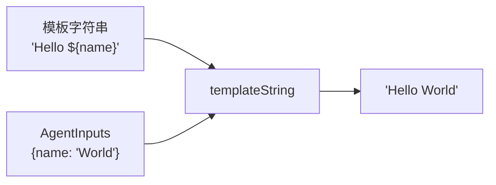

# utils.ts

> 提供代理系统的通用工具函数，目前包含模板字符串替换功能。

## 概述

该文件是代理模块的通用工具函数库。目前仅包含 `templateString` 函数，用于将代理定义中的系统提示词和查询模板中的 `${...}` 占位符替换为实际的输入参数值。

在代理执行流程中，`local-executor.ts` 使用该函数来渲染系统提示词和查询字符串。

## 架构图



## 主要导出

### 函数 `templateString`

```typescript
export function templateString(template: string, inputs: AgentInputs): string
```

将模板字符串中的 `${key}` 占位符替换为 `inputs` 对象中对应 key 的值。

**参数：**
- `template` — 包含 `${...}` 占位符的模板字符串。
- `inputs` — 提供占位符值的 `AgentInputs` 对象。

**返回值：** 替换后的完整字符串。

**异常：** 如果模板中存在 `inputs` 中不存在的占位符 key，抛出 `Error`，错误信息包含缺失的 key 和可用的 key 列表。

## 核心逻辑

### 两阶段替换策略

1. **验证阶段**：使用 `matchAll` 提取模板中所有唯一的占位符 key，检查它们是否都存在于 `inputs` 中。如果有缺失的 key，抛出包含详细信息的错误（列出缺失的 key 和可用的 key），帮助调试。

2. **替换阶段**：使用 `String.prototype.replace` 配合正则替换函数，将每个占位符替换为 `String(inputs[key])` 的值。

**正则表达式**：`/\$\{(\w+)\}/g`
- 匹配 `${` 开头、`}` 结尾、中间为一个或多个单词字符（`\w+`）的模式。
- 捕获组提取 key 名。

## 内部依赖

| 模块 | 用途 |
|------|------|
| `./types.js` | `AgentInputs` 类型 |

## 外部依赖

无。
