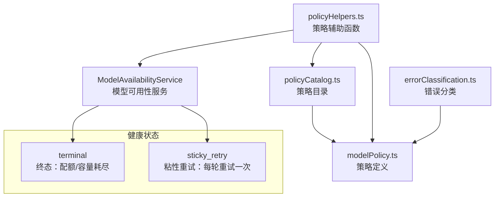

# availability 架构

> 模型可用性管理系统，跟踪模型健康状态并提供智能降级选择策略

## 概述

`availability/` 模块负责管理 Gemini 模型的可用性状态。当模型 API 调用失败时（如配额耗尽、容量不足、模型未找到），该模块记录模型的健康状态，并在后续请求中自动跳过不可用的模型，选择合适的替代模型。模块采用**策略链（Policy Chain）**模式，定义模型优先级和失败行为，与 `fallback/` 模块协作实现完整的降级流程。

## 架构图



## 目录结构

```
availability/
├── modelAvailabilityService.ts  # 模型可用性服务（核心状态管理）
├── modelPolicy.ts               # 模型策略类型定义
├── policyCatalog.ts             # 预定义策略链目录
├── policyHelpers.ts             # 策略应用辅助函数
├── errorClassification.ts       # 错误类型分类
└── testUtils.ts                 # 测试工具
```

## 关键文件

| 文件 | 功能 |
|------|------|
| `modelAvailabilityService.ts` | `ModelAvailabilityService` 类：跟踪模型健康状态（terminal/sticky_retry），提供 `selectFirstAvailable` 方法从候选列表中选择可用模型，支持按轮次重置状态 |
| `modelPolicy.ts` | 定义 `ModelPolicy` 接口：模型名称、失败动作（silent/prompt）、状态转换规则；`ModelPolicyChain` 为策略链类型 |
| `policyCatalog.ts` | 预定义策略链工厂函数：`getModelPolicyChain`（默认链：Pro -> Flash）、`getFlashLitePolicyChain`（FlashLite -> Flash -> Pro）、`createSingleModelChain` |
| `errorClassification.ts` | `classifyFailureKind`：将错误分类为 terminal（终态）、transient（瞬态）、not_found（未找到）、unknown |
| `policyHelpers.ts` | 策略应用辅助函数：`applyModelSelection`、`resolvePolicyChain`、`buildFallbackPolicyContext` 等 |

## 内部依赖

- `config/models.ts` - 模型常量和解析函数
- `code_assist/types.ts` - `UserTierId` 类型
- `utils/googleQuotaErrors.ts` - 配额错误类型
- `utils/httpErrors.ts` - HTTP 错误类型

## 外部依赖

无直接外部依赖。
