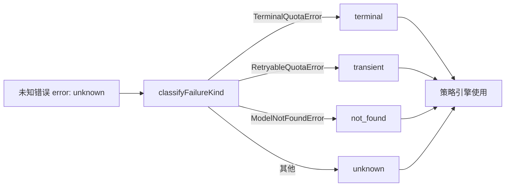

# errorClassification.ts

> 将 API 错误对象分类为标准化的失败类型（FailureKind）。

## 概述

`errorClassification.ts` 是可用性模块中的错误分类器，负责将各种原始错误实例映射为统一的 `FailureKind` 枚举值。该文件充当错误类型与策略系统之间的桥梁，使得上层模块（如回退处理器、策略助手）无需关心具体错误类型即可做出决策。

## 架构图

## 主要导出

### `classifyFailureKind(error: unknown): FailureKind`

将任意错误对象分类为以下四种失败类型之一：

| 错误类型 | 返回值 | 含义 |
|----------|--------|------|
| `TerminalQuotaError` | `'terminal'` | 不可恢复的配额错误 |
| `RetryableQuotaError` | `'transient'` | 可重试的配额错误 |
| `ModelNotFoundError` | `'not_found'` | 模型不存在 |
| 其他 | `'unknown'` | 未知错误类型 |

## 核心逻辑

函数使用 `instanceof` 进行类型检测，按优先级顺序判断：终端错误 > 瞬态错误 > 模型未找到 > 未知。这种排列确保了更严重的错误类型优先匹配。

## 内部依赖

| 模块 | 导入项 | 用途 |
|------|--------|------|
| `../utils/googleQuotaErrors.js` | `TerminalQuotaError`, `RetryableQuotaError` | Google API 配额错误类 |
| `../utils/httpErrors.js` | `ModelNotFoundError` | HTTP 404 模型未找到错误类 |
| `./modelPolicy.js` | `FailureKind` (type) | 失败类型定义 |

## 外部依赖

无。
