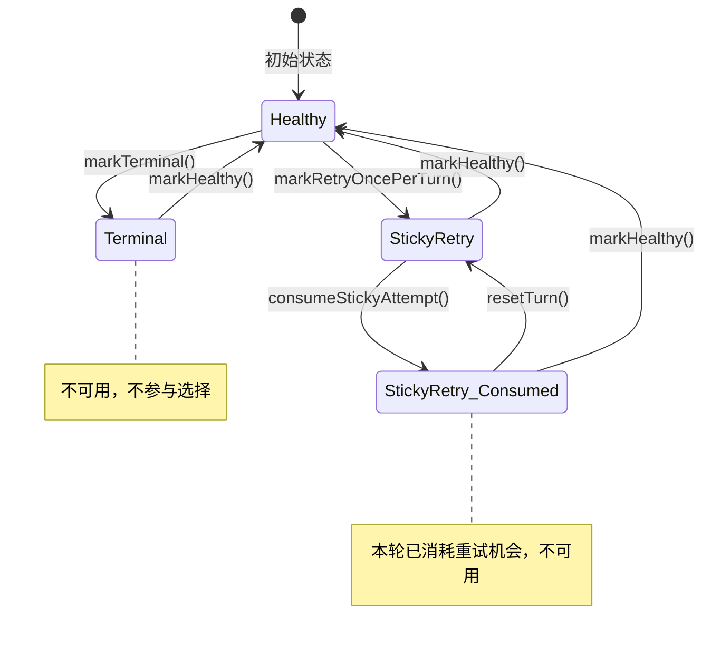

# modelAvailabilityService.ts

> 管理多模型健康状态的核心服务，提供模型可用性查询与选择功能。

## 概述

`modelAvailabilityService.ts` 实现了一个有状态的模型可用性追踪服务。它为每个模型维护一个健康状态（terminal 或 sticky_retry），并提供快照查询和优先级选择能力。该服务是整个模型回退链的基础设施，允许上层逻辑根据模型当前健康状态动态选择可用模型。设计中的 "sticky_retry" 概念允许一个模型在每轮对话中获得一次重试机会，避免因临时故障而永久跳过。

## 架构图

## 主要导出

### 类型

- **`ModelId`** — `string` 类型别名，表示模型标识符。
- **`TurnUnavailabilityReason`** — `'retry_once_per_turn'`，表示每轮一次重试的不可用原因。
- **`UnavailabilityReason`** — 联合类型：`'quota' | 'capacity' | 'retry_once_per_turn' | 'unknown'`。
- **`ModelHealthStatus`** — `'terminal' | 'sticky_retry'`，模型健康状态。
- **`ModelAvailabilitySnapshot`** — `{ available: boolean; reason?: UnavailabilityReason }`，模型可用性快照。
- **`ModelSelectionResult`** — `{ selectedModel: ModelId | null; attempts?: number; skipped: Array<...> }`，模型选择结果。

### 类 `ModelAvailabilityService`

| 方法 | 签名 | 说明 |
|------|------|------|
| `markTerminal` | `(model, reason) => void` | 将模型标记为终端不可用（配额/容量耗尽） |
| `markHealthy` | `(model) => void` | 清除模型的不健康状态 |
| `markRetryOncePerTurn` | `(model) => void` | 标记模型为"每轮重试一次"状态 |
| `consumeStickyAttempt` | `(model) => void` | 消耗 sticky_retry 模型的本轮重试机会 |
| `snapshot` | `(model) => ModelAvailabilitySnapshot` | 获取模型当前可用性快照 |
| `selectFirstAvailable` | `(models) => ModelSelectionResult` | 从候选列表中选择第一个可用模型 |
| `resetTurn` | `() => void` | 重置所有 sticky_retry 模型的已消耗状态（新一轮开始时调用） |
| `reset` | `() => void` | 清除所有模型状态 |

## 核心逻辑

1. **状态机模型**：每个模型在 `health` Map 中维护一个 `HealthState`，可以是 `terminal`（终态不可用）或 `sticky_retry`（附带 `consumed` 标志的单次重试状态）。
2. **防护逻辑**：`markRetryOncePerTurn` 不会覆盖 `terminal` 状态，防止将严重错误降级为可重试。
3. **消耗防无限循环**：sticky_retry 状态追踪 `consumed` 标志，一旦消耗后在当前轮次内不再可用，防止同一模型反复失败导致的无限循环。
4. **优先级选择**：`selectFirstAvailable` 按列表顺序选择第一个可用模型，同时记录被跳过的模型及其原因。

## 内部依赖

无（该文件是自包含的核心服务）。

## 外部依赖

无。
