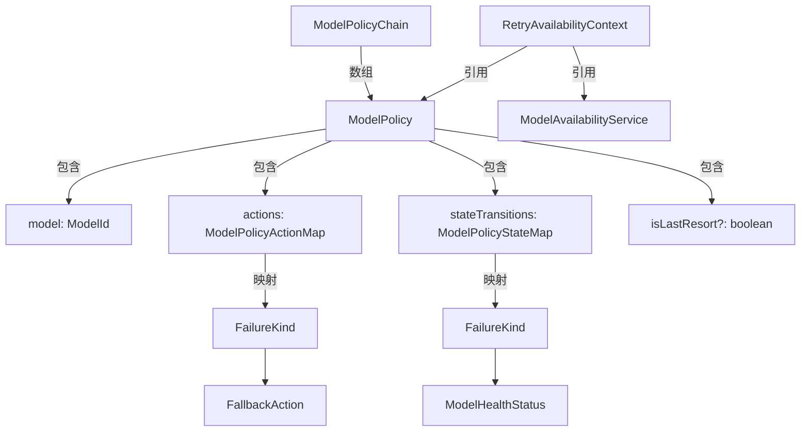

# modelPolicy.ts

> 定义模型可用性策略的类型体系，描述模型失败时的行为规则。

## 概述

`modelPolicy.ts` 是可用性模块的类型定义文件，建立了模型策略系统的核心数据模型。它定义了模型在 API 调用失败时应采取的动作（静默回退或提示用户）以及健康状态的转换规则。该文件是策略目录（policyCatalog）和策略助手（policyHelpers）的类型基础。

## 架构图

## 主要导出

### 类型

| 类型名 | 定义 | 说明 |
|--------|------|------|
| `FallbackAction` | `'silent' \| 'prompt'` | 失败时的交互方式：静默回退或提示用户 |
| `FailureKind` | `'terminal' \| 'transient' \| 'not_found' \| 'unknown'` | 模型 API 失败的分类 |
| `ModelPolicyActionMap` | `Partial<Record<FailureKind, FallbackAction>>` | 失败类型到交互方式的映射 |
| `ModelPolicyStateMap` | `Partial<Record<FailureKind, ModelHealthStatus>>` | 失败类型到健康状态转换的映射 |
| `ModelPolicyChain` | `ModelPolicy[]` | 模型策略链，定义优先级和回退行为 |

### 接口

| 接口名 | 说明 |
|--------|------|
| `ModelPolicy` | 单个模型的策略定义，包含模型 ID、动作映射、状态转换映射、是否为最后备选 |
| `RetryAvailabilityContext` | 重试逻辑所需的上下文：可用性服务实例和当前模型的策略 |

## 核心逻辑

本文件为纯类型定义，无运行时逻辑。关键设计决策：

- **`isLastResort`**：标记一个模型为"最后手段"，当所有模型不可用时仍会尝试该模型。
- **Partial 映射**：`ModelPolicyActionMap` 和 `ModelPolicyStateMap` 使用 `Partial` 允许只为部分失败类型定义行为。

## 内部依赖

| 模块 | 导入项 | 用途 |
|------|--------|------|
| `./modelAvailabilityService.js` | `ModelAvailabilityService`, `ModelHealthStatus`, `ModelId` (types) | 引用可用性服务和模型 ID 类型 |

## 外部依赖

无。
