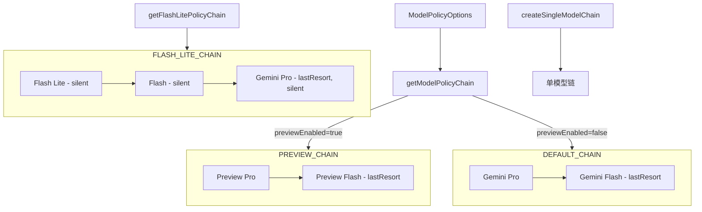

# policyCatalog.ts

> 预定义模型策略链的目录，根据用户配置返回合适的模型回退链。

## 概述

`policyCatalog.ts` 是可用性模块的策略工厂，维护了多条预定义的模型策略链（如默认链、Flash Lite 链、预览链），并根据用户配置（是否启用预览、用户层级等）返回对应的策略链。该文件还提供了策略链的创建、验证和克隆工具函数。

## 架构图

## 主要导出

### 接口

- **`ModelPolicyOptions`** — 策略链生成选项：`{ previewEnabled, userTier?, useGemini31?, useCustomToolModel? }`

### 函数

| 函数 | 签名 | 说明 |
|------|------|------|
| `getModelPolicyChain` | `(options: ModelPolicyOptions) => ModelPolicyChain` | 根据选项返回默认或预览模型策略链 |
| `createSingleModelChain` | `(model: string) => ModelPolicyChain` | 为单个模型创建只含一个策略的链（标记为 lastResort） |
| `getFlashLitePolicyChain` | `() => ModelPolicyChain` | 返回 Flash Lite 模型的三级静默回退链 |
| `createDefaultPolicy` | `(model: string, options?) => ModelPolicy` | 为不在目录中的模型创建默认策略脚手架 |
| `validateModelPolicyChain` | `(chain: ModelPolicyChain) => void` | 验证策略链：非空、有且仅有一个 lastResort |

## 核心逻辑

1. **默认动作策略**：`DEFAULT_ACTIONS` 将所有失败类型映射为 `'prompt'`（提示用户），`SILENT_ACTIONS` 全部映射为 `'silent'`（静默回退）。
2. **默认状态转换**：`DEFAULT_STATE` 将所有失败类型映射为 `'terminal'` 状态。
3. **克隆保护**：所有返回的策略链都经过深克隆（`cloneChain`），避免外部修改影响内部预定义数据。
4. **策略组装**：`definePolicy` 函数将用户提供的部分配置与默认值合并，确保每个策略对象都是完整且独立的实例。

## 内部依赖

| 模块 | 导入项 | 用途 |
|------|--------|------|
| `./modelPolicy.js` | `ModelPolicy`, `ModelPolicyActionMap`, `ModelPolicyChain`, `ModelPolicyStateMap` | 策略类型定义 |
| `../config/models.js` | 各模型常量, `resolveModel` | 模型标识符和解析函数 |
| `../code_assist/types.js` | `UserTierId` (type) | 用户层级类型 |

## 外部依赖

无。
