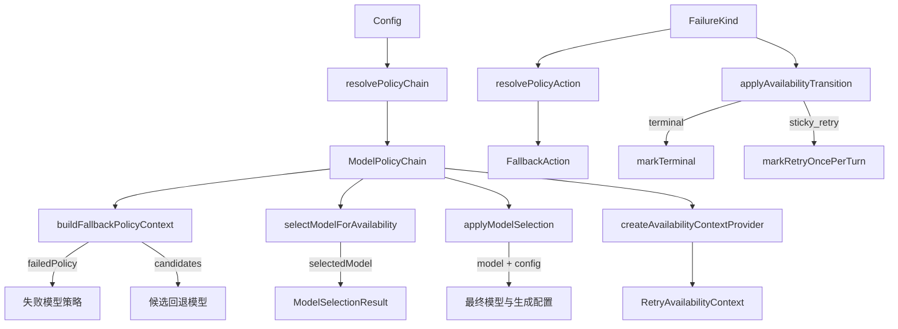

# policyHelpers.ts

> 策略链的运行时解析与应用工具集，协调模型选择、回退和状态转换。

## 概述

`policyHelpers.ts` 是可用性模块中最核心的运行时逻辑文件，负责将配置和策略目录的静态定义转化为实际的模型选择与回退行为。它提供了策略链解析、回退候选构建、动作决策、可用性上下文创建、模型选择应用等完整功能。该文件是 fallback handler 和 retry 逻辑的直接依赖。

## 架构图

## 主要导出

### 函数

| 函数 | 签名 | 说明 |
|------|------|------|
| `resolvePolicyChain` | `(config, preferredModel?, wrapsAround?) => ModelPolicyChain` | 根据配置解析激活的策略链，支持循环缓冲模式 |
| `buildFallbackPolicyContext` | `(chain, failedModel, wrapsAround?) => { failedPolicy?, candidates }` | 从链中找到失败模型并返回后续候选列表 |
| `resolvePolicyAction` | `(failureKind, policy) => FallbackAction` | 根据失败类型和策略决定采取静默还是提示动作 |
| `createAvailabilityContextProvider` | `(config, modelGetter) => () => RetryAvailabilityContext \| undefined` | 创建延迟求值的可用性上下文提供者 |
| `selectModelForAvailability` | `(config, requestedModel) => ModelSelectionResult` | 通过可用性服务选择最佳可用模型 |
| `applyModelSelection` | `(config, modelConfigKey, options?) => { model, config, maxAttempts? }` | 应用模型选择逻辑并产生副作用（设置活跃模型、消耗重试机会） |
| `applyAvailabilityTransition` | `(getContext, failureKind) => void` | 根据失败类型执行模型健康状态转换 |

## 核心逻辑

1. **策略链解析**（`resolvePolicyChain`）：根据配置中的模型（Flash Lite、Gemini 3、Auto、自定义）选择不同的策略链生成路径。支持 `wrapsAround` 循环模式，将活跃模型之后的链和之前的链拼接。
2. **回退上下文构建**（`buildFallbackPolicyContext`）：在策略链中定位失败模型，返回其之后的候选列表。循环模式下会将链首的模型也加入候选。
3. **模型选择与应用**（`applyModelSelection`）：综合可用性服务和策略链，选择最终模型，更新配置中的活跃模型，并在必要时消耗 sticky retry 机会。
4. **状态转换**（`applyAvailabilityTransition`）：将策略中定义的状态转换规则（terminal/sticky_retry）实际应用到可用性服务中。

## 内部依赖

| 模块 | 导入项 | 用途 |
|------|--------|------|
| `../config/config.js` | `Config` (type) | 全局配置 |
| `./modelPolicy.js` | 多个类型 | 策略类型定义 |
| `./policyCatalog.js` | `createDefaultPolicy`, `createSingleModelChain`, `getModelPolicyChain`, `getFlashLitePolicyChain` | 策略链工厂 |
| `../config/models.js` | 模型常量与工具函数 | 模型标识符和解析 |
| `./modelAvailabilityService.js` | `ModelSelectionResult` (type) | 选择结果类型 |
| `../services/modelConfigService.js` | `ModelConfigKey` (type) | 模型配置键类型 |

## 外部依赖

| 包名 | 用途 |
|------|------|
| `@google/genai` | `GenerateContentConfig` 类型 |
