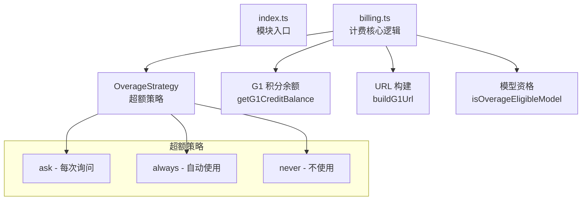

# billing 架构

> 计费管理模块，处理 Google One AI 积分余额查询与超额使用策略

## 概述

`billing/` 模块负责管理 Gemini CLI 的计费相关逻辑，特别是 Google One AI 积分的使用。当用户在免费配额耗尽后，该模块判断是否可以使用 AI 积分继续服务，支持三种超额策略：自动使用（always）、每次询问（ask）和从不使用（never）。模块还提供了 Google One 页面的 URL 构建功能，支持 UTM 追踪参数和账户选择器重定向。

## 架构图



## 目录结构

```
billing/
├── index.ts      # 模块入口，重新导出 billing.ts
└── billing.ts    # 计费核心逻辑
```

## 关键文件

| 文件 | 功能 |
|------|------|
| `billing.ts` | 核心计费逻辑：`OverageStrategy` 类型、`isOverageEligibleModel`（检查模型是否支持积分超额）、`getG1CreditBalance`（提取积分余额）、`shouldAutoUseCredits`/`shouldShowOverageMenu`/`shouldShowEmptyWalletMenu`（UI 决策函数）、`buildG1Url`（构建 Google One 页面 URL） |
| `index.ts` | 简单的重新导出 |

## 内部依赖

- `code_assist/types.ts` - `GeminiUserTier`、`AvailableCredits`、`CreditType` 类型
- `config/models.ts` - 预览模型常量（`PREVIEW_GEMINI_MODEL` 等）

## 外部依赖

无直接外部依赖。
