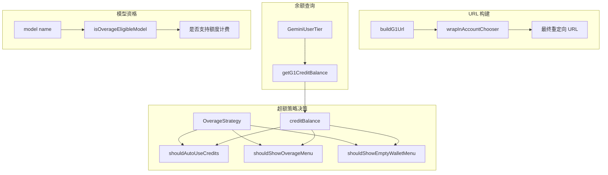

# billing.ts

> 管理 Google One AI 额度计费逻辑，包括超额策略判断、URL 构建和余额查询。

## 概述

`billing.ts` 实现了 Gemini CLI 的 AI 额度计费功能。当用户在免费配额耗尽后，系统可以通过 Google One AI 额度继续使用服务。该文件定义了超额策略（ask/always/never）、合格模型白名单、额度余额查询、G1 购买/管理页面的 URL 构建（含 UTM 追踪和 AccountChooser 重定向），以及基于策略和余额的自动决策逻辑。

## 架构图

## 主要导出

### 类型

- **`OverageStrategy`** — `'ask' | 'always' | 'never'`，超额时的处理策略。

### 常量

| 常量 | 类型 | 说明 |
|------|------|------|
| `G1_CREDIT_TYPE` | `CreditType` | Google One AI 额度类型标识：`'GOOGLE_ONE_AI'` |
| `OVERAGE_ELIGIBLE_MODELS` | `Set<string>` | 支持超额计费的模型集合（Preview 系列模型） |
| `G1_UTM_CAMPAIGNS` | `object` | UTM 追踪活动标识符（管理活动、添加额度、空钱包） |
| `MIN_CREDIT_BALANCE` | `number` | 最低可用额度阈值：50 |

### 函数

| 函数 | 签名 | 说明 |
|------|------|------|
| `isOverageEligibleModel` | `(model: string) => boolean` | 检查模型是否支持 AI 额度超额计费 |
| `wrapInAccountChooser` | `(email, continueUrl) => string` | 将 URL 包装在 Google AccountChooser 重定向中 |
| `buildG1Url` | `(path, email, campaign) => string` | 构建带 UTM 参数的 G1 AI 页面 URL |
| `getG1CreditBalance` | `(tier) => number \| null` | 从用户层级中提取 G1 AI 额度余额 |
| `shouldAutoUseCredits` | `(strategy, creditBalance) => boolean` | 判断是否应自动使用额度 |
| `shouldShowOverageMenu` | `(strategy, creditBalance) => boolean` | 判断是否应显示超额菜单 |
| `shouldShowEmptyWalletMenu` | `(strategy, creditBalance) => boolean` | 判断是否应显示空钱包菜单 |

## 核心逻辑

1. **三级策略**：`always` 自动使用额度、`ask` 每次询问用户、`never` 从不使用额度并展示标准回退。
2. **余额阈值**：`MIN_CREDIT_BALANCE = 50`，余额低于此值时触发空钱包流程而非正常超额流程。
3. **URL 构建管道**：`buildG1Url` 先拼接基础 URL 和 UTM 参数，再通过 `wrapInAccountChooser` 包装为 AccountChooser 重定向 URL，确保用户在正确的 Google 账户上下文中打开页面。
4. **余额计算**：`getG1CreditBalance` 过滤出 G1 类型的所有额度条目并求和（`creditAmount` 为字符串表示的 int64）。

## 内部依赖

| 模块 | 导入项 | 用途 |
|------|--------|------|
| `../code_assist/types.js` | `AvailableCredits`, `CreditType`, `GeminiUserTier` | 额度和用户层级类型 |
| `../config/models.js` | 预览模型常量 | 判断模型是否支持超额计费 |

## 外部依赖

无。
