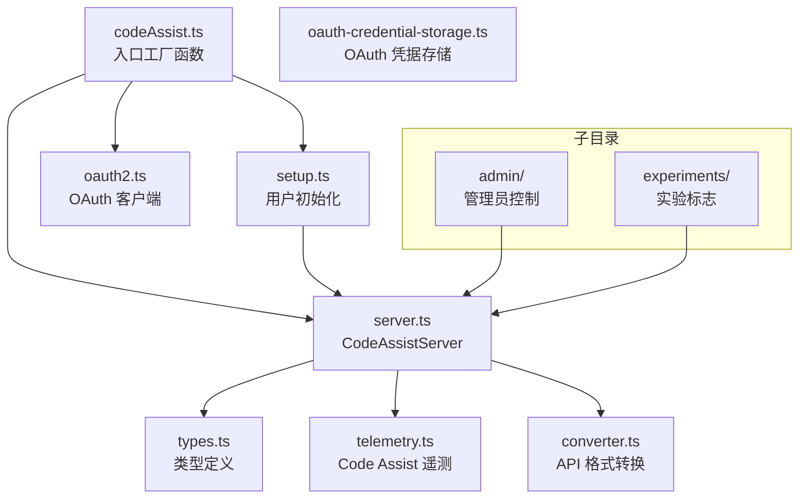

# code_assist 架构

> Google Code Assist 集成模块，提供 OAuth 认证、服务端通信、用户层级管理和管理员控制

## 概述

`code_assist/` 模块实现了 Gemini CLI 与 Google Cloud Code Assist 私有 API 的集成。通过 OAuth2 认证连接到 Google 后端服务，管理用户的订阅层级（免费/标准/旧版）、项目配置、配额查询和实验标志。该模块是 Google 认证用户（Login with Google）流程的核心基础设施，也为管理员控制（企业安全策略）提供支持。

## 架构图



## 目录结构

```
code_assist/
├── codeAssist.ts                 # 入口：createCodeAssistContentGenerator 工厂
├── server.ts                     # CodeAssistServer：API 通信核心
├── oauth2.ts                     # OAuth2 客户端创建
├── setup.ts                      # 用户初始化与层级验证
├── types.ts                      # 类型定义（UserTier、LoadCodeAssistResponse 等）
├── telemetry.ts                  # Code Assist 特定的遥测上报
├── converter.ts                  # API 请求/响应格式转换
├── oauth-credential-storage.ts   # OAuth 凭据持久化存储
├── admin/                        # 管理员控制子模块
└── experiments/                  # 实验配置子模块
```

## 关键文件

| 文件 | 功能 |
|------|------|
| `codeAssist.ts` | `createCodeAssistContentGenerator`：工厂函数，创建基于 Code Assist 的内容生成器；`getCodeAssistServer`：从 Config 中提取 CodeAssistServer 实例 |
| `server.ts` | `CodeAssistServer`：实现 `ContentGenerator` 接口，封装对 Cloud Code 私有 API 的 HTTP 调用（LoadCodeAssist、OnboardUser、GenerateContent 等） |
| `types.ts` | 丰富的类型体系：`GeminiUserTier`（用户层级）、`LoadCodeAssistResponse`（加载响应）、`IneligibleTier`（不合格层级）、`Credits`（积分）、`ClientMetadata`（客户端元数据）、Zod schema 验证（`AdminControlsSettingsSchema`、`McpConfigDefinitionSchema`） |
| `oauth2.ts` | OAuth2 客户端创建，支持 Login with Google 和 Compute ADC 两种认证方式 |
| `setup.ts` | 用户初始化流程：加载用户层级、处理注册、验证不合格原因 |

## 内部依赖

- `core/contentGenerator.ts` - `ContentGenerator` 接口、`AuthType` 枚举
- `core/loggingContentGenerator.ts` - 日志包装
- `config/` - Config 类
- `utils/` - 错误处理、调试日志

## 外部依赖

| 依赖 | 用途 |
|------|------|
| `google-auth-library` | OAuth2 客户端 |
| `zod` | Admin Controls 和 MCP 配置的 schema 验证 |
