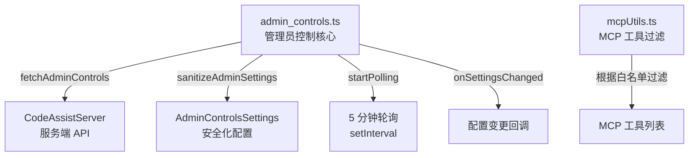

# admin 架构

> 管理员控制模块，为企业用户提供远程安全策略管理，支持轮询更新

## 概述

`admin/` 模块实现了企业级管理员控制功能。通过 Code Assist 服务端获取管理员配置的安全策略，包括严格模式、MCP 服务器白名单、扩展权限和非托管能力控制。支持初次获取和 5 分钟间隔的后台轮询，当策略变更时通过回调通知应用层。该模块还提供 MCP 服务器工具过滤能力（`mcpUtils.ts`），根据管理员白名单对 MCP 工具进行 include/exclude 筛选。

## 架构图



## 目录结构

```
admin/
├── admin_controls.ts   # 管理员控制的获取、轮询和错误消息
└── mcpUtils.ts         # MCP 服务器/工具白名单过滤
```

## 关键文件

| 文件 | 功能 |
|------|------|
| `admin_controls.ts` | `fetchAdminControls`：获取管理员控制配置（支持缓存和轮询）；`sanitizeAdminSettings`：将原始响应安全化为 `AdminControlsSettings`，处理向后兼容（secureModeEnabled -> strictModeDisabled）；`getAdminErrorMessage`/`getAdminBlockedMcpServersMessage`：生成标准化的管理员限制错误消息 |
| `mcpUtils.ts` | MCP 工具白名单过滤函数，根据管理员配置的 `includeTools`/`excludeTools` 规则筛选允许使用的 MCP 工具 |

## 内部依赖

- `code_assist/server.ts` - CodeAssistServer（API 调用）
- `code_assist/types.ts` - `FetchAdminControlsResponse`、`AdminControlsSettings` 等类型和 Zod schema
- `code_assist/codeAssist.ts` - `getCodeAssistServer` 函数
- `config/config.ts` - Config 类
- `utils/debugLogger.ts` - 调试日志

## 外部依赖

| 依赖 | 用途 |
|------|------|
| `node:util` | `isDeepStrictEqual` 用于深度比较配置变更 |
