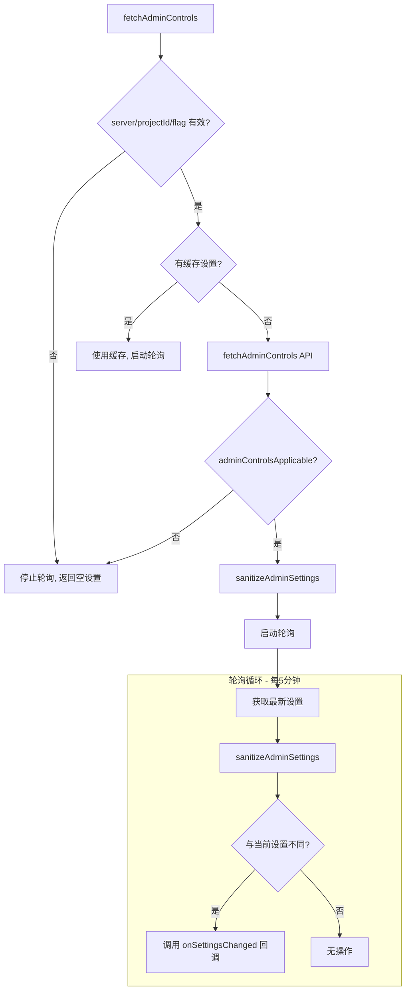

# admin_controls.ts

> 企业管理员控制策略的获取、轮询与本地化解析

## 概述

`admin_controls.ts` 实现了企业管理员控制功能的完整生命周期管理。企业环境中，管理员可以通过 Code Assist 后端配置安全策略（如严格模式、MCP 服务器白名单、CLI 功能开关等），此文件负责：

1. 从后端获取管理控制配置
2. 将原始 API 响应清洗/规范化为安全的内部格式
3. 通过轮询（每 5 分钟）检测配置变更并通知上层
4. 生成标准化的管理员限制错误消息

该文件是企业合规功能的核心组件，确保了受管设备和账户遵循组织策略。

## 架构图

## 主要导出

### 函数

#### `sanitizeAdminSettings(settings: FetchAdminControlsResponse): AdminControlsSettings`

将原始 API 响应清洗为内部使用的 `AdminControlsSettings` 格式。

核心处理：
- 使用 Zod schema 验证输入，验证失败返回空对象
- 解析 `mcpConfigJson` JSON 字符串为结构化对象，并对 `includeTools`/`excludeTools` 排序以保证比较稳定性
- 兼容旧版 `secureModeEnabled` 字段（取反映射到 `strictModeDisabled`）
- 为缺失字段设置默认值（`extensionsEnabled: false`, `unmanagedCapabilitiesEnabled: false`, `mcpEnabled: false`）

#### `fetchAdminControls(server, cachedSettings, adminControlsEnabled, onSettingsChanged): Promise<AdminControlsSettings>`

获取管理控制配置的主入口。
- 支持缓存设置避免启动时阻塞
- 成功获取后自动启动轮询
- 未启用或无 server/projectId 时停止轮询并返回空设置

#### `fetchAdminControlsOnce(server, adminControlsEnabled): Promise<FetchAdminControlsResponse>`

单次获取管理控制配置，不启动轮询。适用于一次性检查场景。

#### `stopAdminControlsPolling(): void`

停止管理控制的轮询定时器。

#### `getAdminErrorMessage(featureName: string, config: Config | undefined): string`

生成标准化的"功能被管理员禁用"错误消息，包含管理控制台链接和项目 ID。

#### `getAdminBlockedMcpServersMessage(blockedServers: string[], config: Config | undefined): string`

生成 MCP 服务器被管理员白名单阻止的错误消息，支持单/复数语法。

## 核心逻辑

### 设置清洗 (`sanitizeAdminSettings`)

1. 通过 `FetchAdminControlsResponseSchema` Zod 验证
2. 解析 `mcpConfigJson` 并通过 `McpConfigDefinitionSchema` 二次验证
3. 对 include/exclude 工具列表排序保证 `isDeepStrictEqual` 比较正确
4. 处理 `secureModeEnabled` -> `strictModeDisabled` 的向后兼容映射

### 轮询机制

- 使用 `setInterval` 每 5 分钟调用 `fetchAdminControls` API
- 使用 `isDeepStrictEqual` 深度比较新旧设置
- 设置变更时通过 `onSettingsChanged` 回调通知上层
- 当 `adminControlsApplicable` 变为 false 时自动停止轮询

## 内部依赖

| 模块 | 用途 |
|------|------|
| `../server.js` | `CodeAssistServer` 类型 |
| `../types.js` | `FetchAdminControlsResponse`, `FetchAdminControlsResponseSchema`, `McpConfigDefinitionSchema`, `AdminControlsSettings` |
| `../codeAssist.js` | `getCodeAssistServer` — 用于错误消息中获取 projectId |
| `../../utils/debugLogger.js` | 调试日志 |
| `../../config/config.js` | `Config` 类型 |

## 外部依赖

| 包 | 用途 |
|------|------|
| `node:util` | `isDeepStrictEqual` — 深度比较设置变更 |
