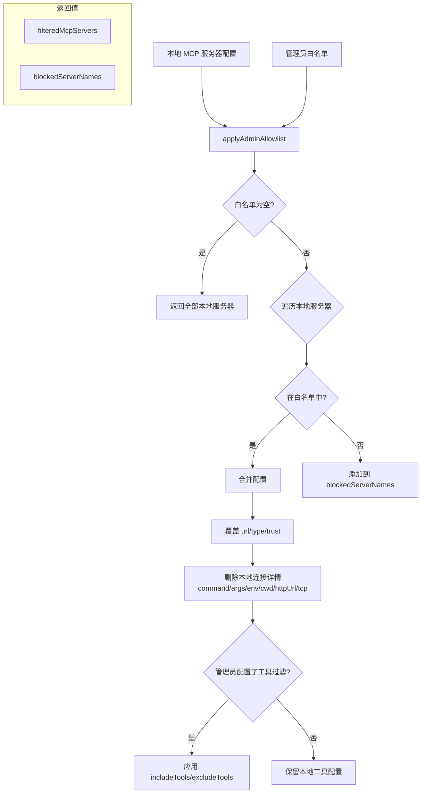

# mcpUtils.ts

> 管理员 MCP 服务器白名单的过滤与合并工具

## 概述

`mcpUtils.ts` 提供了一个单一但关键的工具函数 `applyAdminAllowlist`，用于将企业管理员配置的 MCP 服务器白名单应用到本地配置的 MCP 服务器列表上。该函数实现了安全过滤和配置合并逻辑，确保在受管环境中只有管理员批准的 MCP 服务器才能被使用。

在 Gemini CLI 的企业管理功能中，此文件是 MCP 安全策略的执行点。

## 架构图

## 主要导出

### `applyAdminAllowlist(localMcpServers, adminAllowlist): { mcpServers, blockedServerNames }`

将管理员 MCP 白名单应用到本地 MCP 服务器配置。

**参数**：
- `localMcpServers: Record<string, MCPServerConfig>` — 用户本地配置的 MCP 服务器
- `adminAllowlist: Record<string, MCPServerConfig> | undefined` — 管理员配置的白名单

**返回**：
- `mcpServers: Record<string, MCPServerConfig>` — 过滤并合并后的 MCP 服务器配置
- `blockedServerNames: string[]` — 被白名单阻止的服务器名称列表

## 核心逻辑

### 白名单为空时的行为

当 `adminAllowlist` 为 `undefined` 或空对象时，直接返回全部本地服务器配置和空的阻止列表。这确保了非受管环境下不受影响。

### 合并策略

对于白名单中存在的服务器：

1. **继承本地配置**：以 `...localConfig` 展开保留所有本地设置
2. **覆盖连接信息**：用管理员配置的 `url`、`type`、`trust` 覆盖
3. **清除本地执行详情**：删除 `command`、`args`、`env`、`cwd`、`httpUrl`、`tcp` —— 这是关键的安全措施，防止受管环境中执行本地进程
4. **条件性工具过滤**：仅当管理员配置了 `includeTools` 或 `excludeTools` 时才覆盖本地设置

### 安全设计

该函数的核心安全价值在于：
- 未在白名单中的服务器被完全排除
- 白名单中服务器的连接方式由管理员强制指定（远程 URL 而非本地命令）
- 本地的 `command`/`args` 等执行参数被强制删除，防止任意代码执行

## 内部依赖

| 模块 | 用途 |
|------|------|
| `../../config/config.js` | `MCPServerConfig` 类型 |

## 外部依赖

无。
