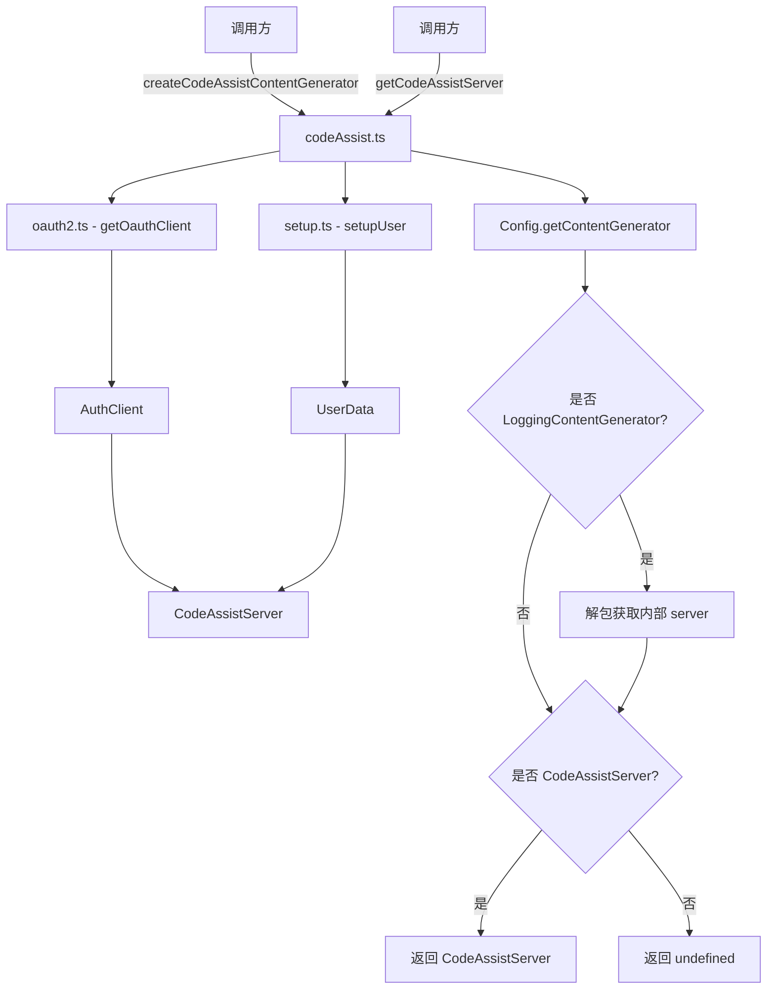

# codeAssist.ts

> Code Assist 内容生成器的工厂与访问入口

## 概述

`codeAssist.ts` 是 Code Assist 模块的顶层入口文件，负责创建和获取 `ContentGenerator` 实例。它根据认证类型（Google 登录或 Compute ADC）编排 OAuth 客户端的初始化、用户配置流程，并最终实例化 `CodeAssistServer`。同时提供了一个便捷方法，从现有 `Config` 中提取已包装的 `CodeAssistServer` 实例。

该文件是连接认证层（`oauth2.ts`）、用户设置层（`setup.ts`）和服务通信层（`server.ts`）的桥梁。

## 架构图

## 主要导出

### `createCodeAssistContentGenerator(httpOptions, authType, config, sessionId?): Promise<ContentGenerator>`

工厂函数，根据认证类型创建一个完整的 `ContentGenerator` 实例。

- **参数**：
  - `httpOptions: HttpOptions` — HTTP 请求选项（如额外 headers）
  - `authType: AuthType` — 认证方式，仅支持 `LOGIN_WITH_GOOGLE` 和 `COMPUTE_ADC`
  - `config: Config` — 应用配置对象
  - `sessionId?: string` — 可选的会话 ID
- **返回**：`Promise<ContentGenerator>` — 即 `CodeAssistServer` 实例
- **异常**：若 `authType` 不被支持则抛出 `Error`

### `getCodeAssistServer(config): CodeAssistServer | undefined`

从 `Config` 中提取底层的 `CodeAssistServer` 实例。如果当前的 `ContentGenerator` 被 `LoggingContentGenerator` 包装，则自动解包。

- **参数**：`config: Config` — 应用配置
- **返回**：`CodeAssistServer | undefined`

## 核心逻辑

1. `createCodeAssistContentGenerator` 首先调用 `getOauthClient` 获取认证客户端；
2. 接着调用 `setupUser` 完成用户注册/加载，获取 `projectId`、`userTier` 等信息；
3. 最后将这些信息注入 `CodeAssistServer` 构造函数，返回就绪的服务实例。

`getCodeAssistServer` 则是一个读取辅助函数，处理了 `LoggingContentGenerator` 装饰器的解包逻辑。

## 内部依赖

| 模块 | 用途 |
|------|------|
| `./oauth2.js` | `getOauthClient` — 获取 OAuth 认证客户端 |
| `./setup.js` | `setupUser` — 用户注册与配置加载 |
| `./server.js` | `CodeAssistServer`, `HttpOptions` — 服务器通信实现 |
| `../core/contentGenerator.js` | `AuthType`, `ContentGenerator` — 认证类型与内容生成器接口 |
| `../core/loggingContentGenerator.js` | `LoggingContentGenerator` — 日志装饰器 |
| `../config/config.js` | `Config` — 应用配置 |

## 外部依赖

无直接外部依赖（所有外部库通过内部模块间接引用）。
