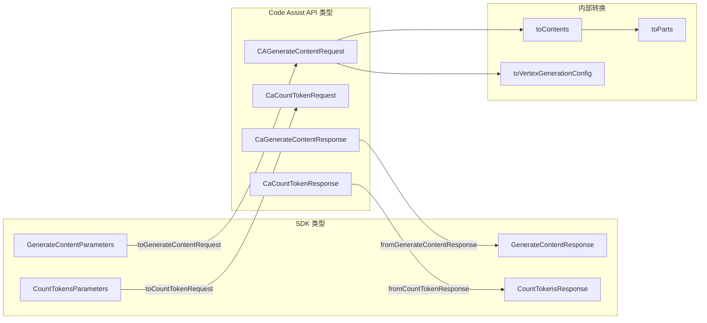

# converter.ts

> Google GenAI SDK 与 Code Assist API 之间的请求/响应格式转换器

## 概述

`converter.ts` 承担了 Gemini CLI 核心数据格式适配的职责。由于 `@google/genai` SDK 的数据结构与 Code Assist 后端 API（基于 Vertex AI 协议）的格式存在差异，本文件提供了一整套双向转换函数，将 SDK 的 `GenerateContentParameters`、`CountTokensParameters` 等转换为 Code Assist API 所需的请求格式，并将响应结果反向转换回 SDK 类型。

此外，文件还包含了对 "思维部分"（thought parts）的特殊处理逻辑，确保在发送给 CountToken API 时不会因 schema 不兼容而失败。

## 架构图

## 主要导出

### 接口

- **`CAGenerateContentRequest`** — Code Assist 生成内容请求，包含 `model`、`project`、`user_prompt_id`、`request`（Vertex 格式）、`enabled_credit_types` 字段
- **`CaGenerateContentResponse`** — Code Assist 生成内容响应，包含 `response`、`traceId`、`consumedCredits`、`remainingCredits`
- **`CaCountTokenRequest`** — Code Assist 计数 token 请求
- **`CaCountTokenResponse`** — Code Assist 计数 token 响应

### 函数

#### `toCountTokenRequest(req: CountTokensParameters): CaCountTokenRequest`
将 SDK 的 token 计数请求转换为 Code Assist API 格式。

#### `fromCountTokenResponse(res: CaCountTokenResponse): CountTokensResponse`
将 Code Assist 的 token 计数响应转换回 SDK 格式。当 `totalTokens` 缺失时默认为 0。

#### `toGenerateContentRequest(req, userPromptId, project?, sessionId?, enabledCreditTypes?): CAGenerateContentRequest`
将 SDK 的内容生成请求转换为 Code Assist API 格式，附加项目、提示 ID、会话 ID 和信用类型等元信息。

#### `fromGenerateContentResponse(res: CaGenerateContentResponse): GenerateContentResponse`
将 Code Assist 的内容生成响应转换回 SDK 的 `GenerateContentResponse`，映射 `traceId` 到 `responseId`。

#### `toContents(contents: ContentListUnion): Content[]`
将 SDK 的多种内容联合类型统一转换为 `Content[]` 数组。

#### `toParts(parts: PartUnion[]): Part[]`
将 SDK 的 Part 联合类型数组转换为标准 `Part[]`。

#### `fromGenerateContentResponseUsage(metadata?): GenerateContentResponseUsageMetadata | undefined`
提取和转换使用量元数据。

## 核心逻辑

1. **内容转换链**：`toContents` -> `toContent` -> `toParts` -> `toPart`，递归处理各种联合类型（字符串、数组、Content 对象、Part 对象）。
2. **Thought Part 处理**：`toPart` 函数对包含 `thought: true` 的 Part 进行特殊处理 —— 将思维内容转为文本前缀 `[Thought: ...]`，并删除 `thought` 属性，以兼容不支持 thought schema 的 API。
3. **生成配置映射**：`toVertexGenerationConfig` 将 SDK 的 `GenerateContentConfig` 扁平属性逐一映射到 Vertex AI 的 `VertexGenerationConfig` 结构。

## 内部依赖

| 模块 | 用途 |
|------|------|
| `../utils/debugLogger.js` | 日志输出（如 token 缺失警告） |
| `./types.js` | `Credits` 类型定义 |

## 外部依赖

| 包 | 用途 |
|------|------|
| `@google/genai` | SDK 类型定义（`GenerateContentResponse`, `Content`, `Part`, `ToolConfig` 等） |
