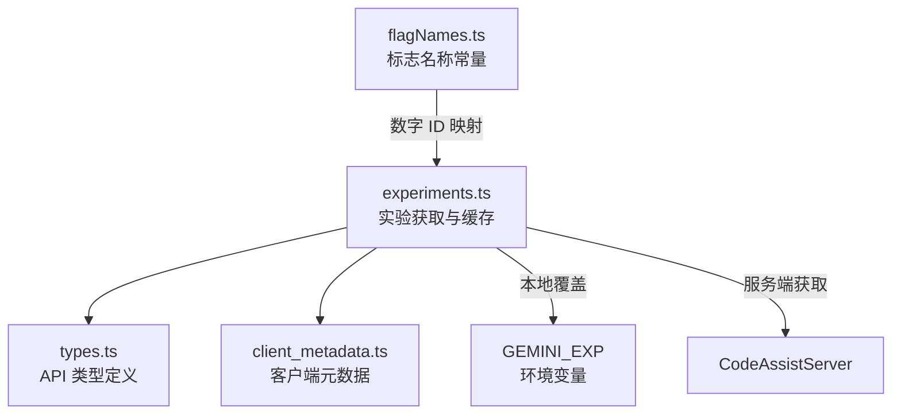

# experiments 架构

> 实验标志（Feature Flag）系统，从服务端获取并缓存实验配置，控制功能开关

## 概述

`experiments/` 模块提供实验标志（Feature Flag）管理能力。通过 Code Assist 服务端获取当前用户的实验配置，支持通过环境变量 `GEMINI_EXP` 本地覆盖。实验标志以数字 ID 标识，支持布尔值、浮点数、整数和字符串类型。获取结果在进程生命周期内缓存（单例 Promise），避免重复请求。

## 架构图



## 目录结构

```
experiments/
├── experiments.ts       # 实验获取核心逻辑
├── types.ts             # ListExperimentsResponse、Flag 等 API 类型
├── flagNames.ts         # 实验标志 ID 常量映射
└── client_metadata.ts   # 客户端元数据构建
```

## 关键文件

| 文件 | 功能 |
|------|------|
| `experiments.ts` | `getExperiments`：获取实验配置（单例缓存），优先从 `GEMINI_EXP` 环境变量指向的本地文件读取，否则调用服务端 API；`parseExperiments`：将响应转换为 flagId -> Flag 的映射 |
| `types.ts` | API 类型：`ListExperimentsResponse`（包含 experimentIds 和 flags 列表）、`Flag`（支持 bool/float/int/string/list 值）、`FilteredFlag`（被过滤的标志） |
| `flagNames.ts` | `ExperimentFlags` 常量对象：将语义化名称映射到数字 ID，如 `CONTEXT_COMPRESSION_THRESHOLD`(45740197)、`ENABLE_PREVIEW`(45740196)、`ENABLE_ADMIN_CONTROLS`(45752213)、`GEMINI_3_1_PRO_LAUNCHED`(45760185) |
| `client_metadata.ts` | 构建客户端元数据（平台、IDE 类型等），用于实验分桶 |

## 内部依赖

- `code_assist/server.ts` - CodeAssistServer
- `code_assist/types.ts` - ClientMetadata 类型
- `utils/debugLogger.ts` - 调试日志

## 外部依赖

| 依赖 | 用途 |
|------|------|
| `node:fs` | 读取本地实验配置文件 |
