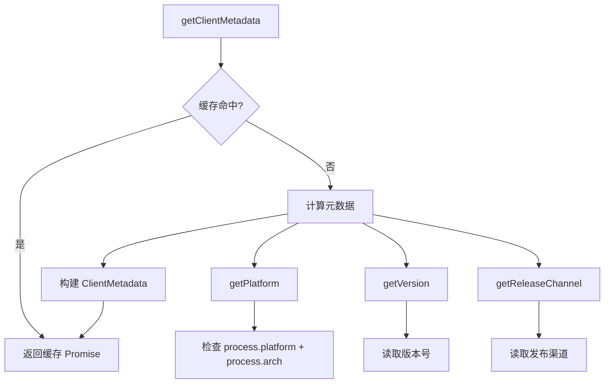

# client_metadata.ts

> 客户端元数据的采集与缓存

## 概述

`client_metadata.ts` 负责收集并缓存 Gemini CLI 客户端的运行环境元数据。这些元数据包括 IDE 类型、插件版本、运行平台和发布渠道等信息，主要用于实验标志请求和遥测上报。

该文件通过单次计算+Promise 缓存的模式确保元数据只采集一次，避免重复的异步操作。

## 架构图

## 主要导出

### `getClientMetadata(): Promise<ClientMetadata>`

返回客户端元数据的异步函数。首次调用时计算并缓存结果 Promise，后续调用直接返回同一 Promise。

返回的 `ClientMetadata` 包含：
- `ideName`: `'IDE_UNSPECIFIED'`（固定值，CLI 不是 IDE）
- `pluginType`: `'GEMINI'`（固定值）
- `ideVersion`: 从 `getVersion()` 获取的版本号
- `platform`: 根据 `process.platform` 和 `process.arch` 映射的平台标识
- `updateChannel`: 从 `getReleaseChannel()` 获取的发布渠道

## 核心逻辑

### 平台检测 (`getPlatform`)

通过组合 `process.platform` 和 `process.arch` 映射到 `ClientMetadataPlatform` 枚举值：

| platform | arch | 结果 |
|----------|------|------|
| `darwin` | `x64` | `DARWIN_AMD64` |
| `darwin` | `arm64` | `DARWIN_ARM64` |
| `linux` | `x64` | `LINUX_AMD64` |
| `linux` | `arm64` | `LINUX_ARM64` |
| `win32` | `x64` | `WINDOWS_AMD64` |
| 其他 | 其他 | `PLATFORM_UNSPECIFIED` |

### 缓存策略

使用模块级 `clientMetadataPromise` 变量存储 Promise 引用。由于 Promise 具有幂等性（resolved 后重复 await 直接返回值），这种模式既简单又安全。

## 内部依赖

| 模块 | 用途 |
|------|------|
| `../../utils/channel.js` | `getReleaseChannel` — 获取发布渠道 |
| `../types.js` | `ClientMetadata`, `ClientMetadataPlatform` 类型 |
| `../../utils/version.js` | `getVersion` — 获取版本号 |

## 外部依赖

| 包 | 用途 |
|------|------|
| `node:url` | `fileURLToPath` — ESM 模块路径转换 |
| `node:path` | 路径操作 |
