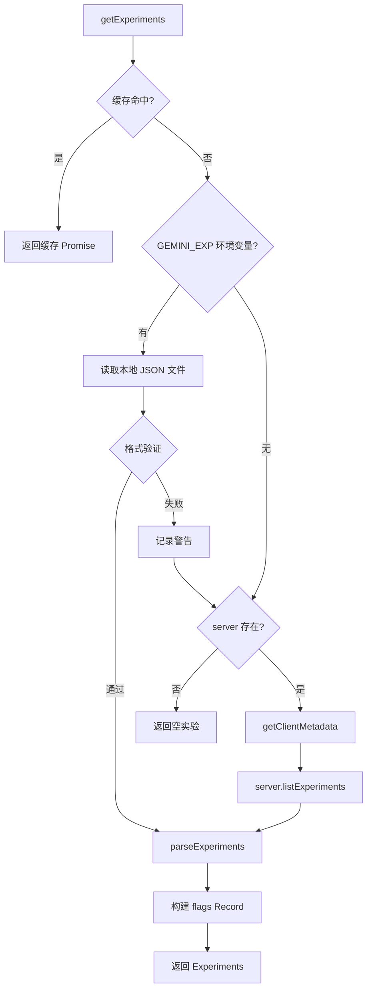

# experiments.ts

> 实验标志（Feature Flags）的获取、解析与缓存

## 概述

`experiments.ts` 实现了 Gemini CLI 的实验标志系统。实验标志（Feature Flags）允许服务端动态控制客户端行为，用于 A/B 测试、渐进式发布和功能开关等场景。

该文件支持两种标志来源：
1. **远程获取**：通过 `CodeAssistServer.listExperiments` API 从后端获取
2. **本地文件**：通过 `GEMINI_EXP` 环境变量指定本地 JSON 文件（用于开发/测试）

获取结果被缓存为 Promise，确保整个会话期间只请求一次。

## 架构图



## 主要导出

### 接口

- **`Experiments`** — 实验数据容器
  - `flags: Record<string, Flag>` — 以 `flagId` 为键的标志映射
  - `experimentIds: number[]` — 激活的实验 ID 列表

### 函数

#### `getExperiments(server?: CodeAssistServer): Promise<Experiments>`

获取实验标志的主入口。

**行为**：
1. 若已有缓存 Promise，直接返回
2. 若设置了 `GEMINI_EXP` 环境变量，从指定文件读取实验配置
3. 若无 server 实例，返回空实验（`{ flags: {}, experimentIds: [] }`）
4. 否则通过 server API 获取

**容错**：
- 本地文件读取失败时回退到远程获取
- 验证 `flags` 和 `experimentIds` 必须为数组（如果存在）

## 核心逻辑

### 解析逻辑 (`parseExperiments`)

将 `ListExperimentsResponse` 转换为 `Experiments`：
- 遍历 `flags` 数组，以 `flagId` 为键构建 `Record<string, Flag>` 查找表
- 直接传递 `experimentIds` 数组

### 缓存策略

与 `client_metadata.ts` 相同，使用模块级 `experimentsPromise` 存储 Promise 引用。整个异步逻辑被包裹在立即执行的 async IIFE 中赋值给 Promise 变量，保证并发调用共享同一 Promise。

### 本地覆盖 (`GEMINI_EXP`)

该机制允许开发者在不连接后端的情况下测试特定实验配置。文件格式与 `ListExperimentsResponse` 一致：

```json
{
  "flags": [{ "flagId": 12345, "boolValue": true }],
  "experimentIds": [100, 200]
}
```

## 内部依赖

| 模块 | 用途 |
|------|------|
| `../server.js` | `CodeAssistServer` 类型 |
| `./client_metadata.js` | `getClientMetadata` — 请求所需的客户端元数据 |
| `./types.js` | `ListExperimentsResponse`, `Flag` 类型 |
| `../../utils/debugLogger.js` | 调试日志 |

## 外部依赖

| 包 | 用途 |
|------|------|
| `node:fs` | 读取本地实验配置文件 |
