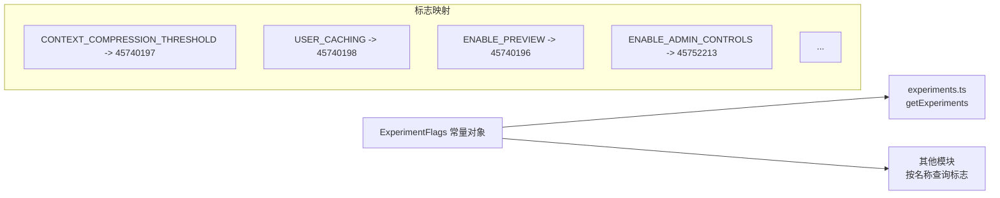

# flagNames.ts

> 实验标志 ID 的命名常量注册表

## 概述

`flagNames.ts` 定义了 Gemini CLI 中所有已知实验标志的数字 ID 到语义名称的映射。这是一个纯常量定义文件，作为实验标志系统的"注册表"，确保代码中引用标志时使用有意义的名称而非魔法数字。

## 架构图

## 主要导出

### `ExperimentFlags` (const 对象)

只读常量对象，键为语义名称，值为数字标志 ID。

| 名称 | ID | 用途 |
|------|------|------|
| `CONTEXT_COMPRESSION_THRESHOLD` | 45740197 | 上下文压缩阈值 |
| `USER_CACHING` | 45740198 | 用户缓存功能 |
| `BANNER_TEXT_NO_CAPACITY_ISSUES` | 45740199 | 无容量问题时的横幅文本 |
| `BANNER_TEXT_CAPACITY_ISSUES` | 45740200 | 有容量问题时的横幅文本 |
| `ENABLE_PREVIEW` | 45740196 | 预览功能开关 |
| `ENABLE_NUMERICAL_ROUTING` | 45750526 | 数值路由功能 |
| `CLASSIFIER_THRESHOLD` | 45750527 | 分类器阈值 |
| `ENABLE_ADMIN_CONTROLS` | 45752213 | 管理员控制功能开关 |
| `MASKING_PROTECTION_THRESHOLD` | 45758817 | 脱敏保护阈值 |
| `MASKING_PRUNABLE_THRESHOLD` | 45758818 | 脱敏可裁剪阈值 |
| `MASKING_PROTECT_LATEST_TURN` | 45758819 | 保护最新一轮对话的脱敏 |
| `GEMINI_3_1_PRO_LAUNCHED` | 45760185 | Gemini 3.1 Pro 发布标志 |

### `ExperimentFlagName` (类型)

`ExperimentFlags` 所有值的联合类型，即 `number` 的子集。用于类型安全地引用标志 ID。

## 核心逻辑

纯常量定义，无运行时逻辑。使用 `as const` 断言确保类型推断为字面量类型而非宽泛的 `number`。

## 内部依赖

无。

## 外部依赖

无。
