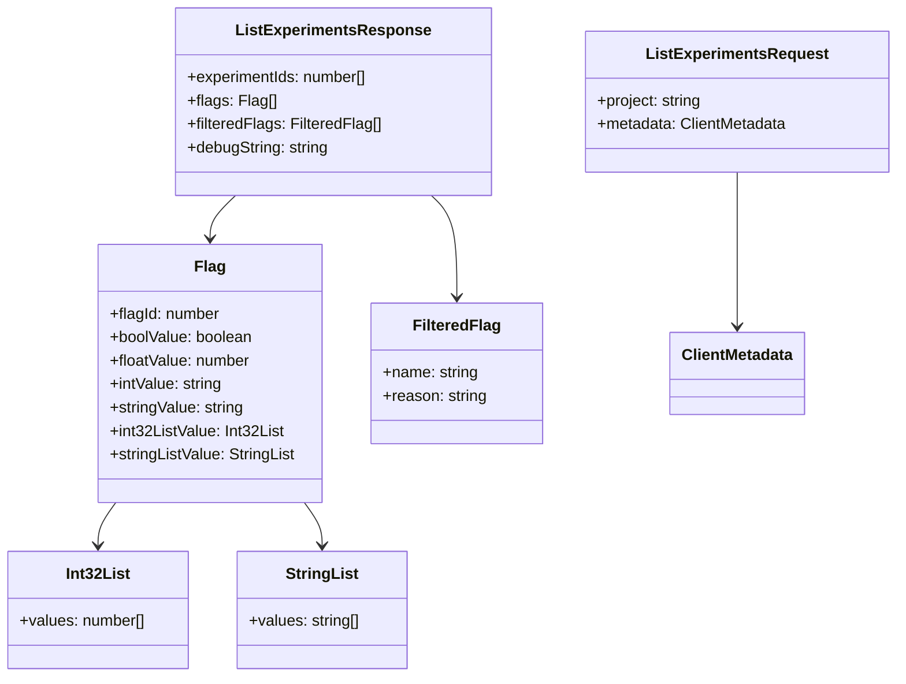

# experiments/types.ts

> 实验标志系统的 API 请求/响应类型定义

## 概述

`experiments/types.ts` 定义了与 Code Assist 后端实验标志 API 交互所需的所有 TypeScript 接口。这些类型覆盖了实验列表请求、响应以及标志值的多态表示。

该文件与主 `types.ts` 分离，体现了实验子系统的独立性——实验标志有自己专属的 API 端点和数据模型。

## 架构图

## 主要导出

### 接口

#### `ListExperimentsRequest`
实验列表请求。
- `project: string` — GCP 项目 ID
- `metadata?: ClientMetadata` — 客户端元数据（从父模块 `types.ts` 引入）

#### `ListExperimentsResponse`
实验列表响应。
- `experimentIds?: number[]` — 激活的实验 ID 列表
- `flags?: Flag[]` — 标志值列表
- `filteredFlags?: FilteredFlag[]` — 被过滤掉的标志（含过滤原因）
- `debugString?: string` — 调试信息字符串

#### `Flag`
单个标志的值表示。标志可以有多种类型的值（多态），同一时间只有一个值字段有意义：
- `flagId?: number` — 标志的数字 ID
- `boolValue?: boolean` — 布尔值
- `floatValue?: number` — 浮点值
- `intValue?: string` — 64 位整数（JSON 中以字符串表示）
- `stringValue?: string` — 字符串值
- `int32ListValue?: Int32List` — 32 位整数列表
- `stringListValue?: StringList` — 字符串列表

#### `Int32List`
32 位整数列表。
- `values?: number[]`

#### `StringList`
字符串列表。
- `values?: string[]`

#### `FilteredFlag`
被过滤的标志信息。
- `name?: string` — 标志名称
- `reason?: string` — 被过滤的原因

## 核心逻辑

纯类型定义文件，不包含运行时逻辑。

## 内部依赖

| 模块 | 用途 |
|------|------|
| `../types.js` | `ClientMetadata` 类型 |

## 外部依赖

无。
