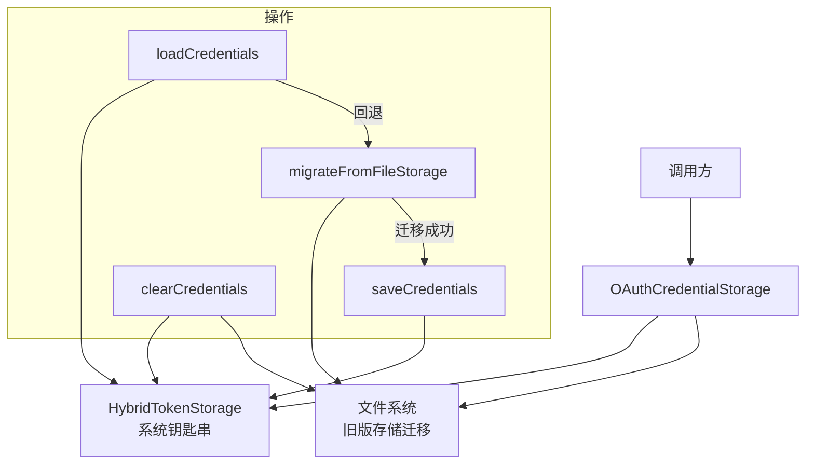

# oauth-credential-storage.ts

> OAuth 凭据的安全存储、加载与迁移管理

## 概述

`oauth-credential-storage.ts` 提供了 `OAuthCredentialStorage` 类，用于管理 Gemini CLI 的 OAuth 凭据持久化。该类封装了基于系统钥匙串（Keychain）的混合存储方案（`HybridTokenStorage`），并支持从旧版基于文件的存储方案自动迁移。

设计动机是将敏感的 OAuth 令牌从明文文件迁移到更安全的系统级存储中，同时保持向后兼容性。

## 架构图

## 主要导出

### `class OAuthCredentialStorage`

静态类，所有方法均为静态方法。

#### `static loadCredentials(): Promise<Credentials | null>`

加载缓存的 OAuth 凭据。优先从 `HybridTokenStorage`（钥匙串）读取；若不存在则尝试从旧版文件存储迁移。

- 将内部 `OAuthCredentials` 格式转换为 Google `Credentials` 格式
- 迁移成功后自动删除旧文件
- 加载失败时抛出错误并通过 `coreEvents` 发送反馈

#### `static saveCredentials(credentials: Credentials): Promise<void>`

保存 OAuth 凭据到钥匙串存储。

- 要求 `access_token` 必须存在，否则抛出异常
- 将 Google `Credentials` 格式转换为 `OAuthCredentials` 格式

#### `static clearCredentials(): Promise<void>`

清除钥匙串中的凭据，并尝试删除旧版文件。

## 核心逻辑

1. **双格式转换**：Google Auth Library 使用 `Credentials` 类型（`access_token`, `refresh_token` 等），而内部存储使用 `OAuthCredentials` 类型（`accessToken`, `refreshToken` 等）。`loadCredentials` 和 `saveCredentials` 分别负责两个方向的转换。
2. **自动迁移**：`migrateFromFileStorage` 读取 `~/.gemini/oauth_creds` 文件，将内容保存到新存储，成功后删除旧文件。仅在 `ENOENT`（文件不存在）时静默返回 null。
3. **错误处理**：所有公共方法在失败时通过 `coreEvents.emitFeedback` 报告错误，并重新抛出带有 `cause` 的封装异常。

## 内部依赖

| 模块 | 用途 |
|------|------|
| `../mcp/token-storage/hybrid-token-storage.js` | `HybridTokenStorage` — 钥匙串+文件混合存储 |
| `../config/storage.js` | `OAUTH_FILE` — OAuth 文件路径常量 |
| `../mcp/token-storage/types.js` | `OAuthCredentials` — 内部凭据类型 |
| `../utils/paths.js` | `GEMINI_DIR`, `homedir` — 路径工具 |
| `../utils/events.js` | `coreEvents` — 事件发射器 |

## 外部依赖

| 包 | 用途 |
|------|------|
| `google-auth-library` | `Credentials` 类型 |
| `node:path` | 路径拼接 |
| `node:fs` | 文件读写与删除 |
