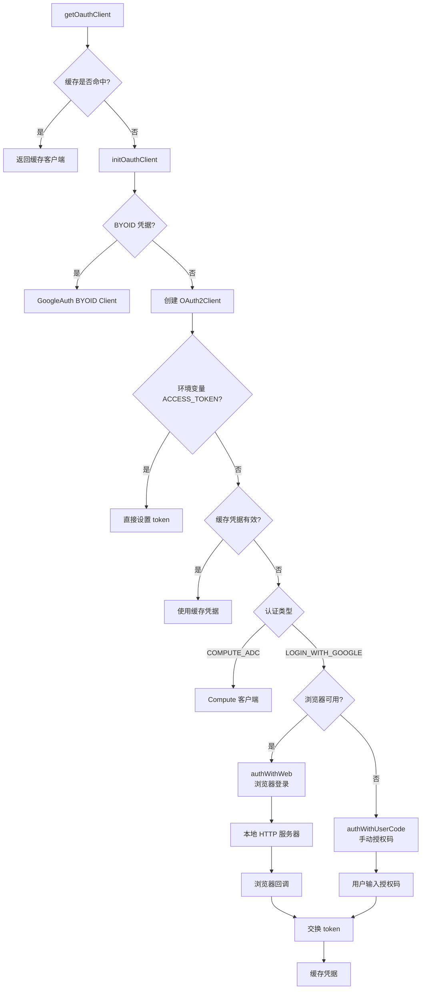

# oauth2.ts

> OAuth2 认证流程的完整实现，支持浏览器登录和手动授权码两种方式

## 概述

`oauth2.ts` 是 Gemini CLI 的核心认证模块，实现了完整的 OAuth2 认证流程。它支持三种认证路径：

1. **浏览器登录**（Web OAuth）：启动本地 HTTP 服务器作为回调端点，自动打开浏览器完成授权。
2. **手动授权码**（User Code）：在无法打开浏览器的环境（如 SSH、Docker）中，用户手动复制授权码。
3. **Compute ADC**：在 Google Cloud 环境（如 Cloud Shell）中使用应用默认凭据。

此外还支持 BYOID（Bring Your Own Identity）外部账户认证，以及环境变量注入的访问令牌。

## 架构图

## 主要导出

### 常量/变量

- **`authEvents: EventEmitter`** — 认证事件发射器，认证成功后触发 `post_auth` 事件，传递 `JWTInput` 对象

### 接口

- **`OauthWebLogin`** — 包含 `authUrl`（认证 URL）和 `loginCompletePromise`（登录完成 Promise）

### 函数

#### `getOauthClient(authType: AuthType, config: Config): Promise<AuthClient>`
获取 OAuth 客户端的主入口。使用 `Map` 缓存确保相同认证类型只初始化一次。

#### `getAvailablePort(): Promise<number>`
获取可用端口。支持通过 `OAUTH_CALLBACK_PORT` 环境变量指定固定端口。

#### `clearOauthClientCache(): void`
清除内存中的 OAuth 客户端缓存。

#### `clearCachedCredentialFile(): Promise<void>`
清除持久化的凭据文件/钥匙串存储，同时清除 Google 账户 ID 缓存和内存中的客户端缓存。

#### `resetOauthClientForTesting(): void`
测试辅助函数，重置客户端缓存以确保测试隔离。

## 核心逻辑

### 初始化流程 (`initOauthClient`)

1. 尝试加载缓存凭据（文件或加密存储）
2. 检测 BYOID 外部账户凭据
3. 检查环境变量中的直接 access token
4. 验证缓存凭据的有效性（本地+服务端双重验证）
5. 根据环境选择认证方式

### 浏览器登录 (`authWithWeb`)

- 在本地监听随机端口（或 `OAUTH_CALLBACK_PORT` 指定端口）
- 支持 `OAUTH_CALLBACK_HOST` 配置（Docker 场景中使用 `0.0.0.0`）
- 实现了 CSRF 防护（state 参数验证）
- 包含 5 分钟超时和 SIGINT/Ctrl+C 取消支持

### 手动授权码 (`authWithUserCode`)

- 使用 PKCE（Proof Key for Code Exchange）增强安全性
- 进入备用终端屏幕（alternate screen）避免干扰主界面
- 最多重试 2 次

### 凭据管理

- 监听 `OAuth2Client` 的 `tokens` 事件自动持久化新凭据
- 支持两种存储方式：加密存储（`OAuthCredentialStorage`）和文件存储
- 认证成功后获取并缓存用户信息（email）

## 内部依赖

| 模块 | 用途 |
|------|------|
| `../config/config.js` | `Config` — 应用配置 |
| `../utils/errors.js` | `FatalAuthenticationError`, `FatalCancellationError` |
| `../utils/userAccountManager.js` | 用户账户信息缓存 |
| `../core/contentGenerator.js` | `AuthType` 认证类型枚举 |
| `../config/storage.js` | `Storage` — 凭据文件路径 |
| `./oauth-credential-storage.js` | 加密凭据存储 |
| `../utils/stdio.js` | 终端 I/O 工具 |
| `../utils/terminal.js` | 终端控制（备用屏幕、鼠标事件等） |
| `../utils/events.js` | `coreEvents`, `CoreEvent` |
| `../utils/authConsent.js` | OAuth 用户同意对话 |
| `../mcp/token-storage/index.js` | `FORCE_ENCRYPTED_FILE_ENV_VAR` |
| `../utils/debugLogger.js` | 调试日志 |

## 外部依赖

| 包 | 用途 |
|------|------|
| `google-auth-library` | `OAuth2Client`, `Compute`, `GoogleAuth`, `CodeChallengeMethod` 等 |
| `open` | 打开系统默认浏览器 |
| `node:http` | 本地回调服务器 |
| `node:url` | URL 解析 |
| `node:crypto` | state 随机生成 |
| `node:net` | 端口检测 |
| `node:events` | `EventEmitter` |
| `node:readline` | 命令行输入 |
| `node:path` | 路径操作 |
| `node:fs` | 文件读写 |
