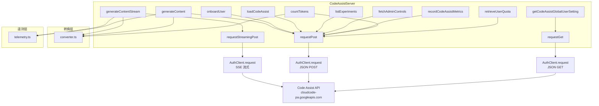

# server.ts

> Code Assist 后端 API 的通信客户端，实现 ContentGenerator 接口

## 概述

`server.ts` 是与 Google Code Assist 后端服务通信的核心实现。`CodeAssistServer` 类实现了 `ContentGenerator` 接口，封装了所有与后端 API 的交互，包括内容生成（流式和非流式）、用户注册、配额查询、实验标志获取、管理控制获取以及遥测指标上报等。

该类处于 Code Assist 模块的最底层，是唯一直接与后端 HTTP API 交互的组件。上层模块通过 `codeAssist.ts` 的工厂函数获取此实例。

## 架构图

## 主要导出

### 常量

- **`CODE_ASSIST_ENDPOINT`** — `'https://cloudcode-pa.googleapis.com'`，默认 API 端点
- **`CODE_ASSIST_API_VERSION`** — `'v1internal'`，API 版本

### 接口

- **`HttpOptions`** — HTTP 请求选项，包含可选的额外请求头 `headers`

### 类：`CodeAssistServer implements ContentGenerator`

#### 构造函数参数

| 参数 | 类型 | 说明 |
|------|------|------|
| `client` | `AuthClient` | 认证客户端 |
| `projectId` | `string?` | GCP 项目 ID |
| `httpOptions` | `HttpOptions` | HTTP 选项 |
| `sessionId` | `string?` | 会话 ID |
| `userTier` | `UserTierId?` | 用户层级 ID |
| `userTierName` | `string?` | 用户层级名称 |
| `paidTier` | `GeminiUserTier?` | 付费层级信息（含可用积分） |
| `config` | `Config?` | 应用配置 |

#### 核心方法

- **`generateContentStream(req, userPromptId, role)`** — 流式生成内容，返回 `AsyncGenerator<GenerateContentResponse>`。自动处理积分扣费逻辑、遥测上报和延迟统计。
- **`generateContent(req, userPromptId, role)`** — 非流式生成内容，返回 `Promise<GenerateContentResponse>`。
- **`countTokens(req)`** — 计算 token 数量。
- **`onboardUser(req)`** — 用户注册/激活。
- **`getOperation(name)`** — 查询长时间运行操作的状态。
- **`loadCodeAssist(req)`** — 加载用户的 Code Assist 配置和层级信息。包含 VPC-SC 错误降级处理。
- **`refreshAvailableCredits()`** — 刷新可用积分余额。
- **`fetchAdminControls(req)`** — 获取管理员控制配置。
- **`listExperiments(metadata)`** — 获取实验标志列表。
- **`retrieveUserQuota(req)`** — 获取用户配额信息。
- **`recordConversationOffered(offered)`** — 上报会话提供遥测。
- **`recordConversationInteraction(interaction)`** — 上报会话交互遥测。
- **`requestPost<T>(method, req, signal?, retryDelay?)`** — 通用 POST 请求，含重试机制（429/499/5xx 共 3 次重试）。
- **`requestStreamingPost<T>(method, req, signal?)`** — SSE 流式 POST 请求，逐行解析 `data:` 前缀的 SSE 事件。

## 核心逻辑

### 流式生成 (`generateContentStream`)

1. 判断是否启用积分（根据 billing 策略和模型支持情况）
2. 发起 SSE 请求，返回 `AsyncGenerator`
3. 在生成器中逐块处理：记录首包延迟、总延迟；上报 `ConversationOffered` 遥测；累计消耗和剩余积分；yield 转换后的响应
4. 流结束后，如有积分消耗则上报计费事件

### SSE 解析 (`requestStreamingPost`)

- 使用 `readline` 逐行解析 SSE 流
- 支持多行 `data:` 合并（按换行拼接）
- 空行作为事件分隔符
- 解析失败时记录 `InvalidChunkEvent` 遥测而非抛出异常

### VPC-SC 降级

`loadCodeAssist` 捕获 `SECURITY_POLICY_VIOLATED` 错误并降级为 STANDARD 层级，允许 VPC Service Controls 环境中的用户继续使用。

## 内部依赖

| 模块 | 用途 |
|------|------|
| `./types.js` | 所有 API 请求/响应类型 |
| `./converter.js` | 格式转换函数 |
| `./telemetry.js` | 遥测上报（`recordConversationOffered`, `formatProtoJsonDuration`） |
| `./experiments/types.js` | 实验相关类型 |
| `./experiments/client_metadata.js` | 客户端元数据 |
| `../core/contentGenerator.js` | `ContentGenerator` 接口 |
| `../billing/billing.js` | 积分计费逻辑 |
| `../telemetry/loggers.js` | 遥测日志工具 |
| `../telemetry/billingEvents.js` | 计费事件类型 |
| `../telemetry/types.js` | `InvalidChunkEvent`, `LlmRole` |
| `../utils/events.js` | `coreEvents` |

## 外部依赖

| 包 | 用途 |
|------|------|
| `@google/genai` | SDK 类型定义 |
| `google-auth-library` | `AuthClient` — 认证客户端（通过 `client.request` 发起 HTTP 请求） |
| `node:readline` | SSE 流逐行解析 |
| `node:stream` | `Readable` — 流类型转换 |
