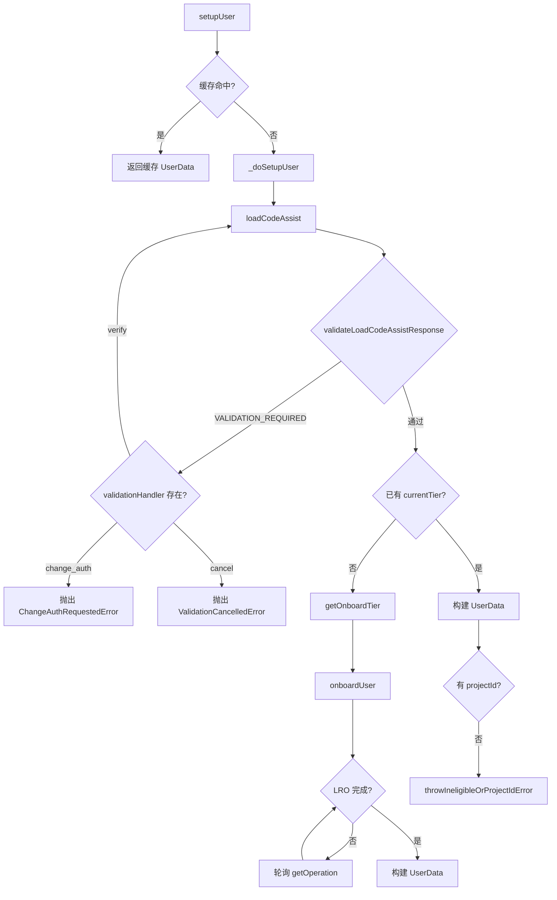

# setup.ts

> 用户注册与层级配置的初始化流程

## 概述

`setup.ts` 负责在认证完成后初始化用户的 Code Assist 使用环境。它通过调用 `loadCodeAssist` API 检查用户的当前层级状态，必要时触发 `onboardUser` 注册流程，并处理各种边界情况（如层级不合格、需要验证、缺少项目 ID 等）。

该文件是认证与服务之间的桥梁——在 `oauth2.ts` 完成身份验证后、`server.ts` 开始实际 API 调用前，确保用户已具备使用 Code Assist 的资格。

## 架构图

## 主要导出

### 错误类

- **`ProjectIdRequiredError`** — 当用户需要设置 `GOOGLE_CLOUD_PROJECT` 环境变量时抛出
- **`ValidationCancelledError`** — 用户取消验证流程时抛出
- **`IneligibleTierError`** — 用户不符合任何层级资格时抛出，包含 `ineligibleTiers` 详情数组

### 接口

- **`UserData`** — 用户配置数据，包含 `projectId`、`userTier`、`userTierName?`、`paidTier?`

### 函数

#### `setupUser(client, validationHandler?, httpOptions?): Promise<UserData>`
用户设置的主入口。使用两级缓存（AuthClient -> projectId）避免重复网络调用，缓存 TTL 为 30 秒。

#### `resetUserDataCacheForTesting(): void`
测试辅助函数，重置用户数据缓存。

## 核心逻辑

### 层级判定流程

1. 调用 `loadCodeAssist` 获取用户状态
2. 验证响应，检测是否需要账户验证（`VALIDATION_REQUIRED`）
3. 若已有 `currentTier`：直接返回（优先使用 `paidTier`，回退到 `currentTier`）
4. 若无 `currentTier`：从 `allowedTiers` 中选择默认层级，执行 `onboardUser` 注册

### 注册流程

- 免费层级（FREE）不需要指定 `cloudaicompanionProject`
- 其他层级需要用户提供项目 ID
- `onboardUser` 返回长时间运行操作（LRO），需每 5 秒轮询直到完成

### 验证重试

通过 `while(true)` 循环实现验证重试：
- `verify`：重新调用 `loadCodeAssist`
- `change_auth`：抛出 `ChangeAuthRequestedError` 切换认证方式
- 其他：抛出 `ValidationCancelledError` 终止流程

### 降级处理

`throwIneligibleOrProjectIdError` 在无项目 ID 时：
- 若有不合格层级信息，抛出 `IneligibleTierError` 告知用户具体原因
- 否则抛出 `ProjectIdRequiredError` 提示设置环境变量

## 内部依赖

| 模块 | 用途 |
|------|------|
| `./types.js` | `UserTierId`, `IneligibleTierReasonCode`, 各种 API 类型 |
| `./server.js` | `CodeAssistServer`, `HttpOptions` |
| `../fallback/types.js` | `ValidationHandler` 类型 |
| `../utils/errors.js` | `ChangeAuthRequestedError` |
| `../utils/googleQuotaErrors.js` | `ValidationRequiredError` |
| `../utils/debugLogger.js` | 调试日志 |
| `../utils/cache.js` | `createCache`, `CacheService` — 缓存工具 |

## 外部依赖

| 包 | 用途 |
|------|------|
| `google-auth-library` | `AuthClient` 类型 |
