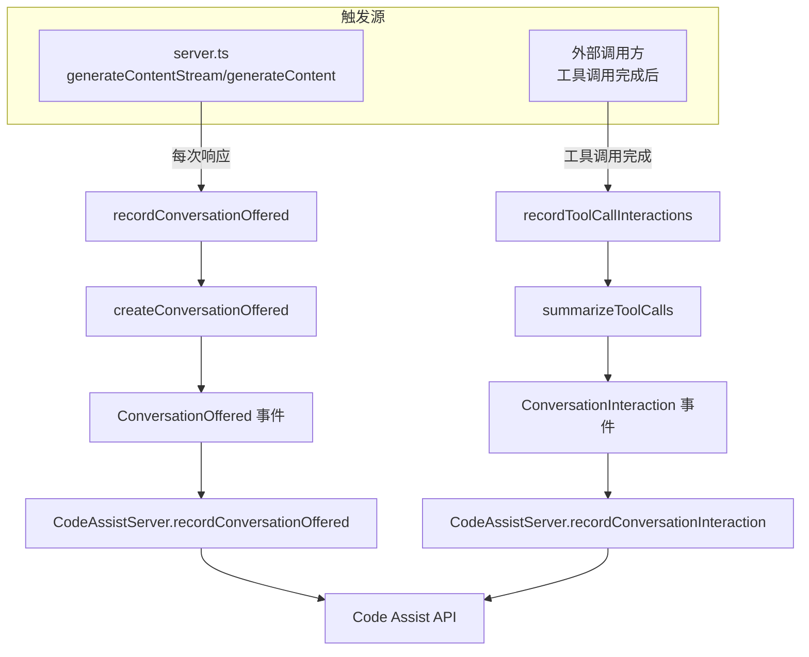

# telemetry.ts

> Code Assist 会话级遥测数据的构建与上报

## 概述

`telemetry.ts` 负责构建和上报两类核心遥测事件：

1. **ConversationOffered** — 模型生成响应后触发，记录响应状态、引用计数、是否包含代码、流式延迟等信息。
2. **ConversationInteraction** — 用户（通过工具调用）对模型响应进行交互后触发，记录接受/拒绝状态、修改行数、编程语言等信息。

这些遥测数据被发送到 Code Assist 后端，用于产品质量分析和用户体验改进。该文件是连接 LLM 响应层与遥测上报层的关键适配器。

## 架构图



## 主要导出

### 函数

#### `recordConversationOffered(server, traceId, response, streamingLatency, abortSignal, trajectoryId): Promise<void>`

异步上报 `ConversationOffered` 遥测。仅当 `traceId` 存在且响应包含编辑类工具调用时才发送。错误被捕获并记录警告日志，不会传播到调用方。

#### `recordToolCallInteractions(config, toolCalls): Promise<void>`

汇总一组已完成的工具调用，上报 `ConversationInteraction` 遥测。仅当所有工具调用都被接受且至少有一个是编辑操作时才生成交互事件。

#### `createConversationOffered(response, traceId, signal, streamingLatency, trajectoryId): ConversationOffered | undefined`

从 LLM 响应构建 `ConversationOffered` 对象。仅在响应包含编辑类函数调用（`EDIT_TOOL_NAMES`）时返回有效对象。

#### `formatProtoJsonDuration(milliseconds: number): string`

将毫秒数转换为 Proto JSON 时长格式字符串（如 `"1.5s"`）。

## 核心逻辑

### ConversationOffered 构建

- 检查响应中是否包含编辑类工具调用（`EDIT_TOOL_NAMES`）
- 统计引用（citation）数量
- 检测响应是否包含代码块（```` ``` ````）
- 根据响应状态和中止信号确定 `ActionStatus`

### 工具调用汇总 (`summarizeToolCalls`)

遍历所有已完成的工具调用：
1. 若任一调用被取消 -> `ACTION_STATUS_CANCELLED`
2. 若任一调用出错 -> `ACTION_STATUS_ERROR_UNKNOWN`
3. 统计接受的调用数量和编辑操作的增删行数
4. 仅当 100% 的调用都被接受且包含编辑操作时，生成 `ACCEPT_FILE` 类型的交互事件
5. 使用第一个工具调用的 `traceId` 关联到对应的 `ConversationOffered`

### 错误状态判定 (`hasError`)

- 非 OK 的 SDK HTTP 响应
- 非 `STOP`/`MAX_TOKENS` 的 finish reason（如内容安全过滤、PII 检测、引用违规等）

## 内部依赖

| 模块 | 用途 |
|------|------|
| `./types.js` | `ActionStatus`, `ConversationOffered`, `ConversationInteraction`, `InitiationMethod` 等 |
| `./codeAssist.js` | `getCodeAssistServer` — 获取服务实例 |
| `./server.js` | `CodeAssistServer` 类型 |
| `../core/coreToolScheduler.js` | `CompletedToolCall` 类型 |
| `../tools/tool-names.js` | `EDIT_TOOL_NAMES` — 编辑类工具名称集合 |
| `../tools/tools.js` | `ToolConfirmationOutcome` |
| `../tools/edit.js` | `isEditToolParams` — 参数类型守卫 |
| `../tools/write-file.js` | `isWriteFileToolParams` — 参数类型守卫 |
| `../utils/generateContentResponseUtilities.js` | `getCitations` — 引用提取 |
| `../utils/language-detection.js` | `getLanguageFromFilePath` — 语言检测 |
| `../utils/fileDiffUtils.js` | diff 统计工具 |
| `../utils/errors.js` | `getErrorMessage` |
| `../utils/debugLogger.js` | 调试日志 |
| `../config/config.js` | `Config` 类型 |

## 外部依赖

| 包 | 用途 |
|------|------|
| `@google/genai` | `FinishReason`, `GenerateContentResponse` |
