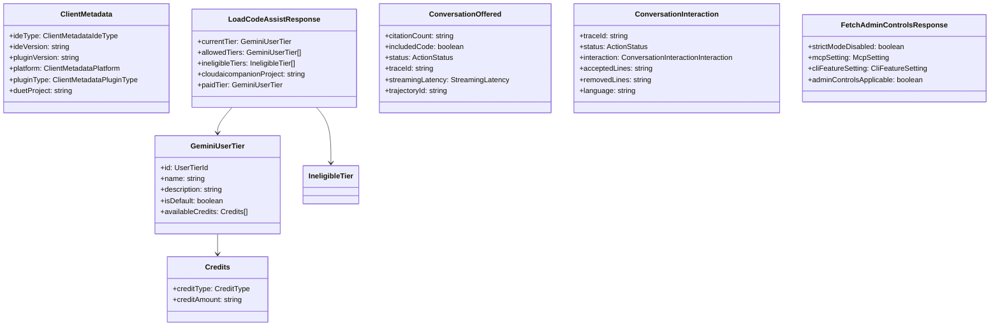

# types.ts

> Code Assist 模块的核心类型定义集合

## 概述

`types.ts` 是 Code Assist 模块的类型中心，定义了与 Google Code Assist 后端 API 交互所需的所有 TypeScript 接口、枚举和 Zod schema。这些类型覆盖了用户层级管理、API 请求/响应协议、遥测事件、管理员控制设置和 MCP 配置等领域。

该文件是模块中几乎所有其他文件的共同依赖，确保了类型的一致性和 API 契约的正确性。

## 架构图

## 主要导出

### 元数据类型

- **`ClientMetadata`** — 客户端元数据（IDE 类型、版本、平台、插件类型等）
- **`ClientMetadataIdeType`** — IDE 类型字面量联合（`VSCODE`, `INTELLIJ`, `GEMINI_CLI` 等）
- **`ClientMetadataPlatform`** — 平台字面量联合（`DARWIN_AMD64`, `LINUX_ARM64` 等）
- **`ClientMetadataPluginType`** — 插件类型字面量联合

### 积分/计费类型

- **`CreditType`** — 积分类型（`CREDIT_TYPE_UNSPECIFIED` | `GOOGLE_ONE_AI`）
- **`Credits`** — 积分数据（`creditType` + `creditAmount`）
- **`AvailableCredits`** / **`ConsumedCredits`** / **`RemainingCredits`** — Credits 的语义别名

### 用户层级类型

- **`UserTierId`** — 用户层级 ID 常量对象与类型（`FREE`, `LEGACY`, `STANDARD`）
- **`GeminiUserTier`** — 完整层级信息（含 ID、名称、描述、积分等）
- **`IneligibleTier`** — 不合格层级信息（含原因码、验证 URL 等）
- **`IneligibleTierReasonCode`** — 不合格原因码枚举（`RESTRICTED_AGE`, `UNSUPPORTED_LOCATION`, `VALIDATION_REQUIRED` 等）
- **`PrivacyNotice`** — 隐私通知信息

### API 请求/响应类型

- **`LoadCodeAssistRequest`** / **`LoadCodeAssistResponse`** — 加载 Code Assist 配置
- **`OnboardUserRequest`** — 用户注册
- **`LongRunningOperationResponse`** — 长时间运行操作响应
- **`OnboardUserResponse`** — 注册响应
- **`SetCodeAssistGlobalUserSettingRequest`** / **`CodeAssistGlobalUserSettingResponse`** — 全局用户设置
- **`RetrieveUserQuotaRequest`** / **`RetrieveUserQuotaResponse`** — 用户配额查询
- **`BucketInfo`** — 配额桶信息
- **`RecordCodeAssistMetricsRequest`** — 遥测上报请求
- **`CodeAssistMetric`** — 单条遥测指标

### 遥测类型

- **`ConversationOffered`** — 会话提供事件
- **`ConversationInteraction`** — 会话交互事件
- **`StreamingLatency`** — 流式延迟（首包延迟 + 总延迟）
- **`ActionStatus`** — 操作状态枚举（无错误、未知错误、已取消、空响应）
- **`ConversationInteractionInteraction`** — 交互类型枚举（点赞/点踩/复制/插入/接受文件等）
- **`InitiationMethod`** — 发起方式枚举（Tab/Command/Agent）

### 管理控制类型

- **`FetchAdminControlsRequest`** / **`FetchAdminControlsResponse`** — 管理控制请求/响应
- **`McpConfigDefinition`** — MCP 服务器配置定义
- **`AdminControlsSettings`** — 解析后的管理控制设置

### Zod Schema

- **`McpConfigDefinitionSchema`** — MCP 配置的运行时验证 schema
- **`AdminControlsSettingsSchema`** — 管理控制设置的验证 schema
- **`FetchAdminControlsResponseSchema`** — API 响应的验证 schema

### 其他

- **`OnboardUserStatusCode`** — 注册状态码枚举
- **`OnboardUserStatus`** — 注册状态（含显示消息和帮助链接）
- **`HelpLinkUrl`** — 帮助链接
- **`GoogleRpcResponse`** / **`GoogleRpcErrorInfo`** — Google RPC 错误响应类型
- **`LoadCodeAssistMode`** — 加载模式（全量检查/健康检查）

## 核心逻辑

本文件为纯类型定义，不包含运行时逻辑。Zod schema 提供运行时验证能力，用于验证从后端返回的管理控制数据的合法性。

## 内部依赖

无。

## 外部依赖

| 包 | 用途 |
|------|------|
| `zod` | 运行时 schema 验证（管理控制相关 schema） |
