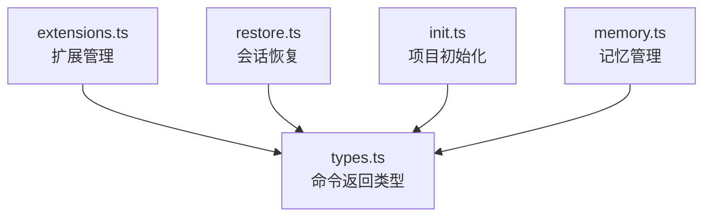

# commands 架构

> CLI 命令定义模块，提供扩展管理、会话恢复、项目初始化和记忆管理等斜杠命令

## 概述

`commands/` 模块定义了 Gemini CLI 中可用的斜杠命令（slash commands）。每个命令是一个独立函数，返回不同类型的动作结果（工具调用、消息显示、历史加载或提示提交）。这些命令由 CLI 层调用，核心包只负责定义逻辑和返回值类型。

## 架构图



## 目录结构

```
commands/
├── types.ts        # 命令动作返回类型定义
├── extensions.ts   # /extensions - 列出已安装的扩展
├── restore.ts      # /restore - 恢复之前的会话
├── init.ts         # /init - 初始化项目配置
└── memory.ts       # /memory - 管理 GEMINI.md 记忆文件
```

## 关键文件

| 文件 | 功能 |
|------|------|
| `types.ts` | 定义 `CommandActionReturn` 联合类型，包含四种命令动作：`ToolActionReturn`（触发工具调用）、`MessageActionReturn`（显示消息）、`LoadHistoryActionReturn`（加载历史）、`SubmitPromptActionReturn`（提交提示） |
| `extensions.ts` | `listExtensions`：列出当前配置中的所有扩展 |
| `restore.ts` | 会话恢复逻辑：从持久化存储中恢复之前的对话历史 |
| `init.ts` | 项目初始化：创建 `.gemini/` 配置目录和默认配置文件 |
| `memory.ts` | 记忆管理：读取/写入 `GEMINI.md` 文件，该文件作为 Agent 的持久化记忆 |

## 内部依赖

- `config/config.ts` - Config 类
- `@google/genai` - `Content`、`PartListUnion` 类型

## 外部依赖

无直接外部依赖。
