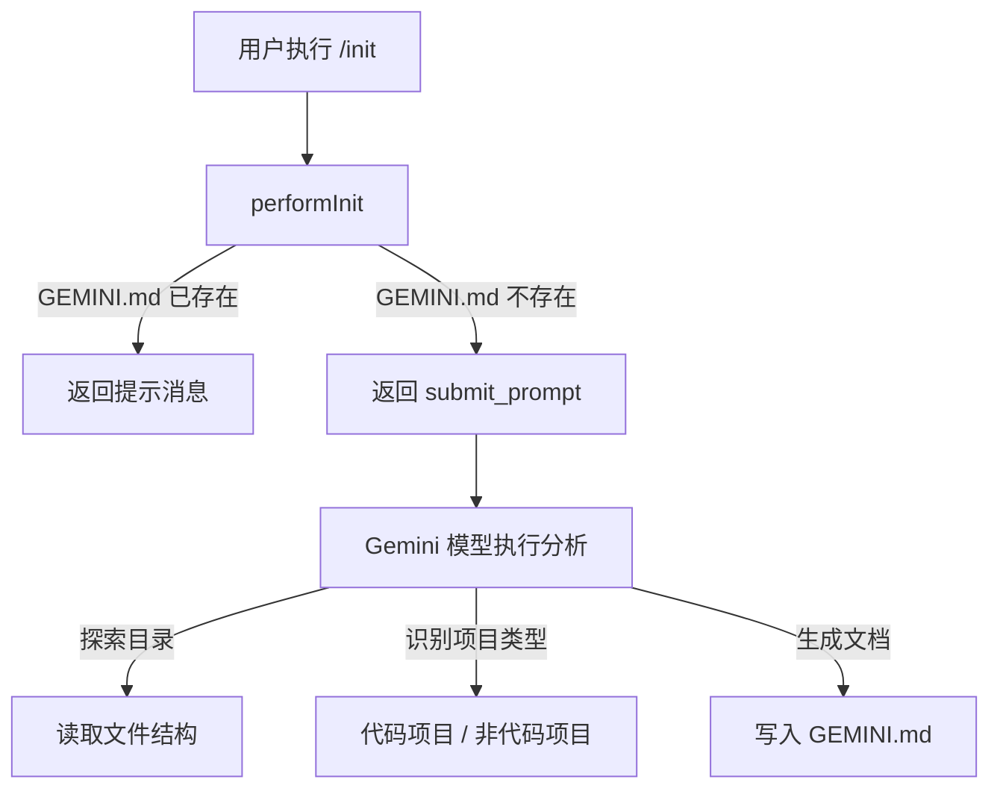

# init.ts

> 实现 `/init` 命令，自动分析项目目录并生成 GEMINI.md 上下文文件。

## 概述

`init.ts` 实现了项目初始化命令的核心逻辑。当用户执行 `/init` 时，如果当前目录已存在 `GEMINI.md`，则返回提示消息；否则生成一段详细的提示词（prompt），引导 Gemini 模型分析当前目录结构并自动创建 `GEMINI.md` 文件。该文件体现了"AI 引导式项目分析"的设计理念。

## 架构图

## 主要导出

### 函数

| 函数 | 签名 | 说明 |
|------|------|------|
| `performInit` | `(doesGeminiMdExist: boolean) => CommandActionReturn` | 执行初始化命令，返回消息或提示词 |

## 核心逻辑

1. **幂等性检查**：如果 `GEMINI.md` 已存在，返回 `{ type: 'message' }` 告知用户无需操作。
2. **提示词生成**：返回 `{ type: 'submit_prompt' }` 包含一段结构化的提示词，指导 AI 执行：
   - 初步探索：列出文件目录、读取 README
   - 迭代深入：最多读取 10 个关键文件
   - 项目类型识别：通过特征文件（package.json、requirements.txt 等）判断
   - 内容生成：根据项目类型（代码/非代码）生成不同结构的文档

## 内部依赖

| 模块 | 导入项 | 用途 |
|------|--------|------|
| `./types.js` | `CommandActionReturn` (type) | 命令返回类型 |

## 外部依赖

无。
