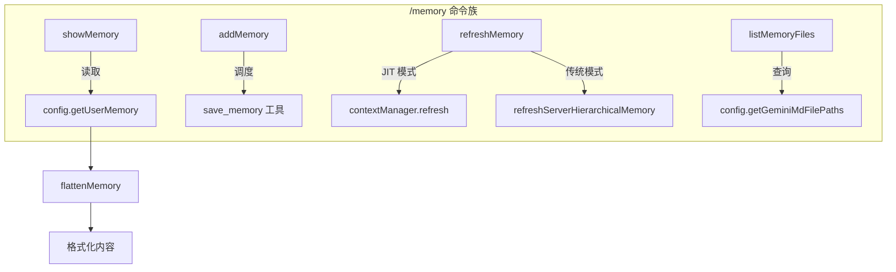

# memory.ts

> 实现 `/memory` 命令族，提供内存内容的查看、添加、刷新和文件列表功能。

## 概述

`memory.ts` 实现了 Gemini CLI 的内存管理命令。"内存"在此上下文中指的是从 `GEMINI.md` 文件中加载的持久化上下文信息，用于为 AI 模型提供项目背景知识。该文件提供四个子命令：查看当前内存、添加新记忆、刷新内存缓存、列出内存文件路径。

## 架构图

## 主要导出

### 函数

| 函数 | 签名 | 说明 |
|------|------|------|
| `showMemory` | `(config: Config) => MessageActionReturn` | 展示当前内存内容和文件数量 |
| `addMemory` | `(args?: string) => MessageActionReturn \| ToolActionReturn` | 添加新记忆，无参数时返回用法提示 |
| `refreshMemory` | `(config: Config) => Promise<MessageActionReturn>` | 异步刷新内存缓存，支持 JIT 和传统两种模式 |
| `listMemoryFiles` | `(config: Config) => MessageActionReturn` | 列出所有正在使用的 GEMINI.md 文件路径 |

## 核心逻辑

1. **双模式刷新**：`refreshMemory` 根据 `isJitContextEnabled()` 选择不同刷新路径 -- JIT 模式通过 ContextManager 刷新，传统模式通过 `refreshServerHierarchicalMemory` 从层级目录重新加载。
2. **工具调度**：`addMemory` 不直接修改内存，而是返回 `{ type: 'tool', toolName: 'save_memory' }`，将实际写入操作委托给工具执行框架。
3. **系统指令更新**：刷新后调用 `config.updateSystemInstructionIfInitialized()` 确保模型的系统指令包含最新内存内容。

## 内部依赖

| 模块 | 导入项 | 用途 |
|------|--------|------|
| `../config/config.js` | `Config` (type) | 全局配置 |
| `../config/memory.js` | `flattenMemory` | 将内存对象展平为字符串 |
| `../utils/memoryDiscovery.js` | `refreshServerHierarchicalMemory` | 从层级目录刷新内存 |
| `./types.js` | `MessageActionReturn`, `ToolActionReturn` | 命令返回类型 |

## 外部依赖

无。
