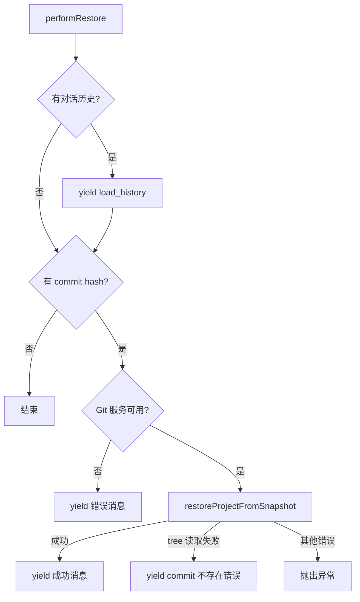

# restore.ts

> 实现检查点还原命令，恢复对话历史和 Git 项目状态到指定快照。

## 概述

`restore.ts` 实现了 Gemini CLI 的检查点还原功能。当用户需要撤销某次工具调用的影响时，该命令可以同时恢复对话历史（通过 `load_history` 动作）和文件系统状态（通过 Git 快照恢复）。使用 `AsyncGenerator` 模式允许分步产出多个动作结果。

## 架构图

## 主要导出

### 函数

| 函数 | 签名 | 说明 |
|------|------|------|
| `performRestore` | `<HistoryType, ArgsType>(toolCallData, gitService) => AsyncGenerator<CommandActionReturn<HistoryType>>` | 异步生成器，逐步产出还原操作的结果 |

## 核心逻辑

1. **历史恢复**：如果 `toolCallData` 包含 `history` 和 `clientHistory`，先产出 `load_history` 动作恢复对话上下文。
2. **Git 快照恢复**：如果有 `commitHash`，通过 `gitService.restoreProjectFromSnapshot` 恢复文件系统状态。
3. **错误处理**：特别处理 `unable to read tree` 错误，表示 commit 已被 GC 回收或仓库重置，给出明确的用户提示。
4. **泛型设计**：`HistoryType` 和 `ArgsType` 泛型参数允许不同 UI 层传入各自的历史数据结构。

## 内部依赖

| 模块 | 导入项 | 用途 |
|------|--------|------|
| `../services/gitService.js` | `GitService` (type) | Git 操作服务 |
| `./types.js` | `CommandActionReturn` (type) | 命令返回类型 |
| `../utils/checkpointUtils.js` | `ToolCallData` (type) | 检查点工具调用数据 |

## 外部依赖

无。
